# NIKE — P&L and Three-Statement Analysis

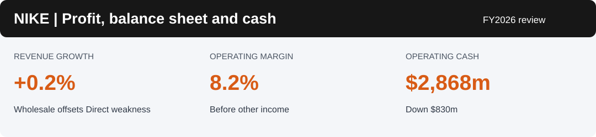

**🎯 Goal:** explain how sales and costs affect profit, how the balance sheet uses funding, and where the cash goes.

- **Data:** original annual report and comparative FY2025 / FY2026 financial statements. Fiscal year ends **31 May**.
- **Work:** nine finance questions, reconciled Excel calculations and evidence from the original report.
- **Deliverables:** performance review, profit and cash bridges, working-capital ratios and proposed management actions.

[📗 Excel analysis](processed_data/NKE_Three_Statement_Analysis.xlsx) · [📂 Original data](raw_data/README.md) · [📊 Analysis outputs](processed_data/README.md) · [🧭 Portfolio](https://github.com/hoichengit/Portfolio-Guide)

**The main conclusion:** NIKE stabilised reported sales, but Direct weakness and poor cash conversion remain. Tariff recovery affects both earnings and receivables, so it must be separated from recurring trading performance.

## Analysis questions

| Statement | Analysis | Question |
|---|---|---|
| P&L | [1. Revenue sources](#analysis-1) | Why was revenue flat despite wholesale growth? |
| P&L | [2. Operating profitability](#analysis-2) | Did trading profitability recover? |
| P&L | [3. Earnings quality](#analysis-3) | Why did net income fall, and how clean are earnings? |
| Balance sheet | [4. Short-term liquidity](#analysis-4) | How much short-term liquidity is available? |
| Balance sheet | [5. Working capital](#analysis-5) | Does the receivable increase mean customers are paying later? |
| Balance sheet | [6. Funding and asset quality](#analysis-6) | Does net cash eliminate funding risk? |
| Cash flow | [7. Profit to operating cash](#analysis-7) | Why was operating cash flow below profit? |
| Cash flow | [8. Cash available after investment](#analysis-8) | Could free cash flow fund dividends and buybacks? |
| Cash flow | [9. Cash reconciliation](#analysis-9) | Why did cash rise despite weaker operating cash flow? |

Amounts are **USD millions** unless stated. Comparisons are **actual vs prior year**, not budget vs actual. A percentage-point change measures the difference between two rates.

## 1. Revenue sources: Why was revenue flat despite wholesale growth?

**Answer:** Revenue increased only **$89m (+0.2%)** to **$46,398m**. Wholesale growth was offset by NIKE Direct and Converse declines.

**Why:** NIKE Brand wholesale added $1,570m; NIKE Direct lost $1,063m and Converse lost $518m. Management reports a 2% group revenue decline excluding currency and an 8% currency-neutral decline in Direct. Reduced digital traffic and the marketplace reset are relevant operating context. [Company explanation](raw_data/NKE_2026_Annual_Report.pdf#page=36).

**Calculation:** **+$1,570m wholesale − $1,063m Direct + $1m Global Brand Divisions − $518m Converse + $99m Corporate = +$89m.** These channels and businesses reconcile to group sales without double counting.

**Management action:** Review wholesale sell-through alongside Direct traffic and returns, rather than treating wholesale shipments as a complete recovery.

📸 Compare the original report with the Excel analysis

**1. Original report — PDF page 35.** Red boxes identify the source figures. Source columns run **FY2026 → FY2025 → FY2024 where shown**; the balance sheet has two years.

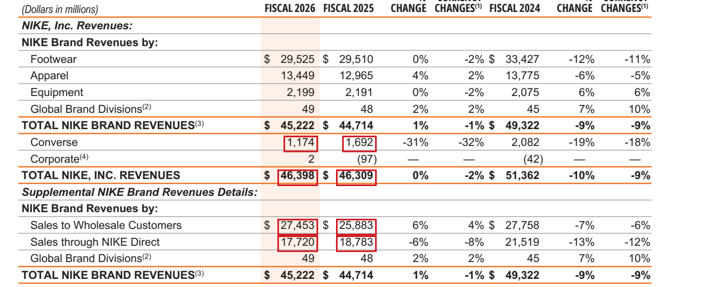

**2. Actual Excel worksheet — `NKE_1_Analysis`.** The same key figures and the calculated answer are highlighted in red. Excel runs **FY2025 → FY2026 → change**.

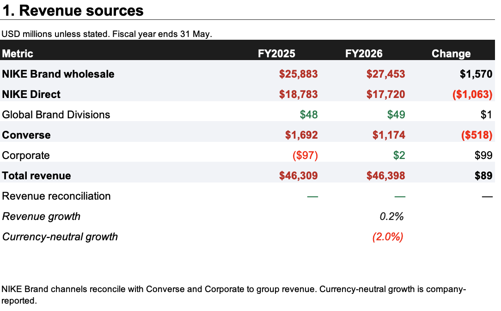

[Open the full-resolution Excel screenshot](evidence/Excel_1.png) · [Download the working Excel file](processed_data/NKE_Three_Statement_Analysis.xlsx)

**Company explanation — PDF page 36.**

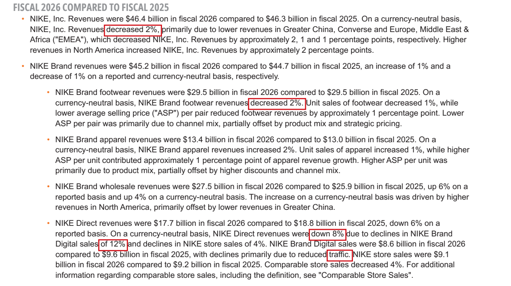

[↑ Back to questions](#analysis-questions)

## 2. Operating profitability: Did trading profitability recover?

**Answer:** Operating profit before other income increased **$95m** to **$3,797m**. Its margin improved from **8.0% to 8.2%**.

**Why:** Gross profit increased $121m and SG&A increased $26m. Demand creation rose $65m, while other operating overhead fell $39m. Management cites logistics and FX benefits to gross margin, partly offset by Converse and product costs. The tariff recovery discussed below also matters to earnings quality. [Company explanation](raw_data/NKE_2026_Annual_Report.pdf#page=37).

**Calculation:** **+$89m revenue + $32m lower COGS − $26m extra SG&A = +$95m.** Here operating profit means sales less COGS and SG&A. NIKE-defined EBIT includes other income and is $3,850m, not $3,797m.

**Management action:** Monitor gross margin and demand-creation effectiveness while distinguishing recurring trading results from tariff accounting.

📸 Compare the original report with the Excel analysis

**1. Original report — PDF page 58.** Red boxes identify the source figures. Source columns run **FY2026 → FY2025 → FY2024 where shown**; the balance sheet has two years.

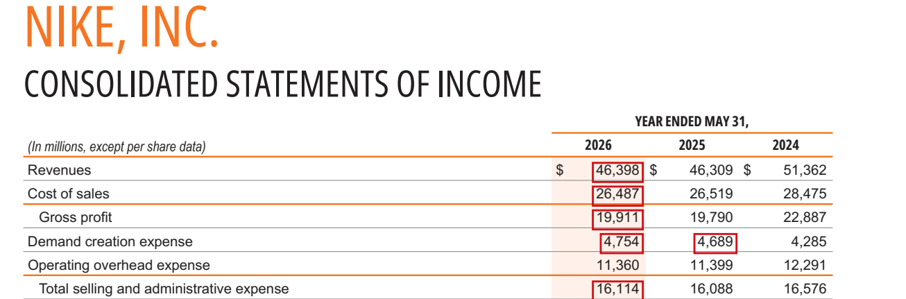

**2. Actual Excel worksheet — `NKE_2_Analysis`.** The same key figures and the calculated answer are highlighted in red. Excel runs **FY2025 → FY2026 → change**.

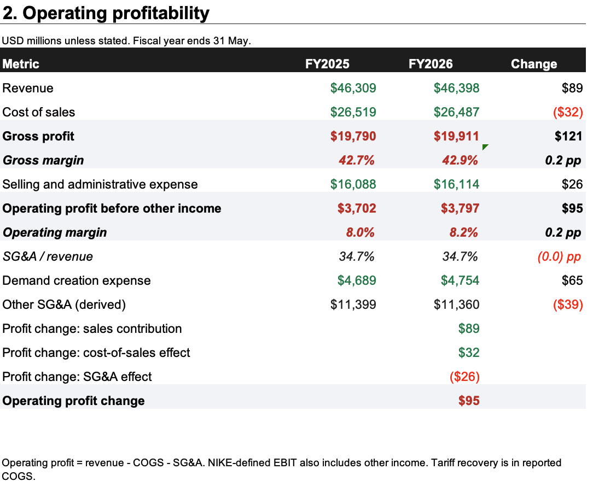

[Open the full-resolution Excel screenshot](evidence/Excel_2.png) · [Download the working Excel file](processed_data/NKE_Three_Statement_Analysis.xlsx)

[↑ Back to questions](#analysis-questions)

## 3. Earnings quality: Why did net income fall, and how clean are earnings?

**Answer:** Net income fell **$111m (-3.4%)** to **$3,108m**. The effective tax rate rose from **17.1% to 20.3%**.

**Why:** Pretax profit rose only $15m, while tax expense rose $126m. NIKE attributes the tax-rate increase mainly to a prior-year one-off deferred-tax benefit. Separately, FY2026 COGS includes a **$986m IEEPA tariff recovery benefit**. [Company explanation](raw_data/NKE_2026_Annual_Report.pdf#page=38).

**Calculation:** $15m additional pretax income − $126m extra tax = −$111m net income. Removing only the tariff recovery reduces operating profit before other income from $3,797m to $2,811m. This is a sensitivity, **not normalised profit**, because the associated tariff costs are still included.

**Management action:** Keep tax comparability and tariff recovery separate when deciding the recurring earnings run rate.

📸 Compare the original report with the Excel analysis

**1. Original report — PDF page 58.** Red boxes identify the source figures. Source columns run **FY2026 → FY2025 → FY2024 where shown**; the balance sheet has two years.

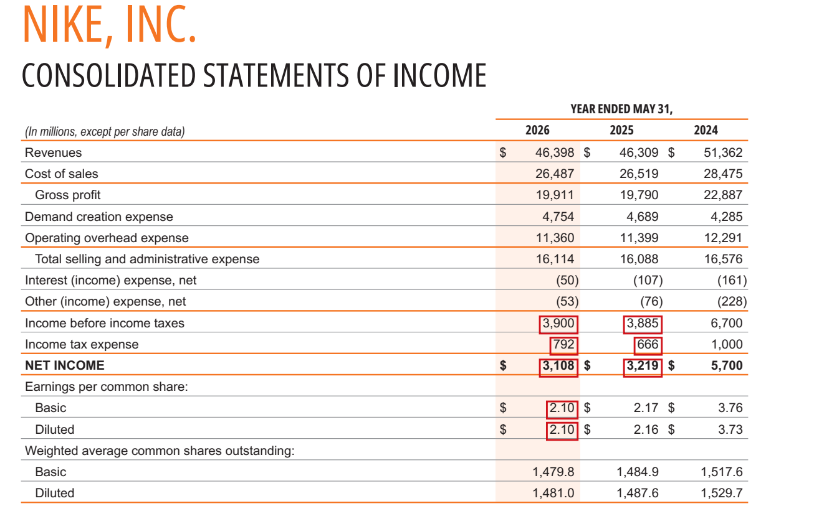

**2. Actual Excel worksheet — `NKE_3_Analysis`.** The same key figures and the calculated answer are highlighted in red. Excel runs **FY2025 → FY2026 → change**.

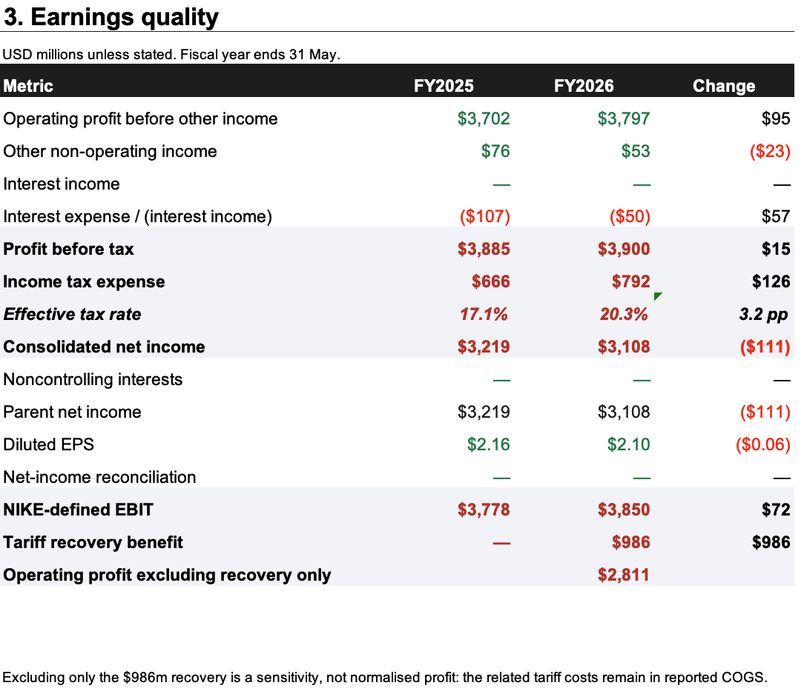

[Open the full-resolution Excel screenshot](evidence/Excel_3.png) · [Download the working Excel file](processed_data/NKE_Three_Statement_Analysis.xlsx)

**Company explanation — PDF page 33.**

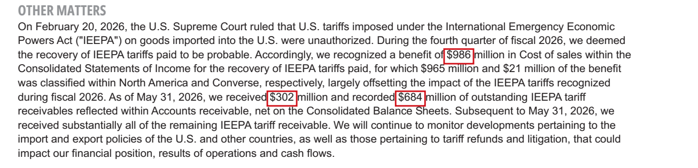

[↑ Back to questions](#analysis-questions)

## 4. Short-term liquidity: How much short-term liquidity is available?

**Answer:** The current ratio fell from **2.21× to 1.96×**, while cash and short-term investments totalled **$9,027m**.

**Why:** Current debt increased from zero to $2,000m as debt moved into the near-term maturity category. Net current assets remained positive at $12,056m. Liquidity is available, but balances alone do not prove future operating cash sufficiency. [Company explanation](raw_data/NKE_2026_Annual_Report.pdf#page=60).

**Calculation:** $24,603m current assets / $12,547m current liabilities = 1.96×. Cash and short-term investments cover current debt 4.51×. The FY2025 ratio to current debt is not applicable because the denominator was zero.

**Management action:** Match accessible liquid assets and committed facilities to debt, lease and operating payment dates.

📸 Compare the original report with the Excel analysis

**1. Original report — PDF page 60.** Red boxes identify the source figures. Source columns run **FY2026 → FY2025 → FY2024 where shown**; the balance sheet has two years.

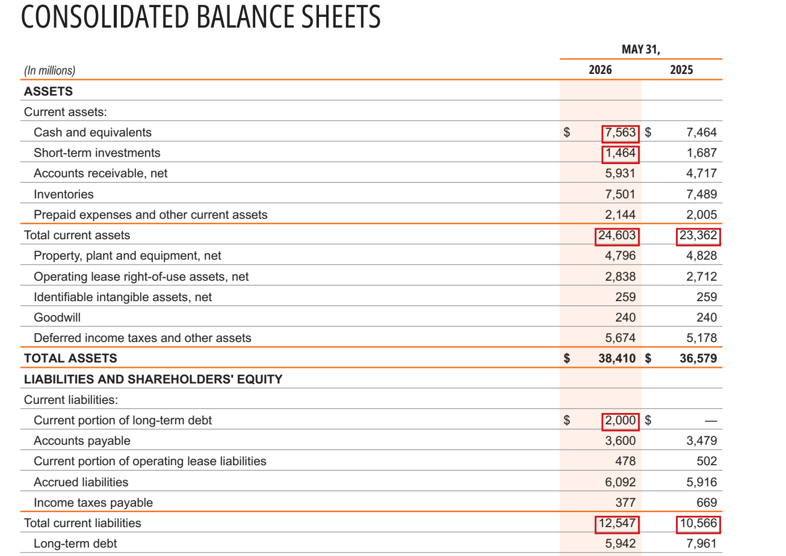

**2. Actual Excel worksheet — `NKE_4_Analysis`.** The same key figures and the calculated answer are highlighted in red. Excel runs **FY2025 → FY2026 → change**.

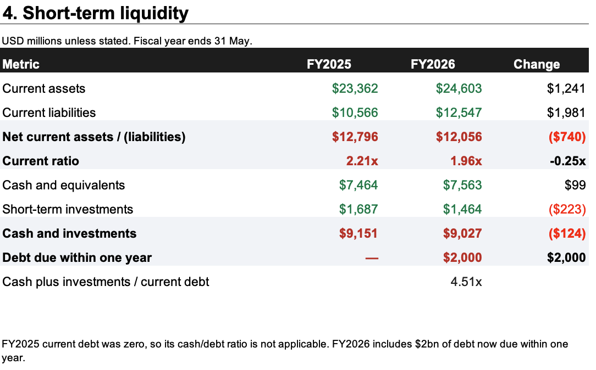

[Open the full-resolution Excel screenshot](evidence/Excel_4.png) · [Download the working Excel file](processed_data/NKE_Three_Statement_Analysis.xlsx)

[↑ Back to questions](#analysis-questions)

## 5. Working capital: Does the receivable increase mean customers are paying later?

**Answer:** Receivables increased **$1,214m**, but **$684m** of the closing balance was a tariff refund receivable, not a customer invoice.

**Why:** The refund balance explains about 56% of the receivable increase. Excluding it, closing AR was $5,247m, still $530m above FY2025. Management also cites wholesale growth and receipt timing. Subsequent collection of substantially all the tariff balance is disclosed in the annual report. [Company explanation](raw_data/NKE_2026_Annual_Report.pdf#page=33).

**Calculation:** Average-balance AR days rose from 36.0 to 41.9. Removing the closing tariff balance from the average gives a 39.2-day proxy. This still uses total company revenue, so it is not a pure credit-sales DSO or an ageing report.

**Management action:** Separate tax/customs claims from trade AR before investigating overdue customers and collection performance.

📸 Compare the original report with the Excel analysis

**1. Original report — PDF page 60.** Red boxes identify the source figures. Source columns run **FY2026 → FY2025 → FY2024 where shown**; the balance sheet has two years.

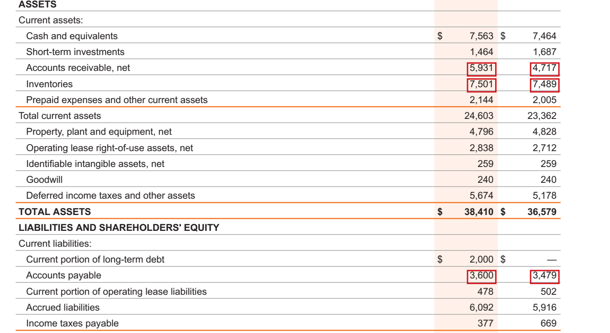

**2. Actual Excel worksheet — `NKE_5_Analysis`.** The same key figures and the calculated answer are highlighted in red. Excel runs **FY2025 → FY2026 → change**.

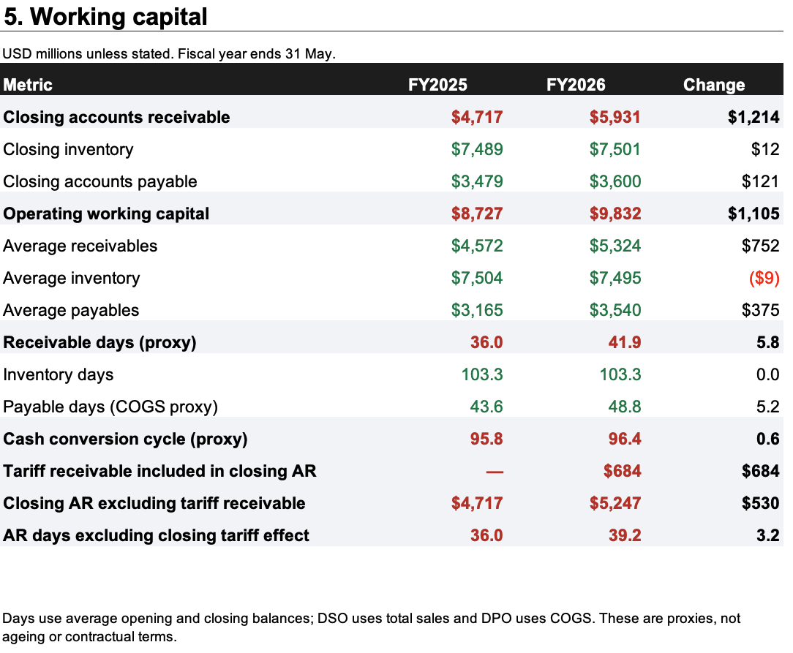

[Open the full-resolution Excel screenshot](evidence/Excel_5.png) · [Download the working Excel file](processed_data/NKE_Three_Statement_Analysis.xlsx)

**Company explanation — PDF page 33.**

[↑ Back to questions](#analysis-questions)

## 6. Funding and asset quality: Does net cash eliminate funding risk?

**Answer:** NIKE held **$1,085m of net cash including short-term investments**, but **25.2% of debt** was due within a year.

**Why:** Total debt was broadly unchanged at $7,942m, while $2,000m moved into current debt. The report also discloses lease obligations and endorsement commitments; these are not eliminated by a positive net-cash figure. [Company explanation](raw_data/NKE_2026_Annual_Report.pdf#page=49).

**Calculation:** $7,563m cash + $1,464m investments − $2,000m current debt − $5,942m long-term debt = $1,085m net cash. This measure excludes leases. Goodwill and intangibles account for only 1.3% of total assets.

**Management action:** Include lease and marketing commitments in cash planning before restarting larger discretionary distributions.

📸 Compare the original report with the Excel analysis

**1. Original report — PDF page 60.** Red boxes identify the source figures. Source columns run **FY2026 → FY2025 → FY2024 where shown**; the balance sheet has two years.

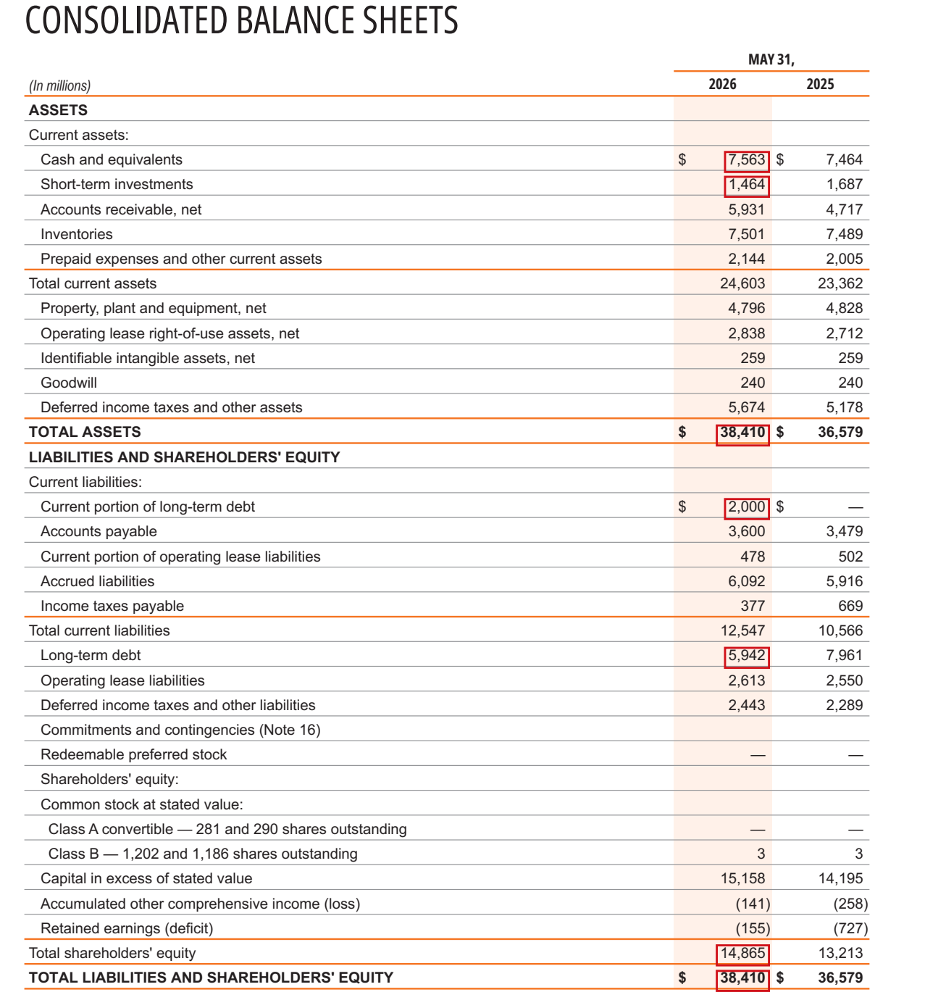

**2. Actual Excel worksheet — `NKE_6_Analysis`.** The same key figures and the calculated answer are highlighted in red. Excel runs **FY2025 → FY2026 → change**.

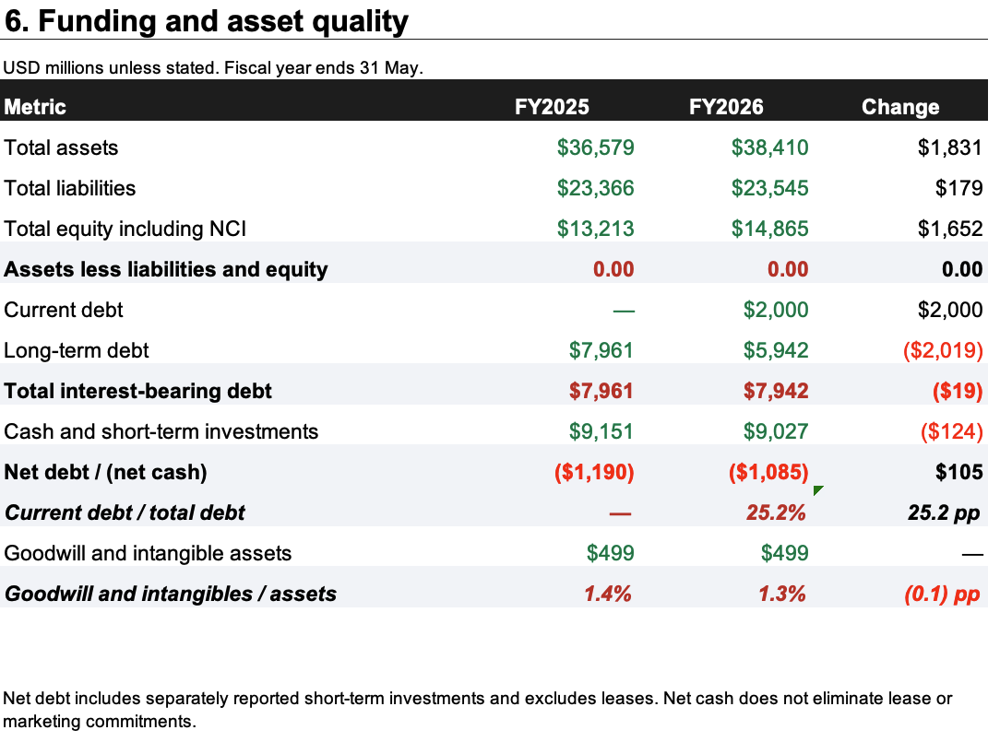

[Open the full-resolution Excel screenshot](evidence/Excel_6.png) · [Download the working Excel file](processed_data/NKE_Three_Statement_Analysis.xlsx)

[↑ Back to questions](#analysis-questions)

## 7. Profit to operating cash: Why was operating cash flow below profit?

**Answer:** CFO fell **$830m (-22.4%)** to **$2,868m**, only **92.3% of net income**.

**Why:** The receivables cash effect worsened $950m and payables/other liabilities worsened $533m. Other assets improved $743m. The report identifies the tariff receivable, wholesale timing and US tax payments as important explanations. [Company explanation](raw_data/NKE_2026_Annual_Report.pdf#page=48).

**Calculation:** $3,108m net income + $1,438m noncash adjustments − $1,678m working-capital and other balance changes = $2,868m CFO. The worksheet reconciles every disclosed component exactly.

**Management action:** Forecast trade collections, tariff refunds and tax payments separately so cash forecasts follow their actual timing.

📸 Compare the original report with the Excel analysis

**1. Original report — PDF page 61.** Red boxes identify the source figures. Source columns run **FY2026 → FY2025 → FY2024 where shown**; the balance sheet has two years.

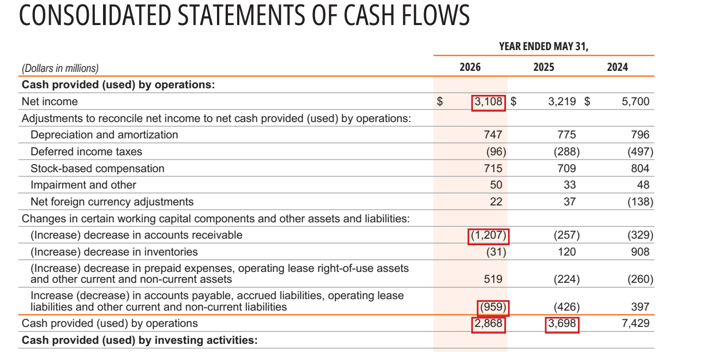

**2. Actual Excel worksheet — `NKE_7_Analysis`.** The same key figures and the calculated answer are highlighted in red. Excel runs **FY2025 → FY2026 → change**.

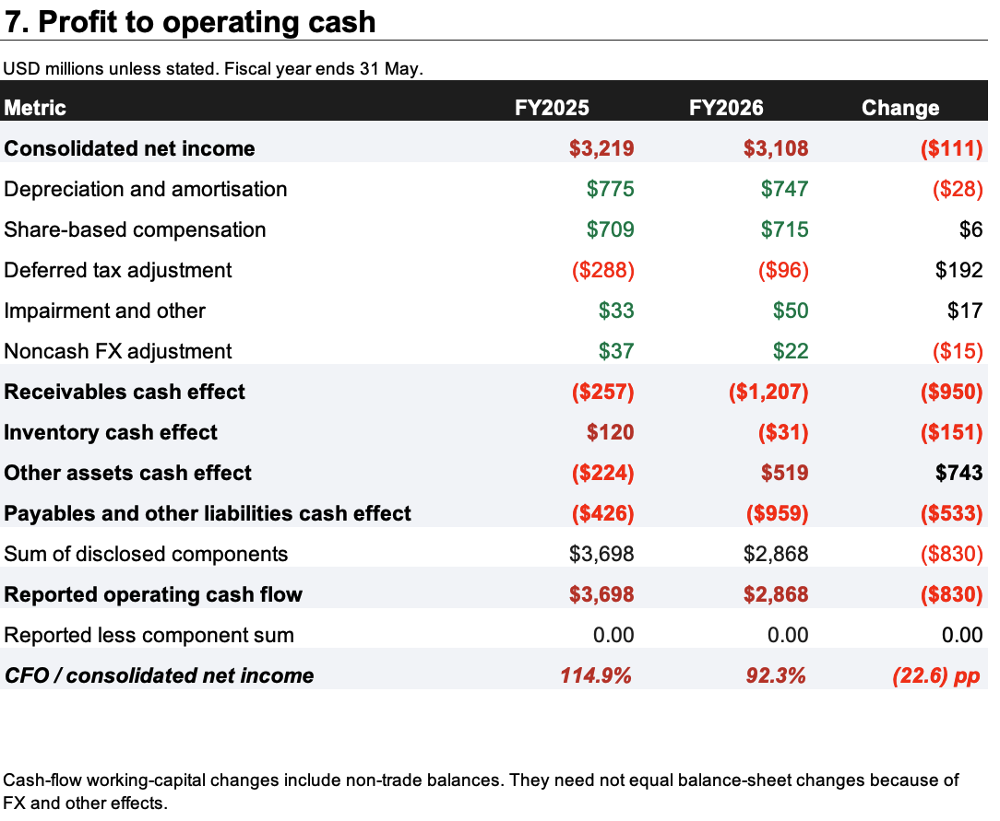

[Open the full-resolution Excel screenshot](evidence/Excel_7.png) · [Download the working Excel file](processed_data/NKE_Three_Statement_Analysis.xlsx)

**Company explanation — PDF page 48.**

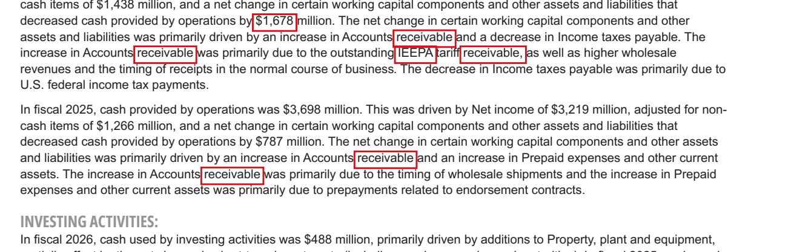

[↑ Back to questions](#analysis-questions)

## 8. Cash available after investment: Could free cash flow fund dividends and buybacks?

**Answer:** FCF fell to **$2,184m**, below **$2,407m of dividends**. After dividends and cash buybacks, the shortfall was **$369m**.

**Why:** CFO declined $830m and capex increased $254m, reducing FCF by $1,084m. Cash buybacks fell sharply from $2,985m to $146m, which protected liquidity despite weak cash conversion. [Company explanation](raw_data/NKE_2026_Annual_Report.pdf#page=61).

**Calculation:** FCF = $2,868m CFO − $684m capex. Subtract $2,407m dividends and $146m cash repurchases. The cash-flow repurchase amount differs from the narrower $122.4m programme figure; this analysis consistently uses the cash-flow statement.

**Management action:** Link buyback capacity to sustainable post-investment cash, with explicit dividend and maturity cover.

📸 Compare the original report with the Excel analysis

**1. Original report — PDF page 61.** Red boxes identify the source figures. Source columns run **FY2026 → FY2025 → FY2024 where shown**; the balance sheet has two years.

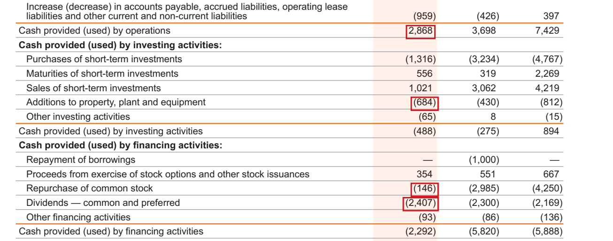

**2. Actual Excel worksheet — `NKE_8_Analysis`.** The same key figures and the calculated answer are highlighted in red. Excel runs **FY2025 → FY2026 → change**.

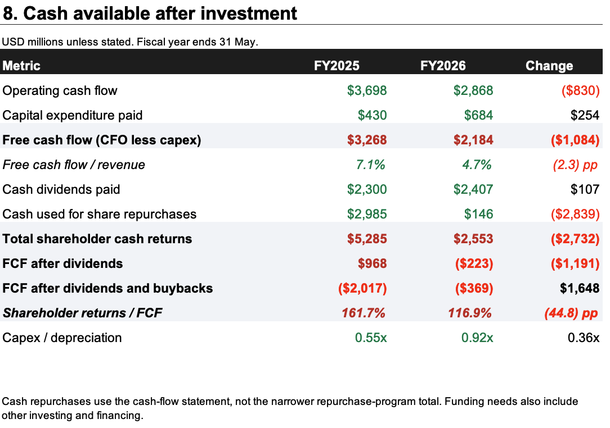

[Open the full-resolution Excel screenshot](evidence/Excel_8.png) · [Download the working Excel file](processed_data/NKE_Three_Statement_Analysis.xlsx)

[↑ Back to questions](#analysis-questions)

## 9. Cash reconciliation: Why did cash rise despite weaker operating cash flow?

**Answer:** Closing cash rose **$99m** to **$7,563m** because lower financing outflows offset weaker operations.

**Why:** Financing cash outflow declined by $3,528m, mainly reflecting much lower buybacks and the absence of the previous year’s $1bn debt repayment. Stable cash therefore does not prove an operating recovery. [Company explanation](raw_data/NKE_2026_Annual_Report.pdf#page=48).

**Calculation:** **$7,464m opening cash + $2,868m CFO − $488m investing − $2,292m financing + $11m FX = $7,563m closing cash.** Both years reconcile exactly to balance-sheet cash.

**Management action:** Show the operating-cash decline and financing restraint together in the cash narrative.

📸 Compare the original report with the Excel analysis

**1. Original report — PDF page 61.** Red boxes identify the source figures. Source columns run **FY2026 → FY2025 → FY2024 where shown**; the balance sheet has two years.

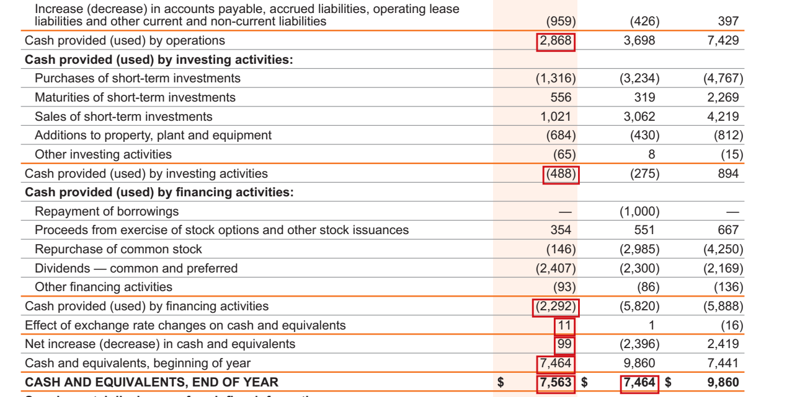

**2. Actual Excel worksheet — `NKE_9_Analysis`.** The same key figures and the calculated answer are highlighted in red. Excel runs **FY2025 → FY2026 → change**.

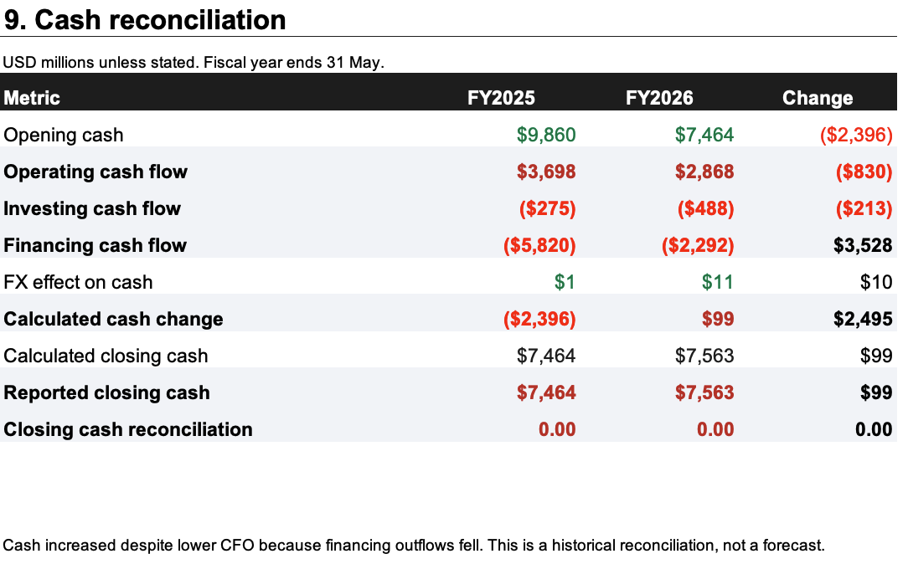

[Open the full-resolution Excel screenshot](evidence/Excel_9.png) · [Download the working Excel file](processed_data/NKE_Three_Statement_Analysis.xlsx)

[↑ Back to questions](#analysis-questions)

## Management handoff

These are proposed follow-ups from an external financial review; no internal company data or management meetings are claimed.

| Priority | Proposed follow-up | Measure to monitor | Internal evidence needed |
|---|---|---|---|
| Commercial recovery | Test wholesale sell-through and Direct recovery | Traffic, conversion, returns and channel margin | Retail sell-through, channel P&L and returns |
| Collections | Separate trade AR from tariff refunds | Trade ageing and refund collection dates | AR ledger, customer terms and customs claims |
| Cash discipline | Link capital returns to cash capacity | FCF dividend cover and maturity headroom | Cash forecast, commitments and capex plan |

## Skills demonstrated

| Skill | Where to see it |
|---|---|
| Commercial performance analysis | Questions 1–2: sales drivers, cost changes and operating margins |
| Earnings-quality review | Question 3: tax, non-operating items and recurring-performance considerations |
| Working-capital and funding analysis | Questions 4–6: liquidity, average-balance days and debt composition |
| Cash-flow analysis | Questions 7–9: profit-to-cash reconciliation, investment and capital returns |
| Excel and quality control | Linked inputs, live formulas, visible reconciliation differences and source references |
| Management reporting | Clear findings, proposed actions and a list of the internal data needed next |

**Scope:** this is an external historical financial review. Annual accounts cannot establish customer ageing, campaign ROI, monthly seasonality or SKU profitability. Company explanations are attributed; calculated results and proposed actions are identified separately. The annual period is kept fixed, so later interim results are not blended into this comparison.

[Methods and checks](processed_data/README.md) · [Back to P&L projects](../README.md)
