# P&G — P&L and Three-Statement Analysis

**🎯 Goal:** explain how sales and costs affect profit, how the balance sheet uses funding, and where the cash goes.

- **Data:** original annual report and comparative FY2025 / FY2026 financial statements. Fiscal year ends **30 June**.
- **Work:** nine finance questions, reconciled Excel calculations and evidence from the original report.
- **Deliverables:** performance review, profit and cash bridges, working-capital ratios and proposed management actions.

[📗 Excel analysis](processed_data/PG_Three_Statement_Analysis.xlsx) · [📂 Original data](raw_data/README.md) · [📊 Analysis outputs](processed_data/README.md) · [🧭 Portfolio](https://github.com/hoichengit/Portfolio-Guide)

**The main conclusion:** P&G grew sales but retained less operating profit per dollar. Cash generation improved, with a meaningful contribution from payables and other operating adjustments.

## Analysis questions

| Statement | Analysis | Question |
|---|---|---|
| P&L | [1. Revenue sources](#analysis-1) | What drove sales growth? |
| P&L | [2. Operating profitability](#analysis-2) | Why did operating profit fall while sales grew? |
| P&L | [3. Earnings quality](#analysis-3) | Why did net income increase despite weaker operating profit? |
| Balance sheet | [4. Short-term liquidity](#analysis-4) | Can near-term obligations be covered? |
| Balance sheet | [5. Working capital](#analysis-5) | Is more cash tied up in trading? |
| Balance sheet | [6. Funding and asset quality](#analysis-6) | What are the funding and asset-quality risks? |
| Cash flow | [7. Profit to operating cash](#analysis-7) | Why did operating cash flow improve? |
| Cash flow | [8. Cash available after investment](#analysis-8) | Did free cash flow cover shareholder returns? |
| Cash flow | [9. Cash reconciliation](#analysis-9) | How do the three statements reconcile to closing cash? |

Amounts are **USD millions** unless stated. Comparisons are **actual vs prior year**, not budget vs actual. A percentage-point change measures the difference between two rates.

## 1. Revenue sources: What drove sales growth?

**Answer:** Revenue rose **$2,748m (+3.3%)** to **$87,032m**. Company-reported organic sales grew **1%**, while volume was unchanged.

**Why:** P&G attributes reported sales growth to roughly **2 percentage points of FX** and **1 point of pricing**, with no change in volume or mix. The headline growth rate therefore overstates volume momentum. [Company explanation](raw_data/PG_2026_Annual_Report.pdf#page=32).

**Calculation:** Divide the sales increase by prior-year sales. Applying the rounded 3% driver total to $84,284m explains $2,528.52m; the remaining $219.48m is a rounding / interaction residual, not a newly identified business driver.

**Management action:** Track organic volume and category mix separately from currency translation.

📸 Compare the original report with the Excel analysis

**1. Original report — PDF page 49.** Red boxes identify the source figures. Source columns run **FY2026 → FY2025 → FY2024 where shown**; the balance sheet has two years.

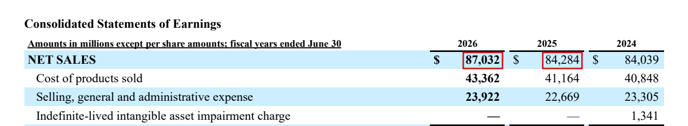

**2. Actual Excel worksheet — `PG_1_Analysis`.** The same key figures and the calculated answer are highlighted in red. Excel runs **FY2025 → FY2026 → change**.

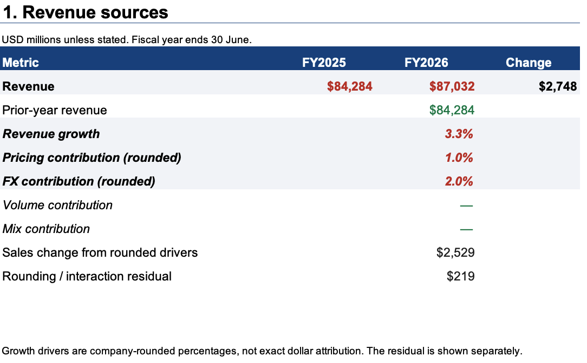

[Open the full-resolution Excel screenshot](evidence/Excel_1.png) · [Download the working Excel file](processed_data/PG_Three_Statement_Analysis.xlsx)

**Company explanation — PDF page 32.**

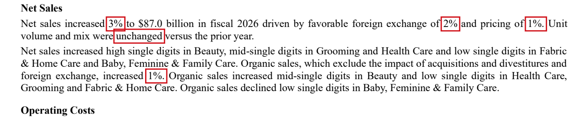

[↑ Back to questions](#analysis-questions)

## 2. Operating profitability: Why did operating profit fall while sales grew?

**Answer:** Operating profit fell **$703m (-3.4%)** to **$19,748m**. Operating margin fell from **24.3% to 22.7%**.

**Why:** Gross profit increased only $550m, while SG&A increased $1,253m. Management reports a 100bp gross-margin decline: product mix, product investment and restructuring outweighed manufacturing savings and pricing. Advertising rose from approximately $9.2bn to $10.2bn. [Company explanation](raw_data/PG_2026_Annual_Report.pdf#page=33).

**Calculation:** The exact accounting bridge is **+$2,748m sales − $2,198m additional COGS − $1,253m additional SG&A = −$703m profit**. It reconciles the change but is not a pure volume/price attribution. Gross margin calculated from unrounded ratios fell 98bp; management rounds this to 100bp.

**Management action:** Review product contribution margins and incremental advertising returns before assuming that more revenue will restore profit.

📸 Compare the original report with the Excel analysis

**1. Original report — PDF page 49.** Red boxes identify the source figures. Source columns run **FY2026 → FY2025 → FY2024 where shown**; the balance sheet has two years.

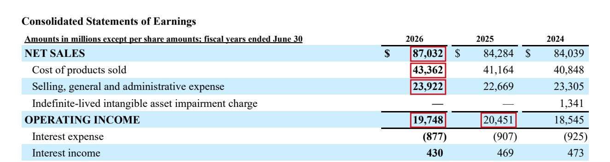

**2. Actual Excel worksheet — `PG_2_Analysis`.** The same key figures and the calculated answer are highlighted in red. Excel runs **FY2025 → FY2026 → change**.

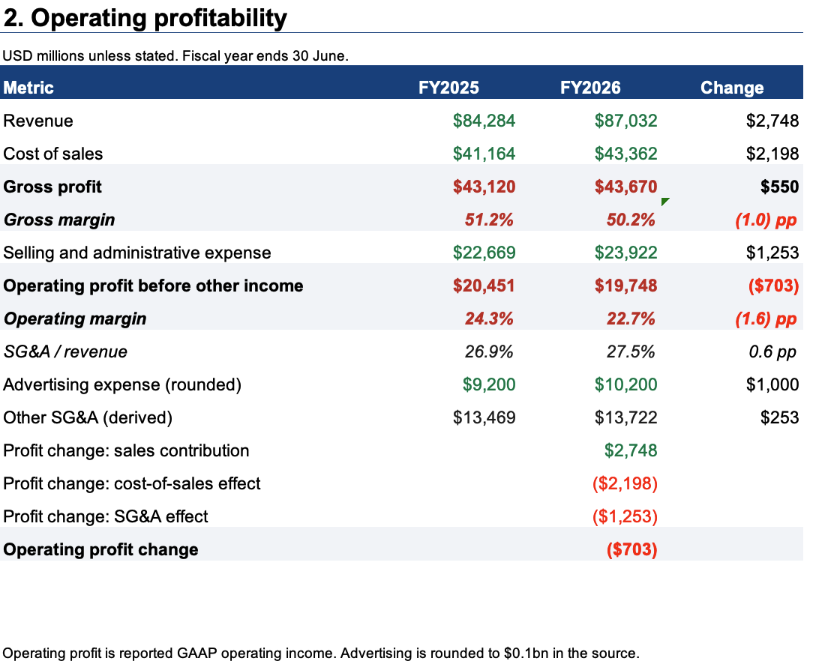

[Open the full-resolution Excel screenshot](evidence/Excel_2.png) · [Download the working Excel file](processed_data/PG_Three_Statement_Analysis.xlsx)

**Company explanation — PDF page 33.**

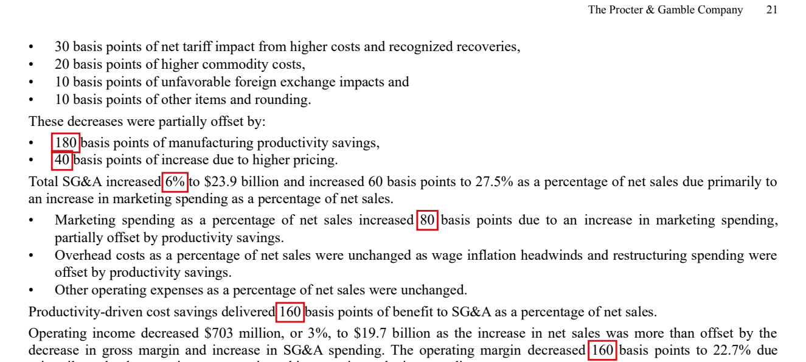

[↑ Back to questions](#analysis-questions)

## 3. Earnings quality: Why did net income increase despite weaker operating profit?

**Answer:** Consolidated net income increased **$79m**, even though operating profit fell **$703m**. Other non-operating income increased **$922m**.

**Why:** The report identifies prior-year Argentina liquidation-related charges and a current-year Glad joint-venture dissolution gain. These comparability items help net earnings without demonstrating stronger recurring trading profit. [Company explanation](raw_data/PG_2026_Annual_Report.pdf#page=33).

**Calculation:** **−$703m operating profit + $922m other income − $39m interest income + $30m lower interest expense − $131m extra tax = +$79m net income.** Parent earnings rose $72m after noncontrolling interests. EPS also benefited from fewer shares.

**Management action:** Present operating performance, non-operating items and per-share effects separately in the management report.

📸 Compare the original report with the Excel analysis

**1. Original report — PDF page 49.** Red boxes identify the source figures. Source columns run **FY2026 → FY2025 → FY2024 where shown**; the balance sheet has two years.

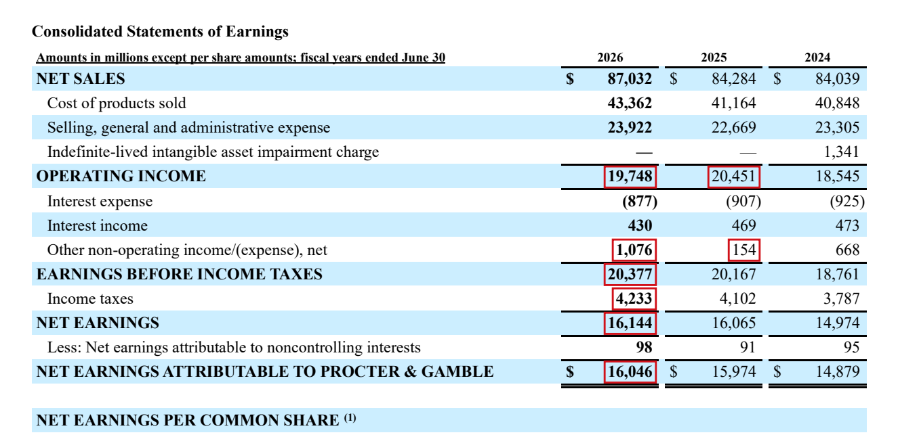

**2. Actual Excel worksheet — `PG_3_Analysis`.** The same key figures and the calculated answer are highlighted in red. Excel runs **FY2025 → FY2026 → change**.

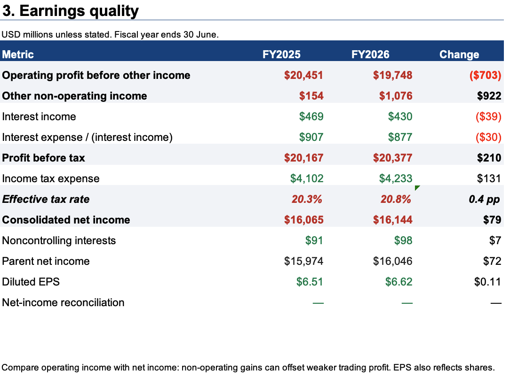

[Open the full-resolution Excel screenshot](evidence/Excel_3.png) · [Download the working Excel file](processed_data/PG_Three_Statement_Analysis.xlsx)

[↑ Back to questions](#analysis-questions)

## 4. Short-term liquidity: Can near-term obligations be covered?

**Answer:** Current liabilities exceed current assets by **$12,486m**. The current ratio is **0.68×**, down from **0.70×**.

**Why:** Debt due within one year increased to $11,296m. P&G also generated $19,556m of annual operating cash flow and disclosed $8bn of undrawn facilities at year-end. A low current ratio needs a funding plan; it does not alone establish financial distress. [Company explanation](raw_data/PG_2026_Annual_Report.pdf#page=38).

**Calculation:** Current ratio = $26,208m / $38,694m. Cash of $9,942m covers 0.88× current debt. Annual CFO and facilities provide context, not a guarantee that all liabilities can be paid on every due date.

**Management action:** Build a dated maturity and cash-needs schedule, including facility renewal dates and downside cash generation.

📸 Compare the original report with the Excel analysis

**1. Original report — PDF page 50.** Red boxes identify the source figures. Source columns run **FY2026 → FY2025 → FY2024 where shown**; the balance sheet has two years.

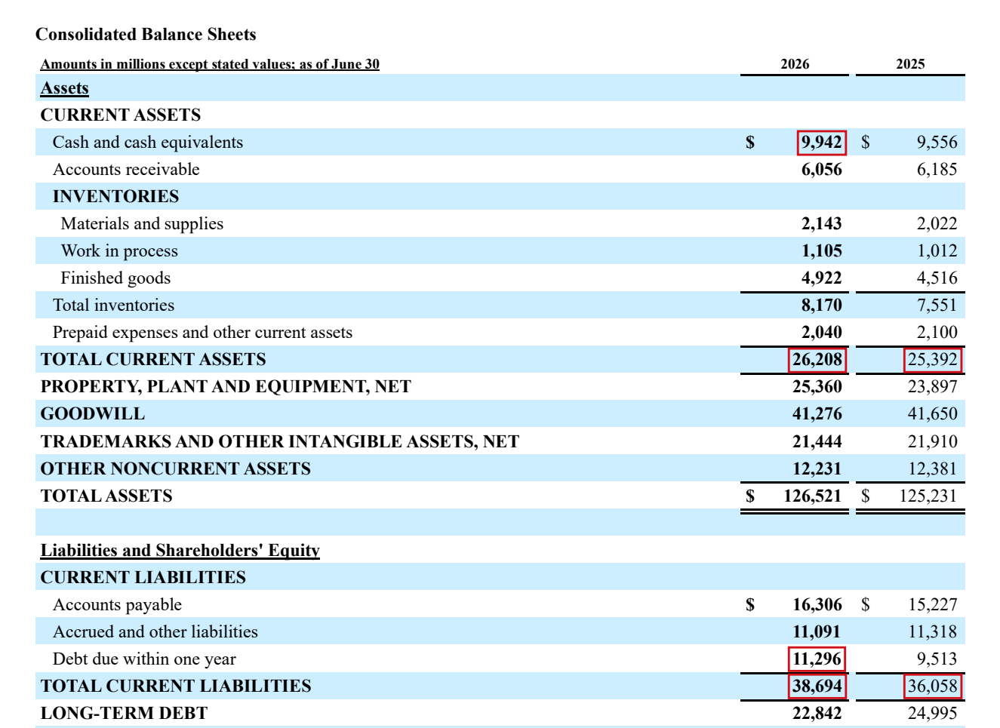

**2. Actual Excel worksheet — `PG_4_Analysis`.** The same key figures and the calculated answer are highlighted in red. Excel runs **FY2025 → FY2026 → change**.

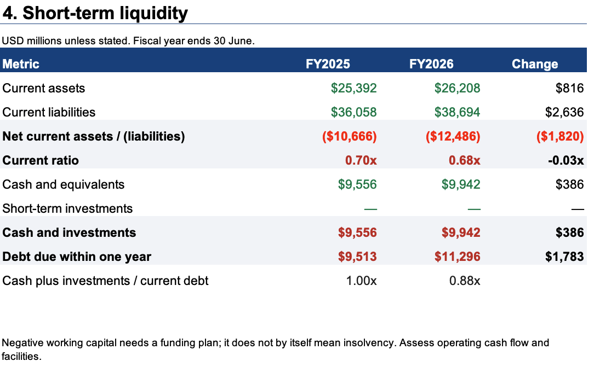

[Open the full-resolution Excel screenshot](evidence/Excel_4.png) · [Download the working Excel file](processed_data/PG_Three_Statement_Analysis.xlsx)

[↑ Back to questions](#analysis-questions)

## 5. Working capital: Is more cash tied up in trading?

**Answer:** Inventory increased **$619m**, but payables increased **$1,079m**. Net operating working capital fell to **−$2,080m**.

**Why:** Management attributes inventory growth to safety stock and new products, and higher payables to supply-chain and marketing activity. Average-balance inventory days increased from 64.6 to 66.2. The cash conversion cycle proxy became less negative: −44.4 to −40.9 days. [Company explanation](raw_data/PG_2026_Annual_Report.pdf#page=37).

**Calculation:** Operating working capital = receivables + inventory − payables. Days use average opening and closing balances. DSO uses total sales; DPO uses COGS because purchases are not supplied. Payables include costs beyond inventory, so this is a broad proxy, not contractual supplier terms.

**Management action:** Check safety-stock requirements and supplier payment terms together; do not treat every inventory increase as waste.

📸 Compare the original report with the Excel analysis

**1. Original report — PDF page 50.** Red boxes identify the source figures. Source columns run **FY2026 → FY2025 → FY2024 where shown**; the balance sheet has two years.

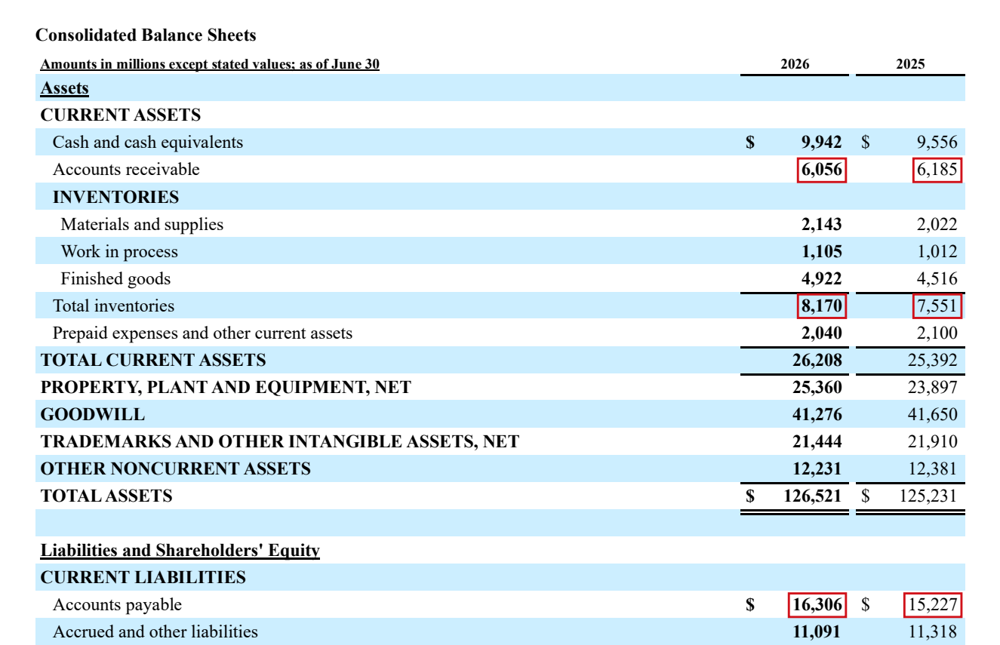

**2. Actual Excel worksheet — `PG_5_Analysis`.** The same key figures and the calculated answer are highlighted in red. Excel runs **FY2025 → FY2026 → change**.

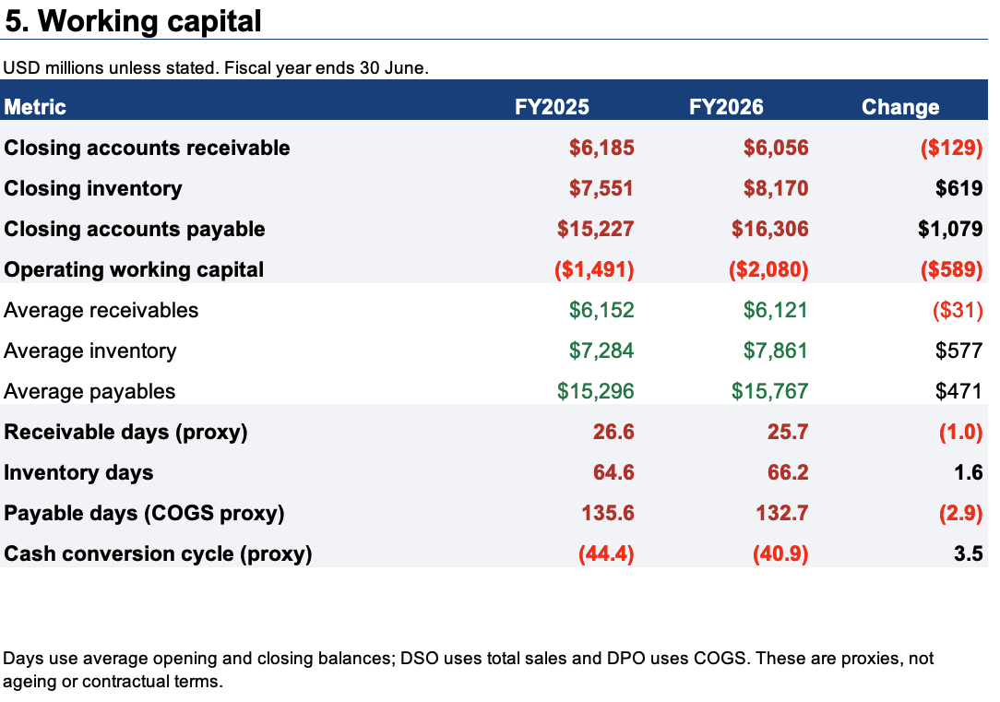

[Open the full-resolution Excel screenshot](evidence/Excel_5.png) · [Download the working Excel file](processed_data/PG_Three_Statement_Analysis.xlsx)

**Company explanation — PDF page 37.**

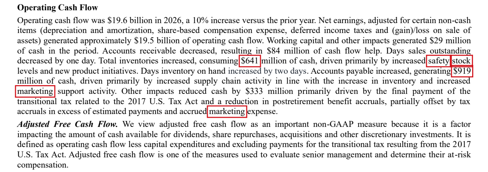

[↑ Back to questions](#analysis-questions)

## 6. Funding and asset quality: What are the funding and asset-quality risks?

**Answer:** Net debt fell **$756m** to **$24,196m**, while the share of debt due within a year rose from **27.6% to 33.1%**. Goodwill and intangibles represent **49.6% of assets**.

**Why:** Lower total debt improves the headline position, but a greater current portion increases refinancing attention. Acquired intangible assets are not a source of near-term cash; their carrying values rely on future business performance. [Company explanation](raw_data/PG_2026_Annual_Report.pdf#page=50).

**Calculation:** Net debt = $11,296m current debt + $22,842m long-term debt − $9,942m cash. Goodwill plus intangibles = $62,720m / $126,521m assets. Leases are excluded from this debt measure. The reported FY2025 balance-sheet totals have a $1m rounding difference, retained in Excel.

**Management action:** Monitor maturities and review the annual impairment assumptions for major acquired brands.

📸 Compare the original report with the Excel analysis

**1. Original report — PDF page 50.** Red boxes identify the source figures. Source columns run **FY2026 → FY2025 → FY2024 where shown**; the balance sheet has two years.

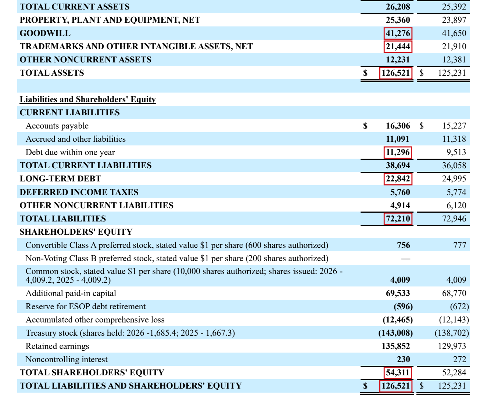

**2. Actual Excel worksheet — `PG_6_Analysis`.** The same key figures and the calculated answer are highlighted in red. Excel runs **FY2025 → FY2026 → change**.

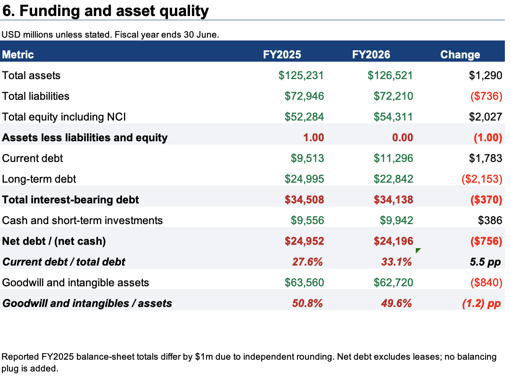

[Open the full-resolution Excel screenshot](evidence/Excel_6.png) · [Download the working Excel file](processed_data/PG_Three_Statement_Analysis.xlsx)

[↑ Back to questions](#analysis-questions)

## 7. Profit to operating cash: Why did operating cash flow improve?

**Answer:** CFO increased **$1,739m** to **$19,556m**, or **121.1% of consolidated net income**.

**Why:** The year-on-year payables cash effect improved $1,461m and other operating adjustments improved $1,320m. These were partly offset by a $1,106m change in asset gain/loss adjustments and $317m more inventory cash use. The improvement is broader than earnings growth. [Company explanation](raw_data/PG_2026_Annual_Report.pdf#page=37).

**Calculation:** Start with consolidated net income, add the disclosed noncash adjustments, then include each working-capital cash effect. The nine reported components exceed total CFO by $1m in both years; the difference is shown, not hidden.

**Management action:** Separate recurring cash generation from supplier timing, tax timing and noncash accounting adjustments.

📸 Compare the original report with the Excel analysis

**1. Original report — PDF page 52.** Red boxes identify the source figures. Source columns run **FY2026 → FY2025 → FY2024 where shown**; the balance sheet has two years.

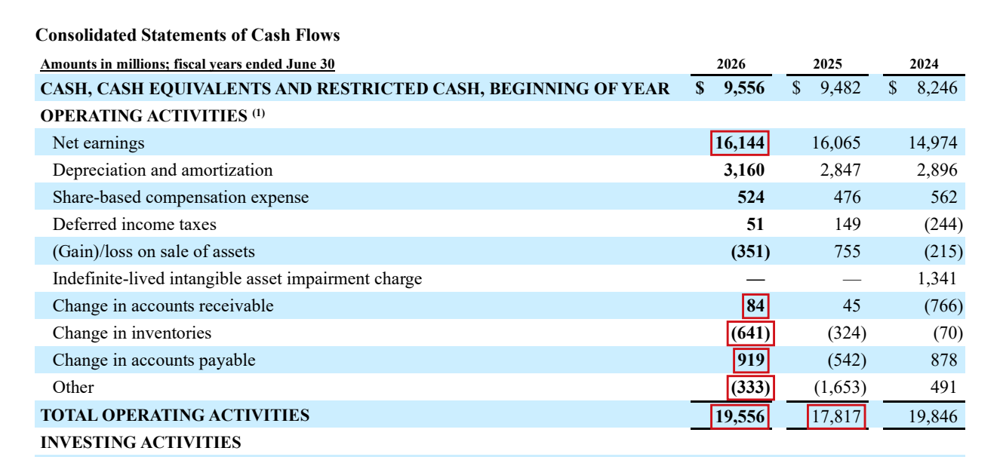

**2. Actual Excel worksheet — `PG_7_Analysis`.** The same key figures and the calculated answer are highlighted in red. Excel runs **FY2025 → FY2026 → change**.

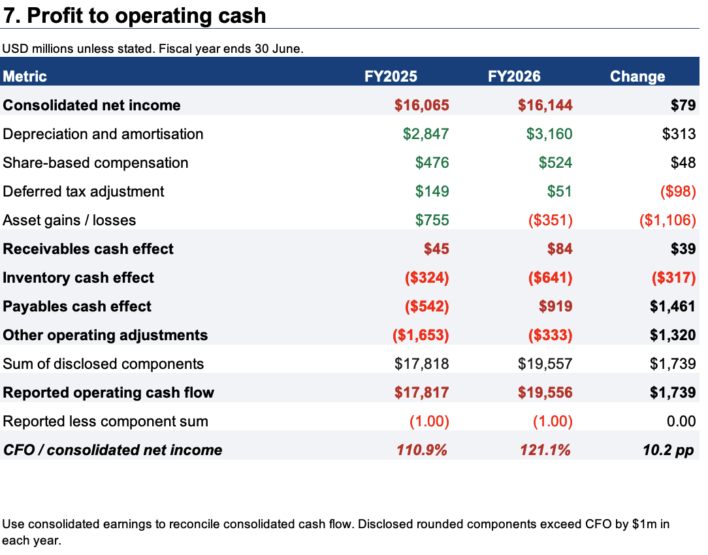

[Open the full-resolution Excel screenshot](evidence/Excel_7.png) · [Download the working Excel file](processed_data/PG_Three_Statement_Analysis.xlsx)

**Company explanation — PDF page 37.**

[↑ Back to questions](#analysis-questions)

## 8. Cash available after investment: Did free cash flow cover shareholder returns?

**Answer:** Free cash flow was **$15,147m**. Dividends and cash buybacks totalled **$15,260m**, exceeding FCF by **$113m**.

**Why:** CFO rose $1,739m, but capex also rose $636m. Lower buybacks narrowed the shortfall from $2,328m in FY2025. This is a cash allocation comparison, not proof that dividends are unsustainable. [Company explanation](raw_data/PG_2026_Annual_Report.pdf#page=52).

**Calculation:** FCF = $19,556m CFO − $4,409m capex. Subtract $10,232m dividends and $5,028m cash repurchases. P&G’s adjusted FCF is $15,835m because it adds back $688m of transition-tax payments; the two definitions should not be mixed.

**Management action:** Assess discretionary buybacks after planned investment, debt maturities and a liquidity buffer.

📸 Compare the original report with the Excel analysis

**1. Original report — PDF page 52.** Red boxes identify the source figures. Source columns run **FY2026 → FY2025 → FY2024 where shown**; the balance sheet has two years.

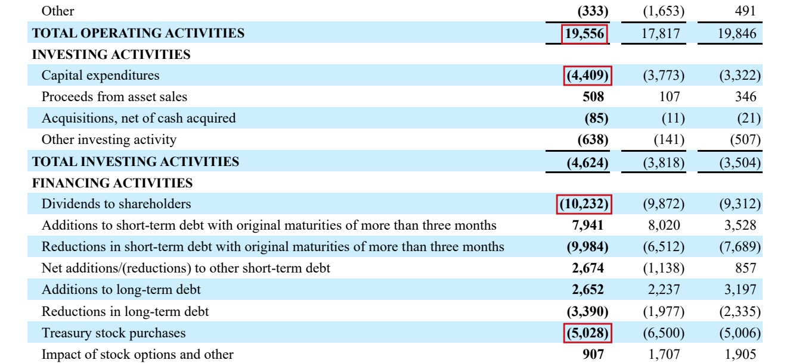

**2. Actual Excel worksheet — `PG_8_Analysis`.** The same key figures and the calculated answer are highlighted in red. Excel runs **FY2025 → FY2026 → change**.

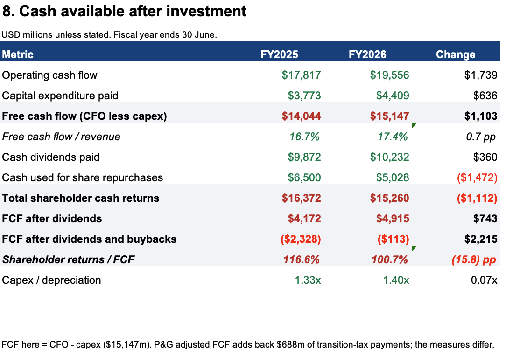

[Open the full-resolution Excel screenshot](evidence/Excel_8.png) · [Download the working Excel file](processed_data/PG_Three_Statement_Analysis.xlsx)

[↑ Back to questions](#analysis-questions)

## 9. Cash reconciliation: How do the three statements reconcile to closing cash?

**Answer:** Cash increased **$386m** to **$9,942m**, despite a **$16,144m accounting profit**.

**Why:** Operating cash was largely used for investment and financing distributions. Profit is therefore not the amount retained in the bank. [Company explanation](raw_data/PG_2026_Annual_Report.pdf#page=52).

**Calculation:** **$9,556m opening cash + $19,556m CFO − $4,624m investing − $14,460m financing − $86m FX = $9,942m closing cash.** The result matches balance-sheet cash. The FY2025 comparator retains its $1m source rounding difference.

**Management action:** Use this cash reconciliation alongside the P&L when explaining performance to management.

📸 Compare the original report with the Excel analysis

**1. Original report — PDF page 52.** Red boxes identify the source figures. Source columns run **FY2026 → FY2025 → FY2024 where shown**; the balance sheet has two years.

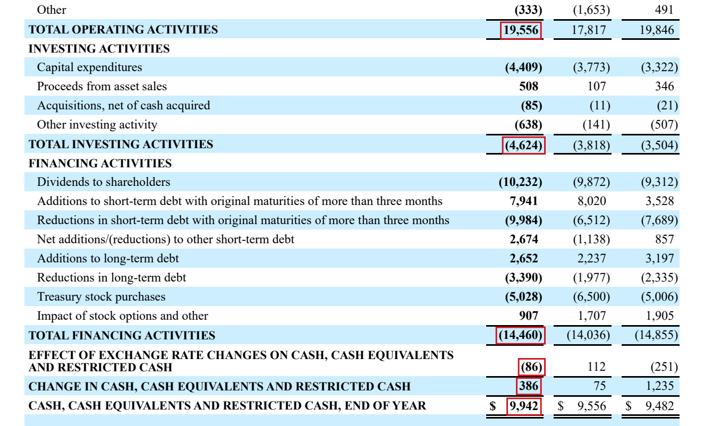

**2. Actual Excel worksheet — `PG_9_Analysis`.** The same key figures and the calculated answer are highlighted in red. Excel runs **FY2025 → FY2026 → change**.

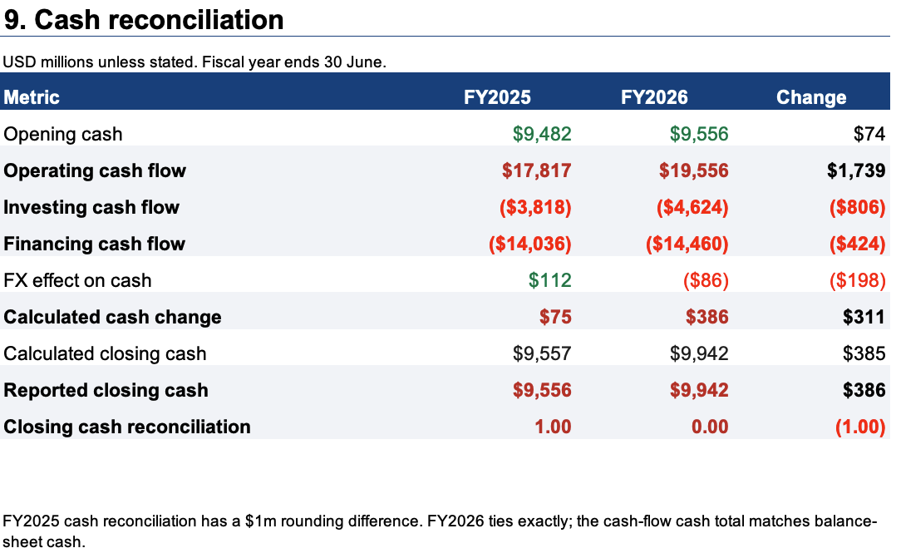

[Open the full-resolution Excel screenshot](evidence/Excel_9.png) · [Download the working Excel file](processed_data/PG_Three_Statement_Analysis.xlsx)

[↑ Back to questions](#analysis-questions)

## Management handoff

These are proposed follow-ups from an external financial review; no internal company data or management meetings are claimed.

| Priority | Proposed follow-up | Measure to monitor | Internal evidence needed |
|---|---|---|---|
| Margin recovery | Review mix and incremental marketing returns | Gross margin and product contribution | SKU margins, campaign spend and incremental sales |
| Inventory and suppliers | Validate safety-stock needs and supplier funding | Inventory ageing, cash conversion cycle and payment terms | Stock ageing, service levels, purchase ledger |
| Cash allocation | Schedule investment, dividends and debt maturities | Post-investment cash and funding headroom | Monthly cash forecast and maturity schedule |

## Skills demonstrated

| Skill | Where to see it |
|---|---|
| Commercial performance analysis | Questions 1–2: sales drivers, cost changes and operating margins |
| Earnings-quality review | Question 3: tax, non-operating items and recurring-performance considerations |
| Working-capital and funding analysis | Questions 4–6: liquidity, average-balance days and debt composition |
| Cash-flow analysis | Questions 7–9: profit-to-cash reconciliation, investment and capital returns |
| Excel and quality control | Linked inputs, live formulas, visible reconciliation differences and source references |
| Management reporting | Clear findings, proposed actions and a list of the internal data needed next |

**Scope:** this is an external historical financial review. Annual accounts cannot establish customer ageing, campaign ROI, monthly seasonality or SKU profitability. Company explanations are attributed; calculated results and proposed actions are identified separately. The annual period is kept fixed, so later interim results are not blended into this comparison.

[Methods and checks](processed_data/README.md) · [Back to P&L projects](../README.md)
