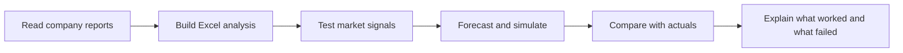

# P&G | Financial Analysis & Forecast Review 📊

**Can public information help us judge P&G's outlook and forecast its next results?**

This project follows the work from company guidance to market research, forecasts and actual results. It shows the calculations, the evidence and the forecasts that did not work.

[▶️ Start with the quick read](analysis/13_quick_read.md) · [📥 Open the latest Excel](outputs/jan_mar_replay/PG_12_Jan_Mar_Replay.xlsx) · [🔎 Check the detailed results](analysis/12_jan_mar_replay.md)

## 🎯 The goal

- Turn public financial reports into clear Excel analysis.
- Test market signals before changing a forecast.
- Compare predictions with actual results and simple benchmarks.
- Explain uncertainty without hiding model failures.

## 🧠 The latest finding

**The model is not reliable enough yet.**

| January–March 2026 test | Average absolute error |
|---|---:|
| Initial forecast, using information through 22 January | 2.50 percentage points |
| Updated forecast, using information through 23 April | 2.85 percentage points |
| Simple average of the last four reported quarters | 2.63 percentage points |

The update was less accurate. Its simulated 80% ranges covered only **1 of 6** actual outcomes.

**These are historical reconstructions.** Calculations use dated inputs, but the model was designed after historical outcomes had been seen.

## 🛠️ How the work flows

## 📚 Explore the project

### 1. Understand the company's outlook

Read the guidance and translate a full-year range into a remaining-quarter sales requirement.

- [Company guidance](analysis/01_management_guidance.md)
- [April–June sales needed to reach that guidance](analysis/02_quarter_sales_target.md)

### 2. Challenge the forecast with market evidence

Match company results with market data, test earlier quarters and estimate missing market months.

- [Scenario adjustment and research questions](analysis/03_scenario_adjustment.md)
- [Historical company and market comparisons](analysis/04_historical_matching.md)
- [Tests using information available at each date](analysis/05_release_backtest.md)
- [Additional drivers and tariff timing](analysis/06_driver_policy_tests.md)
- [Market relationships and missing-month forecasts](analysis/07_two_stage_forecast.md)

### 3. Compare forecasts with actuals

Measure errors, investigate the misses and test whether model improvements last.

- [April–June forecast versus actual](analysis/08_april24_forecast_vs_actual.md)
- [Business explanations and Monte Carlo simulation](analysis/09_variance_causes_and_risk.md)
- [Revised forecasting methods](analysis/11_forecast_improvement.md)
- [January–March replay and future-information checks](analysis/12_jan_mar_replay.md)
- **[Simple version: what we did and what we learned](analysis/13_quick_read.md)**

## 🧰 Skills demonstrated

| Skill | Example from the project |
|---|---|
| Financial research | Trace growth measures and guidance back to dated company releases. |
| Excel analysis | Reconcile annual and quarterly amounts; calculate forecast errors. |
| Market analysis | Match monthly indicators to quarterly financial results. |
| Python modeling | Run historical forecast comparisons and risk simulations. |
| Quality checks | Test date cutoffs, missing data and future-information leakage. |
| Communication | Present conclusions first, with expandable evidence and clear limitations. |

## 📁 Open the outputs

| Analysis | Workbook |
|---|---|
| Company guidance | [Excel](outputs/april_guidance_sample/PG_1_Management_Guidance.xlsx) |
| Historical market analysis | [Excel](outputs/history_review/PG_4_Historical_Market_Analysis.xlsx) |
| Driver and policy tests | [Excel](outputs/driver_tests/PG_6_Driver_and_Policy_Tests.xlsx) |
| Missing-month forecasts | [Excel](outputs/two_stage/PG_7_Two_Stage_Forecast.xlsx) |
| April–June forecast comparison | [Excel](outputs/april24_forecast/PG_8_April24_Forecast_vs_Actual.xlsx) |
| Variance causes and simulation | [Excel](outputs/variance_causes/PG_9_Variance_Causes_and_Monte_Carlo.xlsx) |
| Forecast improvement | [Excel](outputs/forecast_improvement/PG_11_Forecast_Improvement.xlsx) |
| **January–March reliability test** | **[Excel](outputs/jan_mar_replay/PG_12_Jan_Mar_Replay.xlsx)** |

🔎 Scope and important limits

The original forecast case covers April–June 2026, using the results published on 24 April. The later January–March replay checks the same six measures at earlier information cutoffs.

The six measures overlap and must not be added together. This is not a completed company-wide revenue, profit and cash-flow scenario model. The probability estimates are exploratory, and model design remains retrospective.

Earlier unsupported blanket scenario reductions were withdrawn. Historical files remain available for traceability. The date correction and current limits are explained in the latest detailed analysis.

