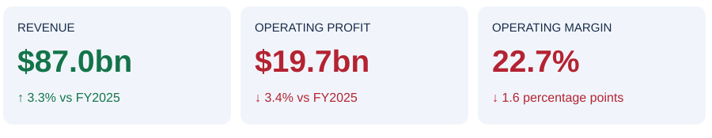

# P&G Financial Analysis & Agentic Scenario Planning

**Why did sales grow while profit fell, and did market research improve the earnings forecast?**

[📄 Executive memo](reports/investment_memo.md) · [📊 Excel models](model/README.md) · [🖥️ Power BI](dashboard/README.md) · [⚙️ Agent workflow](agents/README.md)

## In 30 seconds

**Sales grew. Costs grew faster. The forecast needed more attention to operating expenses.**

- **Annual results:** Revenue rose **3.3%**, while operating profit fell **3.4%**.
- **Business drivers:** FX and pricing supported growth; Beauty added **38.5%** of the sales increase.
- **Forecast review:** May research reduced the quarterly earnings error by **$69.1m**, but the base still exceeded actual earnings by **$580.5m**.

[Read the findings and evidence →](analysis/README.md)

## 🧭 Explore the project

| Read | What you will see |
|---|---|
| [1. Financial performance](analysis/README.md#-historical-performance) | Seven questions, original filings, Excel calculations and red-marked evidence. |
| [2. Market research and scenarios](analysis/08_market_research.md) | How dated evidence changes assumptions and why. |
| [3. Forecast vs actual](analysis/10_forecast_review.md) | The remaining earnings miss and the next modelling priorities. |
| [4. Agent design and controls](agents/README.md) | Actual role outputs, a reusable workflow and validation records. |

## 🧰 Skills demonstrated

| Skill | Concrete evidence |
|---|---|
| Financial statement analysis | [199 reported inputs and cross-statement checks](analysis/03_statements.md). |
| Commercial finance | [Profit bridge](analysis/02_profit.md), [segment contribution](analysis/06_segments.md) and [margin drivers](analysis/07_margins.md). |
| Excel modelling | [Linked historical report and editable scenario model](model/README.md). |
| Research and scenario planning | [Dated evidence, matched controls and explicit assumptions](analysis/09_scenarios.md). |
| Power BI | [Six-page report, scenario slicers and recorded DAX checks](dashboard/README.md). |
| Python and agent workflows | [Role handoffs, frozen assumptions and repeatable checks](agents/README.md). |
| Financial communication | [One-page memo](reports/investment_memo.md) and [documented analytical choices](decisions/decision_log.md). |

[See each skill, task and deliverable →](SKILLS.md)

📅 Understand the two time periods

- **Historical review:** FY2024–FY2026 annual results; balance sheets at 30 June 2025 and 2026.
- **Scenario case:** April–June 2026, reconstructed using information available by **31 March** or **15 May 2026**. The existing quarterly case and its deliverables are linked from this project.
- **Separation:** The annual report is used for historical analysis and later outcome review. It is not an input to the March or May forecast packets.
- **Timing:** The forecasting exercise was run retrospectively in October 2026. Date controls do not remove a model’s pretrained knowledge.

📁 Data, calculations and review

[Source files](data/raw/README.md) · [Processed data](data/processed/README.md) · [Data manifest](data/DATA_MANIFEST.md) · [Model guide](model/README.md) · [QA results](qa/README.md) · [Reproduce the work](src/README.md)

Public-company analysis and analyst forecasts; company internal budgets are not available. The quarterly cash model uses a conversion ratio. [Scope and limitations](reports/scope.md) explain what the results support.

