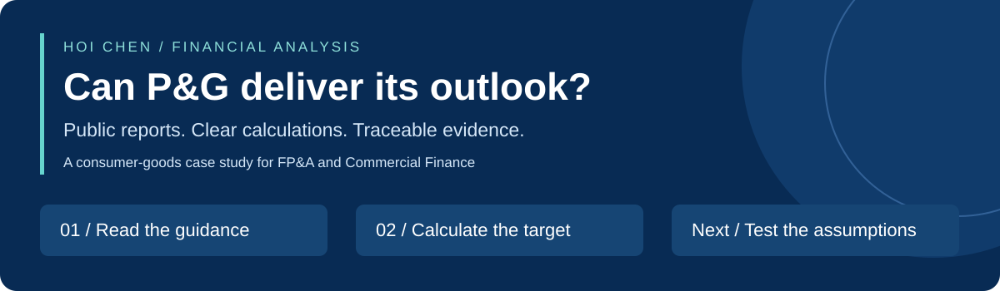

# P&G | From Company Guidance to a Quarterly Sales Target

**I turn published financial reports into Excel analysis that explains what a company needs to deliver next.**

`Financial research` · `Excel modelling` · `Revenue analysis` · `Reconciliation`

[**▶ Start with the result**](analysis/02_quarter_sales_target.md) · [**📊 Open Excel**](outputs/april_guidance_sample/PG_2_Quarter_Sales_Target.xlsx) · [**🔎 Check the evidence**](analysis/02_quarter_sales_target.md#-our-excel-result) · [**🧭 How to use this project**](PROJECT_GUIDE.md)

## 🎯 The business question

**What must P&G sell in April–June 2026 to achieve its full-year sales guidance?**

- **What I built:** two Excel worksheets that capture company guidance and calculate the remaining quarter's sales target.
- **Why it matters:** a full-year growth rate can hide a very different target for the remaining quarter.
- **Scope:** an external case study using public information available by **24 April 2026**.

## 💡 The finding in 20 seconds

> **3% full-year growth requires just 0.45% growth in April–June.**
>
> $86,812.52m annual target − $65,829.00m already reported = **$20,983.52m still needed**.

**Read the red boxes from top to bottom:** annual target → sales already reported → remaining quarter. [See the calculation and original reports →](analysis/02_quarter_sales_target.md)

## 📂 Explore the analysis

| Question | What I did | Open the output |
|---|---|---|
| [**1. Company guidance**](analysis/01_management_guidance.md) | Extracted the published sales and EPS ranges. Separated company guidance from calculated midpoints. | [Excel: guidance](outputs/april_guidance_sample/PG_1_Management_Guidance.xlsx) |
| [**2. Quarterly sales target**](analysis/02_quarter_sales_target.md) | Converted annual growth into quarterly sales required. Matched the calculation to published actuals. | [Excel: sales target](outputs/april_guidance_sample/PG_2_Quarter_Sales_Target.xlsx) |

Each analysis page follows **question → answer → calculation → expandable evidence**. Red boxes highlight the numbers to compare.

## 🛠️ Skills you can inspect

| Skill | Demonstrated in this project |
|---|---|
| **Financial research** | Trace figures to dated company releases and preserve reporting periods. |
| **Excel modelling** | Link inputs, annual targets, nine-month actuals and quarterly growth through formulas. |
| **Quality checks** | Reconcile annual sales to actuals plus the remaining quarter; check that input changes update results. |
| **Commercial judgement** | Explain why annual growth differs from quarterly growth and why a midpoint is not an independent forecast. |
| **Communication** | Lead with an answer and let readers expand the evidence when needed. |

## 🚀 Currently working on

**Next: test whether the implied quarterly targets are realistic.**

| Stage | Status | Deliverable |
|---|---|---|
| Company guidance + quarterly target | ✅ Ready to review | Two analysis pages and two Excel workbooks |
| Independent scenarios as of 24 April | ◻ Next | Evidence → assumptions → downside / base / upside sales |
| Market update through 15 May | ◻ Planned | Revised assumptions and a change log |
| Forecast vs actual | ◻ Planned | Explain the differences after the quarter is reported |
| Power BI presentation | ◻ Planned for this revised model | Interactive summary of the completed analysis |

The 1% / 3% / 5% references describe the company guidance range. **Our independent scenarios have not been completed in this revised model.**

📎 Sources, tools and project scope

- **Sources:** P&G's public earnings releases; direct links appear beside each evidence image.
- **Tools used here:** Microsoft Excel, JavaScript for workbook preparation, Markdown and GitHub for presentation.
- **Files:** downloadable workbooks contain inputs, formulas and source references; screenshots show selected results.
- **Method:** this is a historical reconstruction with a fixed information cutoff. Later information belongs to later review stages.
- **Scope:** an independent portfolio case study; it is not P&G's internal budget or an official P&G publication.
- **Version:** this April-start model replaces the earlier March-start framing. Older supporting files are not results of this revised workflow.

**By [Hoi Chen](https://github.com/hoichengit)** · Ask me about turning annual guidance into quarterly targets, tracing financial data and explaining forecast assumptions.
