# NIKE — Stock Valuation

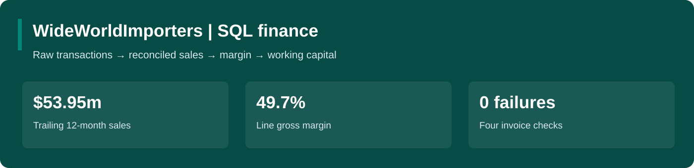

**🎯 Goal:** assess what the business could be worth, and identify the assumptions needed to support its share price.

- **Data:** five fiscal years of SEC financial statements, business-segment disclosures, two peers and dated market inputs.
- **Work:** build a linked financial forecast, value future cash flows, test sensitivities and reverse-engineer market expectations.
- **Result:** Base value **$42.14**, versus **$39.06** on 31 August 2026; the model implies **+7.9%**.

[📗 Excel model](processed_data/NKE_Financial_Analysis.xlsx) · [📂 Raw data](raw_data/README.md) · [🔎 Analysis outputs](processed_data/README.md)

> Historical valuation exercise, reconstructed with filings available by **31 August 2026**. The scenarios are analyst assumptions, not company guidance or a claim of forecasting accuracy.

## Analysis questions

| Question | What I tested |
|---|---|
| [1. Revenue sources](#1-revenue-sources) | Where does the company earn its revenue? |
| [2. Profitability](#2-profitability) | How has operating profitability changed? |
| [3. Cash conversion](#3-cash-conversion) | Do accounting profits turn into cash? |
| [4. Five-year forecast](#4-five-year-forecast) | What do the three scenarios assume? |
| [5. DCF valuation](#5-dcf-valuation) | What is each scenario worth per share? |
| [6. Peer comparison](#6-peer-comparison) | Does the peer comparison support the valuation? |
| [7. Reverse DCF](#7-reverse-dcf) | What growth does the market price require? |

**What matters:** the NIKE Base case needs operating-margin recovery to 12% by FY2031; a low reverse-DCF growth rate still depends on that margin path.

## 1. Revenue sources: Where does the company earn its revenue?

**Answer:** **North America** is the largest disclosed component at **$20,511m**, or **44.2%** of company revenue. Total FY2026 revenue was **$46,398m**.

**How:** Read the geographic segment table, add Converse and corporate items, and reconcile to total revenue. Regions are operating segments, not product categories.

📸 Open the evidence

**Original income statement — key figures outlined in red**

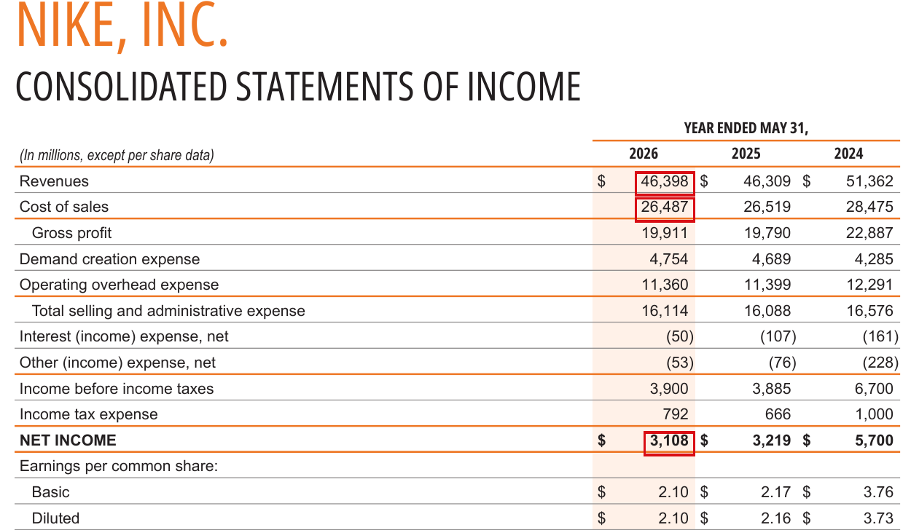

**Actual Excel worksheet — revenue highlighted in red**

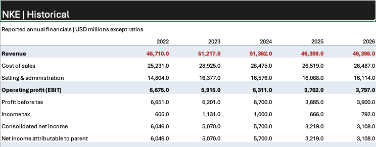

**Revenue by business / geography**

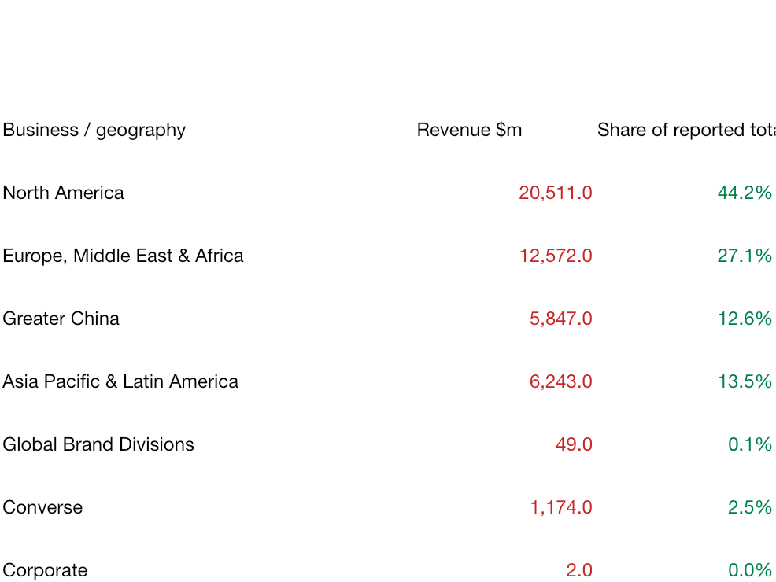

## 2. Profitability: How has operating profitability changed?

**Answer:** Operating margin moved from **8.0%** to **8.2%**; revenue changed **+0.2%**. This separates growth from the profit kept on each sales dollar.

**How:** Divide operating profit by revenue. NIKE operating profit here is revenue less cost of sales and SG&A; it excludes other non-operating income and differs from NIKE's reported EBIT metric.

📸 Open the evidence

**Original income statement**

**Actual Excel worksheet — income statement, FY2022 to FY2026**

**Historical financials — complete analysis**

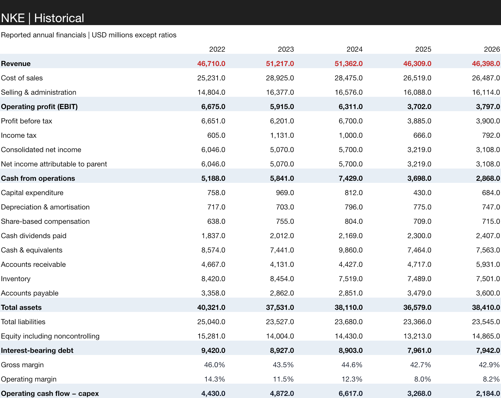

## 3. Cash conversion: Do accounting profits turn into cash?

**Answer:** Cash from operations was **$2,868m** against parent net income of **$3,108m**. After **$684m** of capex, cash flow was **$2,184m**.

**How:** Compare operating cash flow with earnings, then subtract capital spending. This CFO-minus-capex measure includes working-capital and cash-tax effects; it is not the same as unlevered DCF cash flow.

📸 Open the evidence

**Original cash-flow statement**

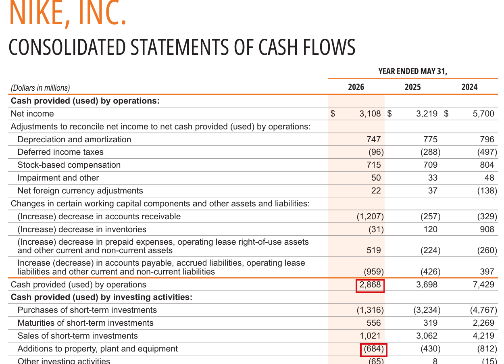

**Excel cash-flow figures — FY2022 to FY2026, left to right**

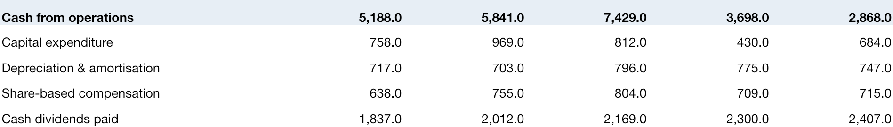

## 4. Five-year forecast: What do the three scenarios assume?

**Answer:** The Base case grows FY2031 revenue to **$55,360m**, with a **12.0%** operating margin. The workbook uses one active scenario selector, so the statements and DCF change together.

**How:** Apply growth and margin assumptions to the latest annual base. Keep receivable, inventory and payable days at their FY2026 levels; link cash flow to the balance sheet and verify that assets equal liabilities plus equity.

| Scenario | Revenue growth: FY2027 → FY2031 | Operating margin: FY2027 → FY2031 |
|---|---|---|
| Bear | -3% → 0% → 1% → 2% → 2% | 7.5% → 7.5% → 8.0% → 8.5% → 9.0% |
| Base | 2% → 4% → 5% → 4% → 3% | 8.5% → 9.5% → 10.5% → 11.5% → 12.0% |
| Bull | 5% → 7% → 7% → 6% → 5% | 9.5% → 11.0% → 12.5% → 13.5% → 14.0% |

📸 Open the evidence

**Five-year linked forecast**

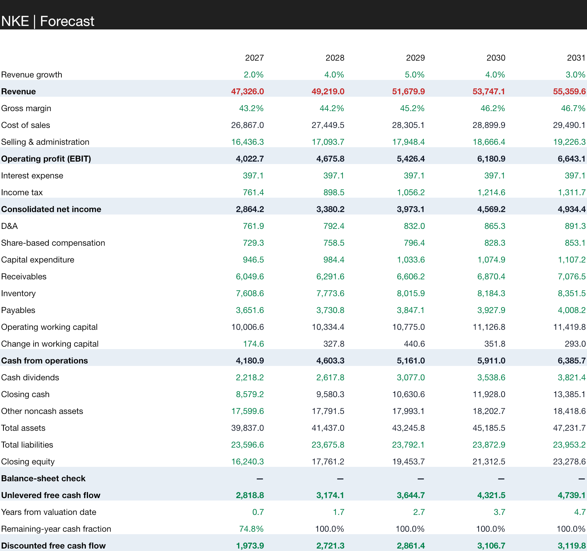

## 5. DCF valuation: What is each scenario worth per share?

**Answer:** The three model values are **$27.98 / $42.14 / $53.25** for Bear / Base / Bull. Base WACC is **9.20%**, with **2.5%** terminal growth.

**How:** Discount forecast unlevered free cash flow; add discounted terminal value, then cash and investments; subtract debt and noncontrolling interests. Divide by the diluted-share proxy. The remaining first fiscal year is prorated from the valuation date.

**Key risk:** terminal value contributes **77.6%** of enterprise value. Small changes in WACC or long-run growth can change the conclusion.

📸 Open the evidence

**Value per share calculation**

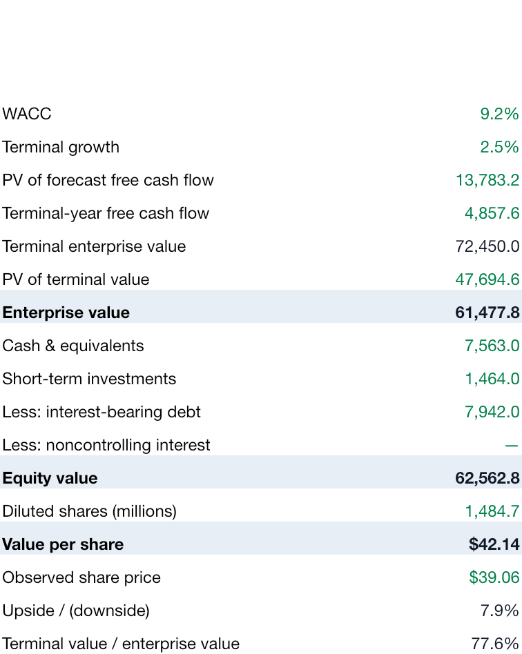

**WACC and terminal-growth sensitivity**

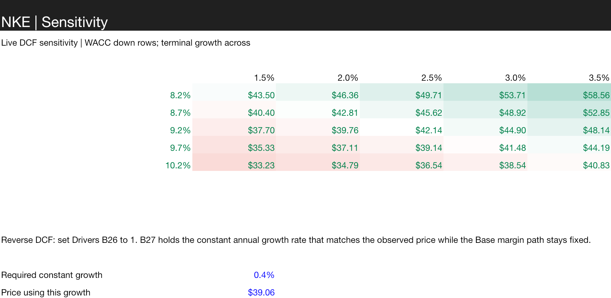

## 6. Peer comparison: Does the peer comparison support the valuation?

**Answer:** The two peers trade at **11.7×** and **8.9×** GAAP earnings, versus **18.6×** for NKE. This is a plausibility check; it is not a substitute for the cash-flow model.

**How:** Rebuild each peer's trailing twelve months as latest full year + current year-to-date − prior comparable year-to-date. Divide market capitalisation by GAAP parent earnings; keep each company's period and share-count date visible.

| Peer | TTM through | Share count dated | GAAP P/E |
|---|---|---|---|
| DECK | 2026-06-30 | 2026-07-09 | 11.7× |
| LULU | 2026-05-03 | 2026-05-29 | 8.9× |

The small peer set differs in business mix and growth. GAAP earnings retain exceptional items; KMB also requires care around business disposals. No unjustified "normalised" adjustment is inserted.

📸 Open the evidence

**Peer calculations and period dates**

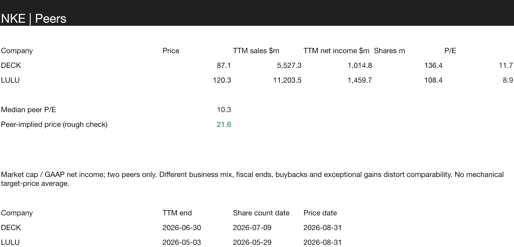

## 7. Reverse DCF: What growth does the market price require?

**Answer:** Holding the Base margin path and other assumptions fixed, approximately **0.39% annual revenue growth** produces **$39.06 per share**. This is one conditional solution, not a forecast of what investors believe.

**How:** Use the same DCF engine and search for a constant revenue-growth rate that makes model value equal the dated market price. In Excel, switch Drivers B26 to 1 and use the prefilled growth in B27 to reproduce the result.

📸 Open the evidence

**Reverse DCF result and replay inputs**

## What this project demonstrates

| Skill | Evidence |
|---|---|
| Financial-statement analysis | Five annual periods; revenue, margins, cash and capital structure |
| Financial modelling | Linked forecast with scenario selector and balance checks |
| Valuation | DCF, market-price comparison, peer check and reverse DCF |
| Model risk | Timing, dilution, terminal value and assumption sensitivities |
| Communication | Short answers with expandable source and worksheet evidence |

## Model boundaries

- Revenue is forecast at company level. The segment analysis explains exposure; it is not a separate segment forecast.
- Growth, margins, beta, equity premium and debt cost are analyst assumptions, not statistically estimated coefficients.
- SG&A / revenue stays at the latest historical ratio. The chosen operating-margin path is achieved through gross-margin change; this is a simplification, especially for NIKE's recovery case.
- Working capital uses receivables + inventory − payables. Other operating balances stay fixed; no acquisitions, buybacks, FX cash effects or new borrowing are forecast.
- Latest fiscal-year-end cash and debt stand in for valuation-date balances. First-year cash flow is prorated uniformly, which ignores seasonality.
- The share denominator combines latest disclosed common shares with conversion / annual dilution proxies. It is not an exact valuation-date diluted share count.
- Stock compensation remains an operating cost in the DCF. Operating leases stay in operating expenses and are excluded from the debt bridge.

[Reproduce the model](src/README.md) · [Sources and definitions](raw_data/README.md) · [Back to portfolio](https://github.com/hoichengit/Portfolio-Guide)

**Power BI status:** the five-page report is undergoing final Desktop verification. The verified Excel model and supporting analysis are available above.
