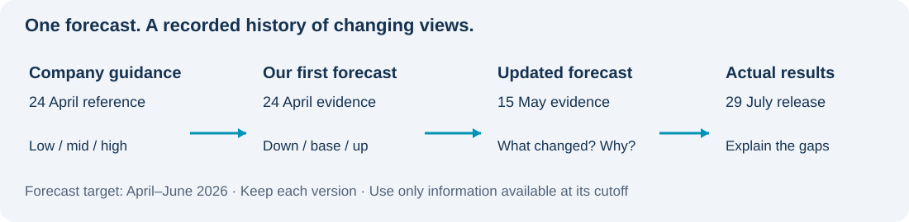

# P&G | From Company Guidance to an Independent Forecast

**Can P&G deliver its outlook, and what would change our view?**

- 📅 **Start:** the January–March results released on 24 April 2026.
- 🎯 **Forecast:** April–June 2026 as one quarter; add nine-month actuals to show the full year. No monthly split.
- 🔎 **Method:** separate company guidance, our assumptions and actual results.

## 1. Understand the company's outlook

**P&G guided to 1%–5% full-year sales growth. The midpoint is a reference, not our forecast.**

- [**1. Company guidance:** What did P&G expect?](analysis/01_management_guidance.md)
- [**2. Quarterly sales target:** What sales are needed in April–June?](analysis/02_quarter_sales_target.md)

💡 **The 3% annual midpoint requires only 0.45% growth in April–June.** Open question 2 to see why.

## 2. Test market evidence before adjusting the scenarios

**Four years of history help us test a market signal before changing the forecast.**

- **Company history:** 17 quarters, January 2022–March 2026, across five reporting segments.
- **Product research:** 11 categories mapped to available market data; missing product-level amounts stay missing.
- **Historical tests:** 18 exploratory company–market comparisons.
- **Release-aware backtest:** 122 archived market versions; five forecasting methods tested over eight quarters. Grooming pricing improved, while several demand models failed to beat simple rules.
- **Competitors:** optional checks for industry performance and market share; no peer coefficient enters this model.

👉 [See the release-aware backtest and data-gap remedies](analysis/05_release_backtest.md) · [Read the questions and answers](analysis/03_scenario_adjustment.md) · [Expand original-report and Excel evidence](analysis/04_historical_matching.md) · [Download the historical analysis](outputs/history_review/PG_4_Historical_Market_Analysis.xlsx)

This historical reconstruction separates what was known on 24 April from what was known on 15 May. The previous unsupported blanket reductions have been withdrawn from the active argument. A new calibrated downside/base/upside forecast remains unfinished.

## 3. Measure uncertainty — after the forecast is built

Use sensitivity analysis to select the important drivers, then document distributions and correlations before running Monte Carlo simulations. Report ranges and threshold probabilities conditional on those assumptions, not guaranteed real-world odds.

## 🧰 Skills demonstrated so far

| Skill | Evidence |
|---|---|
| Financial research | Locate the actual guidance and preserve its date and definition. |
| Excel | Build linked sales calculations and reconcile annual totals to quarterly targets. |
| Market analysis | Align monthly indicators with quarterly company results; test associations and stability. |
| Analytical judgement | Separate annual from quarterly growth, and company guidance from our own scenarios. |

[📊 Download the Excel sample](outputs/april_guidance_sample/PG_1_Management_Guidance.xlsx) · [🔎 Read the analysis](analysis/01_management_guidance.md)

Project version

This preview replaces the previous landing page and its March-start forecast framing. Earlier models and results remain in repository history and supporting files; they are not results of the revised April-start design. Monte Carlo has not yet been run for this design.

