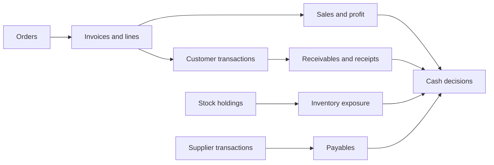
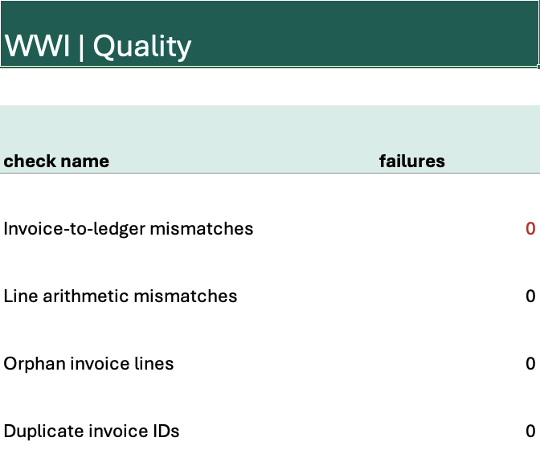
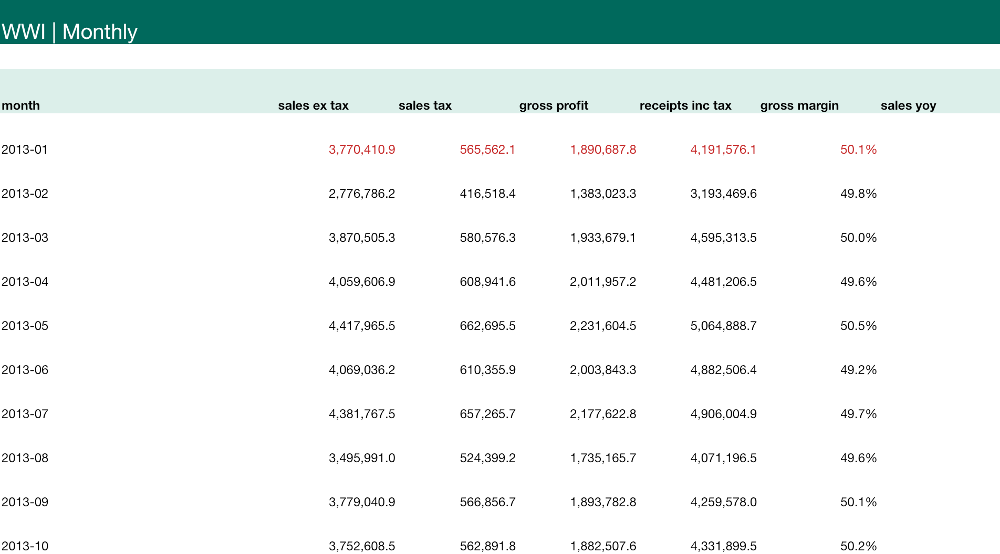
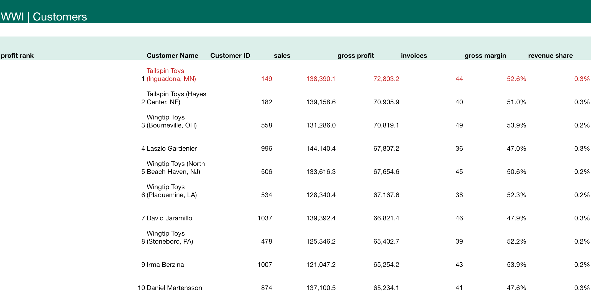
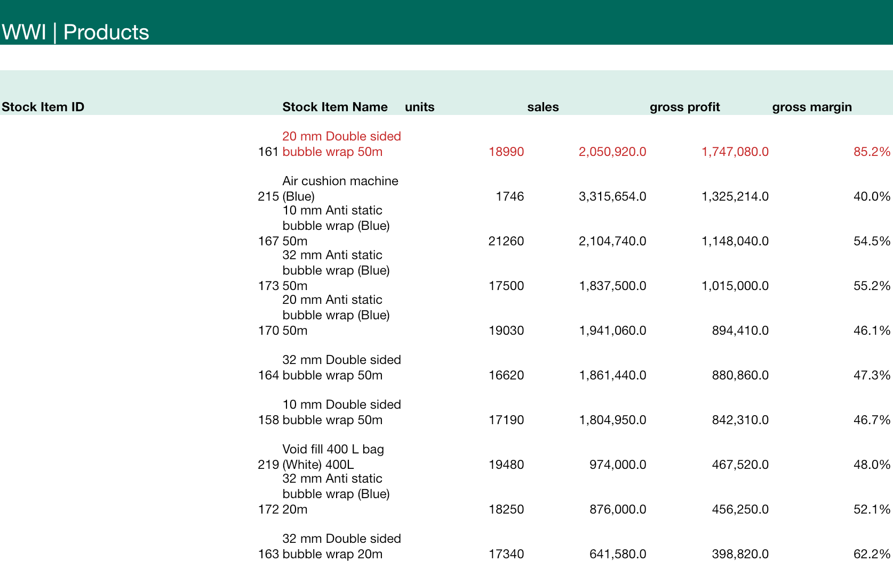
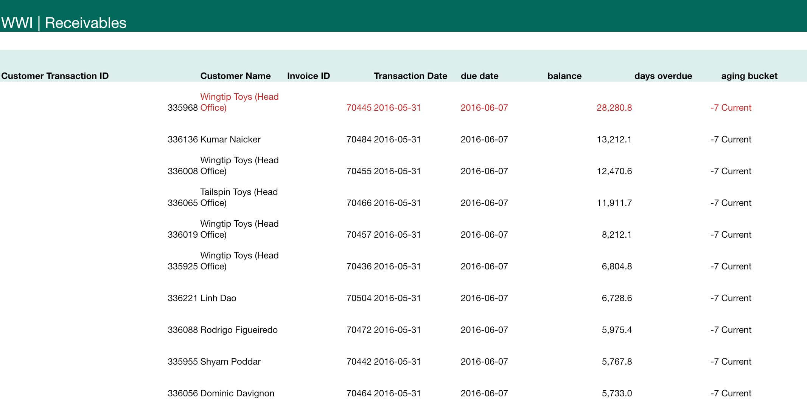
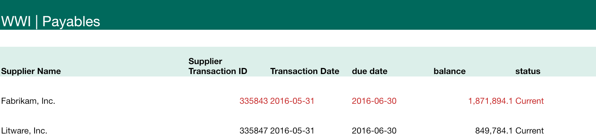
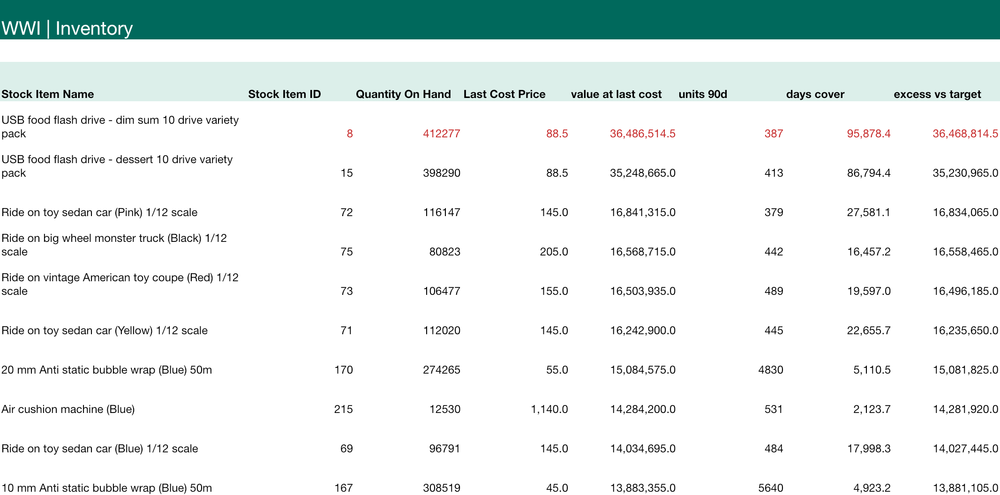

# WideWorldImporters — SQL & Financial Data Analysis


**🎯 Goal:** turn a wholesaler's transactions into reliable sales, profit and cash decisions.

- **Data:** Microsoft's fictional wholesale business; 14 related tables, January 2013–May 2016.
- **Work:** reconcile invoices, distinguish sales from receipts, analyse margins, and inspect receivables, payables and inventory.
- **Result:** trailing sales of **$53.95m**, line gross margin of **49.7%**, and **zero failed invoice checks**.

[📊 Dashboard & PBIX](dashboard.md) · [📗 Excel analysis](processed_data/WWI_Financial_Analysis.xlsx) · [📂 Raw data](raw_data/README.md) · [▶ Re-run the SQL](src/README.md)

> This is Microsoft's sample company, not a real business. SQL runs in **SQLite**; the original source is a **SQL Server BACPAC**. The dialect and conversion are disclosed.

## Analysis questions

| Question | SQL skills |
|---|---|
| [1. Can we trust the invoice totals?](#question-1) | CTE · JOIN · UNION ALL · ABS |
| [2. How do invoiced sales, profit and cash differ?](#question-2) | CTE · SUM · CASE · LAG · NULLIF |
| [3. Which customers generate profit?](#question-3) | JOIN · ROW_NUMBER · window SUM |
| [4. Where is product profitability strongest?](#question-4) | GROUP BY · SUM · NULLIF |
| [5. Did price or volume drive May sales growth?](#question-5) | CTE · CASE · SUM · UNION ALL |
| [6. Which unpaid invoices need collection?](#question-6) | Date arithmetic · CASE · JOIN |
| [7. What supplier cash commitments are still open?](#question-7) | JOIN · date · CASE |
| [8. Where is cash tied up in slow-moving stock?](#question-8) | LEFT JOIN · COALESCE · NULLIF |
| [9. How much order value has not yet become invoiced sales?](#question-9) | Pre-aggregation · LEFT JOIN |
| [10. What could working-capital improvements release?](#question-10) | CTE · CROSS JOIN · MIN |



<a id="question-1"></a>

## 1. Can we trust the invoice totals?

**Answer:** All four checks return **0 failures**: invoice totals match the ledger, line arithmetic is correct, invoice-line keys match and invoice IDs are unique.

**How:** Aggregate invoice lines before joining ledger entries. Reconcile tax-inclusive totals and test arithmetic within $0.02.

[Download result CSV](processed_data/01_quality.csv) · [SQL file](sql/01_quality.sql)

<details>
<summary>💻 Show the SQL</summary>

```sql
WITH lines AS (
 SELECT InvoiceID, SUM(ExtendedPrice) AS line_total
 FROM Sales_InvoiceLines GROUP BY InvoiceID
), ledger AS (
 SELECT InvoiceID, SUM(TransactionAmount) AS ledger_total
 FROM Sales_CustomerTransactions WHERE TransactionTypeID IN (1,2)
 GROUP BY InvoiceID
)
SELECT 'Invoice-to-ledger mismatches' AS check_name, COUNT(*) AS failures
FROM lines l LEFT JOIN ledger t ON l.InvoiceID=t.InvoiceID
WHERE t.InvoiceID IS NULL OR ABS(l.line_total-t.ledger_total)>0.02
UNION ALL
SELECT 'Line arithmetic mismatches',COUNT(*) FROM Sales_InvoiceLines
WHERE ABS(Quantity*UnitPrice+TaxAmount-ExtendedPrice)>0.02
UNION ALL
SELECT 'Orphan invoice lines',COUNT(*) FROM Sales_InvoiceLines l
LEFT JOIN Sales_Invoices i ON l.InvoiceID=i.InvoiceID WHERE i.InvoiceID IS NULL
UNION ALL
SELECT 'Duplicate invoice IDs',COUNT(*)-COUNT(DISTINCT InvoiceID) FROM Sales_Invoices;
```

</details>

<details>
<summary>📸 Open the evidence</summary>

**Original table values extracted from the Microsoft database**


**Actual Excel worksheet**



</details>

<a id="question-2"></a>

## 2. How do invoiced sales, profit and cash differ?

**Answer:** TTM invoiced sales are **$53,945,520.55 excluding tax**; customer receipts are **$61,713,218.44 including tax**. They should not be subtracted as a clean collection variance: the tax basis and timing differ.

**How:** Group invoice-line sales by invoice month and customer payments by transaction month; use LAG for same-month prior-year growth.

[Download result CSV](processed_data/02_monthly.csv) · [SQL file](sql/02_monthly.sql)

<details>
<summary>💻 Show the SQL</summary>

```sql
WITH sales AS (
 SELECT substr(i.InvoiceDate,1,7) AS month,
 SUM(l.ExtendedPrice-l.TaxAmount) AS sales_ex_tax,
 SUM(l.TaxAmount) AS sales_tax, SUM(l.LineProfit) AS gross_profit
 FROM Sales_Invoices i JOIN Sales_InvoiceLines l ON i.InvoiceID=l.InvoiceID
 GROUP BY 1
), cash AS (
 SELECT substr(TransactionDate,1,7) AS month,
 -SUM(CASE WHEN TransactionTypeID=3 THEN TransactionAmount ELSE 0 END) AS receipts_inc_tax
 FROM Sales_CustomerTransactions GROUP BY 1
)
SELECT s.*, c.receipts_inc_tax,
 1.0*gross_profit/NULLIF(sales_ex_tax,0) AS gross_margin,
 1.0*sales_ex_tax/NULLIF(LAG(sales_ex_tax,12) OVER(ORDER BY s.month),0)-1 AS sales_yoy
FROM sales s LEFT JOIN cash c ON s.month=c.month ORDER BY s.month;
```

</details>

<details>
<summary>📸 Open the evidence</summary>

**Excel analysis**



</details>

<a id="question-3"></a>

## 3. Which customers generate profit?

**Answer:** The highest-profit customer location is **Tailspin Toys (Inguadona, MN)**, generating **$72,803.20** in line gross profit. Customer locations are analysed separately from their bill-to parent.

**How:** Aggregate by invoiced CustomerID, calculate margin and revenue share, then rank by gross profit.

[Download result CSV](processed_data/03_customers.csv) · [SQL file](sql/03_customers.sql)

<details>
<summary>💻 Show the SQL</summary>

```sql
WITH c AS (
 SELECT i.CustomerID, SUM(l.ExtendedPrice-l.TaxAmount) AS sales,
 SUM(l.LineProfit) AS gross_profit, COUNT(DISTINCT i.InvoiceID) AS invoices
 FROM Sales_Invoices i JOIN Sales_InvoiceLines l ON i.InvoiceID=l.InvoiceID
 WHERE i.InvoiceDate>='2015-06-01' AND i.InvoiceDate<'2016-06-01'
 GROUP BY i.CustomerID
)
SELECT ROW_NUMBER() OVER(ORDER BY c.gross_profit DESC) AS profit_rank,
 n.CustomerName,c.*,1.0*c.gross_profit/NULLIF(c.sales,0) AS gross_margin,
 1.0*c.sales/SUM(c.sales) OVER() AS revenue_share
FROM c JOIN Sales_Customers n ON c.CustomerID=n.CustomerID ORDER BY profit_rank;
```

</details>

<details>
<summary>📸 Open the evidence</summary>

**Excel analysis**



</details>

<a id="question-4"></a>

## 4. Where is product profitability strongest?

**Answer:** The top gross-profit product is **20 mm Double sided bubble wrap 50m**, with **$1,747,080.00** gross profit and a **85.2%** line margin.

**How:** Join products to invoice lines; divide total line profit by sales, not an average of row margins.

[Download result CSV](processed_data/04_products.csv) · [SQL file](sql/04_products.sql)

<details>
<summary>💻 Show the SQL</summary>

```sql
SELECT s.StockItemID,s.StockItemName,SUM(l.Quantity) AS units,
 SUM(l.ExtendedPrice-l.TaxAmount) AS sales,SUM(l.LineProfit) AS gross_profit,
 1.0*SUM(l.LineProfit)/NULLIF(SUM(l.ExtendedPrice-l.TaxAmount),0) AS gross_margin
FROM Sales_InvoiceLines l JOIN Sales_Invoices i ON l.InvoiceID=i.InvoiceID
JOIN Warehouse_StockItems s ON l.StockItemID=s.StockItemID
WHERE i.InvoiceDate>='2015-06-01' AND i.InvoiceDate<'2016-06-01'
GROUP BY s.StockItemID,s.StockItemName ORDER BY gross_profit DESC;
```

</details>

<details>
<summary>📸 Open the evidence</summary>

**Excel analysis**



</details>

<a id="question-5"></a>

## 5. Did price or volume drive May sales growth?

**Answer:** May revenue changed by **$490,202.10**: **$267,728.95** from volume at prior prices, **$-24,338.05** from realised price / within-product mix, and **$246,811.20** from product entry or exit.

**How:** Use an exact sequential bridge: quantity change × old realised price, then new quantity × realised price change. Compare May with May.

[Download result CSV](processed_data/05_growth_bridge.csv) · [SQL file](sql/05_growth_bridge.sql)

<details>
<summary>💻 Show the SQL</summary>

```sql
WITH p AS (
 SELECT l.StockItemID,
 SUM(CASE WHEN substr(i.InvoiceDate,1,7)='2015-05' THEN l.Quantity ELSE 0 END) AS q0,
 SUM(CASE WHEN substr(i.InvoiceDate,1,7)='2016-05' THEN l.Quantity ELSE 0 END) AS q1,
 SUM(CASE WHEN substr(i.InvoiceDate,1,7)='2015-05' THEN l.ExtendedPrice-l.TaxAmount ELSE 0 END) AS r0,
 SUM(CASE WHEN substr(i.InvoiceDate,1,7)='2016-05' THEN l.ExtendedPrice-l.TaxAmount ELSE 0 END) AS r1
 FROM Sales_InvoiceLines l JOIN Sales_Invoices i ON l.InvoiceID=i.InvoiceID
 WHERE substr(i.InvoiceDate,1,7) IN ('2015-05','2016-05') GROUP BY l.StockItemID
)
SELECT 'Volume at prior price (common products)' AS driver,SUM((q1-q0)*1.0*r0/q0) AS impact
FROM p WHERE q0>0 AND q1>0
UNION ALL SELECT 'Realised price / within-product mix',SUM(q1*(1.0*r1/q1-1.0*r0/q0)) FROM p WHERE q0>0 AND q1>0
UNION ALL SELECT 'New or discontinued products',SUM(r1-r0) FROM p WHERE q0=0 OR q1=0
UNION ALL SELECT 'Total sales change',SUM(r1-r0) FROM p;
```

</details>

<details>
<summary>📸 Open the evidence</summary>

**Excel analysis**


</details>

<a id="question-6"></a>

## 6. Which unpaid invoices need collection?

**Answer:** Open receivables total **$267,011.44**, and **$0.00 is overdue** at 31 May 2016. There is no evidence here of a late-payment problem.

**How:** Add the bill-to customer payment terms to transaction date, then compare due date with the snapshot date. OutstandingBalance is a snapshot, so it cannot reconstruct historical aging.

[Download result CSV](processed_data/06_receivables.csv) · [SQL file](sql/06_receivables.sql)

<details>
<summary>💻 Show the SQL</summary>

```sql
WITH overdue AS (
 SELECT t.CustomerTransactionID,c.CustomerName,t.InvoiceID,t.TransactionDate,
 date(t.TransactionDate,'+'||c.PaymentDays||' days') AS due_date,
 t.OutstandingBalance AS balance,
 CAST(julianday('2016-05-31')-julianday(t.TransactionDate)-c.PaymentDays AS INTEGER) AS days_overdue
 FROM Sales_CustomerTransactions t JOIN Sales_Customers c ON t.CustomerID=c.CustomerID
 WHERE t.OutstandingBalance<>0
)
SELECT *, CASE WHEN days_overdue<=0 THEN 'Current' WHEN days_overdue<=30 THEN '1-30 days'
 WHEN days_overdue<=60 THEN '31-60 days' ELSE '61+ days' END AS aging_bucket
FROM overdue ORDER BY days_overdue DESC,balance DESC;
```

</details>

<details>
<summary>📸 Open the evidence</summary>

**Excel analysis**



</details>

<a id="question-7"></a>

## 7. What supplier cash commitments are still open?

**Answer:** Open supplier balances total **$2,721,678.21** across **2 invoices**. Both are current at the snapshot date; their due dates determine the upcoming cash requirement.

**How:** Join each supplier invoice to that supplier’s payment terms. Keep current and overdue balances distinct.

[Download result CSV](processed_data/07_payables.csv) · [SQL file](sql/07_payables.sql)

<details>
<summary>💻 Show the SQL</summary>

```sql
SELECT s.SupplierName,t.SupplierTransactionID,t.TransactionDate,
 date(t.TransactionDate,'+'||s.PaymentDays||' days') AS due_date,
 t.OutstandingBalance AS balance,
 CASE WHEN date(t.TransactionDate,'+'||s.PaymentDays||' days')<'2016-05-31' THEN 'Overdue' ELSE 'Current' END AS status
FROM Purchasing_SupplierTransactions t JOIN Purchasing_Suppliers s ON t.SupplierID=s.SupplierID
WHERE t.OutstandingBalance<>0 ORDER BY due_date,balance DESC;
```

</details>

<details>
<summary>📸 Open the evidence</summary>

**Excel analysis**



</details>

<a id="question-8"></a>

## 8. Where is cash tied up in slow-moving stock?

**Answer:** Stock valued at last cost totals **$475.28m**, unusually high relative to sales. This is a sample-data limitation to investigate, not proof of a real company's overstocking.

**How:** Multiply quantity on hand by last cost; divide stock by the recent 90-day sales rate. Last cost is not a verified inventory carrying value.

[Download result CSV](processed_data/08_inventory.csv) · [SQL file](sql/08_inventory.sql)

<details>
<summary>💻 Show the SQL</summary>

```sql
WITH usage AS (
 SELECT l.StockItemID,SUM(l.Quantity) AS units_90d
 FROM Sales_InvoiceLines l JOIN Sales_Invoices i ON l.InvoiceID=i.InvoiceID
 WHERE i.InvoiceDate BETWEEN '2016-03-03' AND '2016-05-31' GROUP BY l.StockItemID
)
SELECT s.StockItemName,h.StockItemID,h.QuantityOnHand,h.LastCostPrice,
 h.QuantityOnHand*h.LastCostPrice AS value_at_last_cost,
 COALESCE(u.units_90d,0) AS units_90d,
 90.0*h.QuantityOnHand/NULLIF(u.units_90d,0) AS days_cover,
 CASE WHEN h.QuantityOnHand>h.TargetStockLevel THEN (h.QuantityOnHand-h.TargetStockLevel)*h.LastCostPrice ELSE 0 END AS excess_vs_target
FROM Warehouse_StockItemHoldings h JOIN Warehouse_StockItems s ON h.StockItemID=s.StockItemID
LEFT JOIN usage u ON h.StockItemID=u.StockItemID ORDER BY value_at_last_cost DESC;
```

</details>

<details>
<summary>📸 Open the evidence</summary>

**Original table values extracted from the Microsoft database**


**Excel analysis**



</details>

<a id="question-9"></a>

## 9. How much order value has not yet become invoiced sales?

**Answer:** There are **3,085 orders** with a value difference against matched invoices. This is a reconciliation worklist, not a clean backlog: backorder chains, partial fulfilment and timing need separate review.

**How:** Aggregate order lines and invoice lines separately before joining by OrderID; flag unmatched amounts without creating duplicate revenue.

[Download result CSV](processed_data/09_orders.csv) · [SQL file](sql/09_orders.sql)

<details>
<summary>💻 Show the SQL</summary>

```sql
WITH ordered AS (
 SELECT OrderID,SUM(Quantity*UnitPrice) AS ordered_ex_tax FROM Sales_OrderLines GROUP BY OrderID
), billed AS (
 SELECT i.OrderID,SUM(l.ExtendedPrice-l.TaxAmount) AS invoiced_ex_tax
 FROM Sales_Invoices i JOIN Sales_InvoiceLines l ON i.InvoiceID=l.InvoiceID GROUP BY i.OrderID
)
SELECT o.OrderID,o.OrderDate,o.BackorderOrderID,r.ordered_ex_tax,
 COALESCE(b.invoiced_ex_tax,0) AS invoiced_ex_tax,
 r.ordered_ex_tax-COALESCE(b.invoiced_ex_tax,0) AS unmatched_order_value
FROM Sales_Orders o JOIN ordered r ON o.OrderID=r.OrderID
LEFT JOIN billed b ON o.OrderID=b.OrderID
WHERE ABS(r.ordered_ex_tax-COALESCE(b.invoiced_ex_tax,0))>0.02
ORDER BY o.OrderDate DESC;
```

</details>

<details>
<summary>📸 Open the evidence</summary>

**Excel analysis**


</details>

<a id="question-10"></a>

## 10. What could working-capital improvements release?

**Answer:** A two-day AR reduction, capped at open AR, plus a 1% stock reduction gives an illustrative **$5.02m** release. It is a scenario, not cash already collected or savings achieved.

**How:** Use annual sales / 365 × proposed days saved, capped at open receivables. Add the stock-at-cost scenario, while recognising sell-through, replacement, discounts and tax.

[Download result CSV](processed_data/10_cash_scenario.csv) · [SQL file](sql/10_cash_scenario.sql)

<details>
<summary>💻 Show the SQL</summary>

```sql
WITH inputs AS (
 SELECT 2.0 AS ar_days_reduction, 0.01 AS stock_reduction
), annual_sales AS (
 SELECT SUM(l.ExtendedPrice-l.TaxAmount) AS revenue
 FROM Sales_InvoiceLines l JOIN Sales_Invoices i ON i.InvoiceID=l.InvoiceID
 WHERE i.InvoiceDate>='2015-06-01' AND i.InvoiceDate<'2016-06-01'
), balances AS (
 SELECT (SELECT SUM(OutstandingBalance) FROM Sales_CustomerTransactions) AS ar,
 (SELECT SUM(QuantityOnHand*LastCostPrice) FROM Warehouse_StockItemHoldings) AS stock
)
SELECT ar_days_reduction,stock_reduction,
 MIN(revenue/365.0*ar_days_reduction,ar) AS capped_ar_release,
 stock*stock_reduction AS stock_release_at_cost,
 MIN(revenue/365.0*ar_days_reduction,ar)+stock*stock_reduction AS illustrative_total
FROM inputs CROSS JOIN annual_sales CROSS JOIN balances;
```

</details>

<details>
<summary>📸 Open the evidence</summary>

**Excel analysis**


</details>

## What this project demonstrates

| Skill | Evidence |
|---|---|
| SQL | Joins, CTEs, date arithmetic, conditional aggregation and window functions |
| Data quality | Invoice-ledger reconciliation, arithmetic checks and key tests |
| Commercial finance | Customer / product profitability and a price-volume bridge |
| Working capital | Receivables aging, supplier due dates and inventory exposure |
| Financial judgement | Clear distinction between a sample-data anomaly and an actionable business conclusion |

**Boundaries:** no overhead ledger, formal budget, audited inventory valuation or bank reconciliation is supplied. This project therefore does not claim net profit, budget variance, audited cash or proven cash savings.

[Data dictionary](raw_data/README.md) · [Reproduce every query](src/README.md) · [Back to portfolio](https://github.com/hoichengit/Portfolio-Guide)
