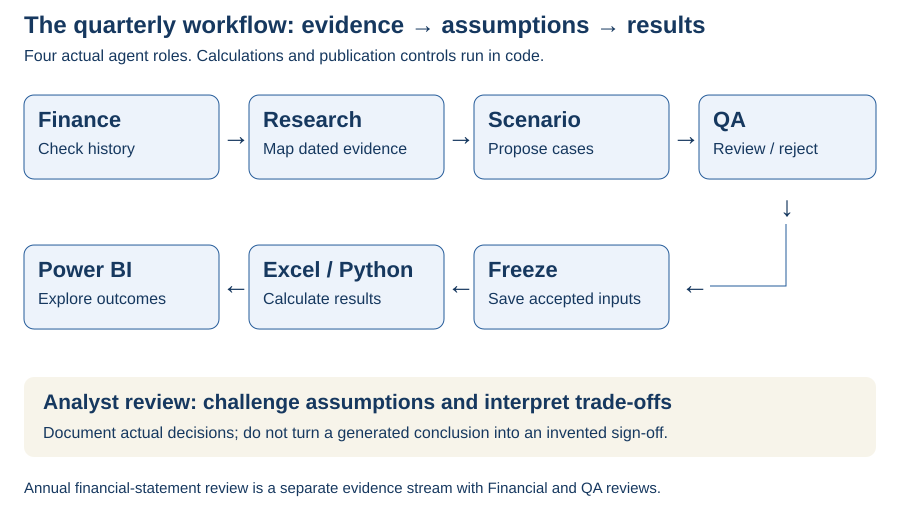

# Agent workflow

**Four executable roles organise financial evidence, challenge assumptions and check outputs. Excel and Python perform the calculations.**

| Role | Problem it solves | Inspect |
|---|---|---|
| [Finance](financial.md) | Consistent financial definitions and baseline inputs. | Reported statements and checked mappings. |
| [Research](research.md) | External evidence that actually changes model drivers. | Dated source register and model implications. |
| [Scenario](scenario.md) | Coherent bear, base and bull assumptions. | Structured assumption tables and bounds. |
| [QA](qa.md) | Inconsistent sources, dates, assumptions or calculations. | Findings, rejection history and frozen records. |
| [Business Driver specialism](business_driver.md) | Why revenue and margin changed. | Historical driver analysis; not a separate executable role. |

The annual report was reviewed by Financial and QA agents. The linked quarterly workflow contains actual Finance → Research → Scenario → QA runs. The five-area presentation distinguishes expertise without claiming a fifth model call that did not occur.

## 📂 Inspect a real run

| Step | Input / output |
|---|---|
| Finance | [Input](https://github.com/hoichengit/Portfolio-Guide/blob/codex/financial-scenarios/outputs/runs/PG_mid_market/finance/input.json) · [Output](https://github.com/hoichengit/Portfolio-Guide/blob/codex/financial-scenarios/outputs/runs/PG_mid_market/finance/output.json) |
| Research | [Input](https://github.com/hoichengit/Portfolio-Guide/blob/codex/financial-scenarios/outputs/runs/PG_mid_market/research/input.json) · [Output](https://github.com/hoichengit/Portfolio-Guide/blob/codex/financial-scenarios/outputs/runs/PG_mid_market/research/output.json) |
| Scenario | [Input](https://github.com/hoichengit/Portfolio-Guide/blob/codex/financial-scenarios/outputs/runs/PG_mid_market/scenario/input.json) · [Output](https://github.com/hoichengit/Portfolio-Guide/blob/codex/financial-scenarios/outputs/runs/PG_mid_market/scenario/output.json) |
| QA | [Initial review](https://github.com/hoichengit/Portfolio-Guide/blob/codex/financial-scenarios/outputs/runs/PG_mid_market/qa_initial/output.json) · [Final review](https://github.com/hoichengit/Portfolio-Guide/blob/codex/financial-scenarios/outputs/runs/PG_mid_market/qa/output.json) |
| Freeze | [Hashes, timing and retained review lineage](https://github.com/hoichengit/Portfolio-Guide/blob/codex/financial-scenarios/outputs/runs/PG_mid_market/freeze.json) |

[Skills library](skills.md) · [Rerun guide](../src/README.md) · [Annual review record](review.md) · [← Project home](../README.md)
