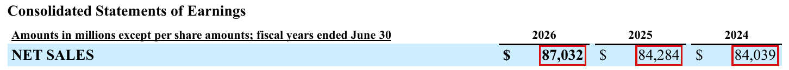
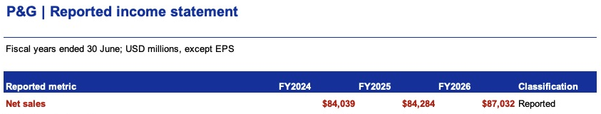

# Finance Agent

**Purpose:** Build comparable financial inputs from company filings.

[Skills](skills.md#financial) · [Executable role instructions](https://github.com/hoichengit/Portfolio-Guide/blob/codex/financial-scenarios/agents/finance.md) · [Actual structured output](https://github.com/hoichengit/Portfolio-Guide/blob/codex/financial-scenarios/outputs/runs/PG_mid_market/finance/output.json) · [All roles](README.md)

## Questions this role handles

| Area | Example |
|---|---|
| Period mapping, statement extraction and metric definitions. | [Revenue extraction](#worked-example) |

## Revenue extraction: What did the role establish?

**Answer:** Annual revenue agrees with Excel for all three years.

[Read the full financial question](../analysis/01_revenue.md)

🔎 Compare source and Excel

**Original report**

**Excel output**

Red marks identify the relevant amounts. Use the full question for the period, units and reconciliation details.

## Handoff

Send structured history and comparability issues to Research and Scenario; QA checks the source mapping.

[← Agent workflow](README.md) · [Project home](../README.md)
