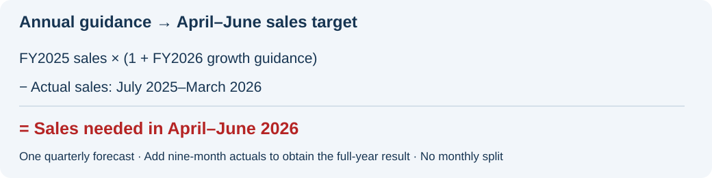
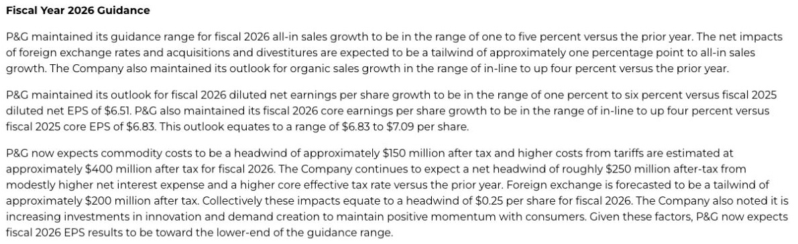
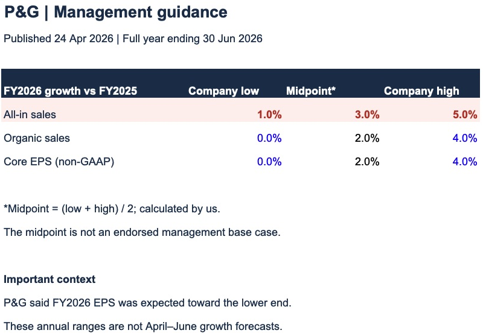

# 1. Management guidance: What did P&G expect on 24 April?

**Answer: P&G expected full-year sales growth of 1%–5%; we record that range before forming our own view.**

## 🎯 Goal

Forecast **April–June 2026 as one quarter**, then combine it with the first nine months to show the full-year result.

We use quarterly public financial data. We do not split the forecast into months without evidence for that monthly pattern.

**Data:** [P&G's 24 April earnings release](https://www.pginvestor.com/news/news-details/2026/PG-Announces-Fiscal-Year-2026-Third-Quarter-Results/default.aspx) → [our Excel guidance table](../outputs/april_guidance_sample/PG_1_Management_Guidance.xlsx).

## What do the numbers say?

| FY2026 growth vs FY2025 | Company low | Calculated midpoint | Company high |
|---|---:|---:|---:|
| **All-in sales** | **1%** | **3%** | **5%** |
| Organic sales | 0% | 2% | 4% |
| Core EPS (non-GAAP) | 0% | 2% | 4% |

**How:** enter the company's lower and upper limits in Excel, then add them and divide by two to calculate the midpoint.

> 🔎 **The important detail:** P&G also said EPS was likely to be near the lower end. A mechanical midpoint misses that message.

## What can we use this for?

- **Company reference:** low / midpoint / high describe the published range.
- **Independent scenarios:** downside / base / upside will reflect our evidence and judgement.
- **Quarterly forecast:** full-year sales less the first nine months gives implied April–June sales; an annual growth rate cannot be copied into a quarterly forecast.

All-in sales includes currency and portfolio effects; organic sales removes specified currency and acquisition/divestiture effects. Core EPS is an adjusted measure, so it must be compared with core EPS rather than GAAP EPS.

## 📅 From annual guidance to a quarterly sales target

1. Multiply **FY2025 sales** by **1 + the FY2026 growth rate** to get the implied full-year sales target.
2. Subtract **actual July 2025–March 2026 sales** to get the sales needed in **April–June 2026**.
3. Compare that amount with **April–June 2025 sales** to calculate the implied quarterly growth rate.

Repeat for the company’s low, midpoint and high references. These are implied targets; our independent scenarios come next. **Do not divide the annual growth rate by four or twelve.**

This subtraction works for sales amounts; organic growth and EPS require their own comparable-basis calculations.

🔎 Evidence: original announcement → our Excel table

### Original announcement

The announcement spells out percentages in words. Match these three phrases to the table above:

| Find in the screenshot | Numeric meaning | Metric |
|---|---|---|
| **① First paragraph:** “one to five percent” | **1%–5%** | Full-year all-in sales growth |
| **② First paragraph:** “in-line to up four percent” | **0%–4%** | Full-year organic sales growth |
| **③ Second paragraph:** “in-line to up four percent” | **0%–4%** | Full-year core EPS growth |

**“In-line” means unchanged from the prior year: 0% growth.** The screenshot below is the actual guidance section, not the quarterly headline results at the top of the announcement.

[Open the original announcement](https://www.pginvestor.com/news/news-details/2026/PG-Announces-Fiscal-Year-2026-Third-Quarter-Results/default.aspx).

### Excel worksheet

**The red sales row matches the company's range.** The 3% midpoint is our calculation, not an additional company forecast.

[Download Excel](../outputs/april_guidance_sample/PG_1_Management_Guidance.xlsx) · [View the full Excel screenshot](../evidence/april_guidance_excel_full.png)

The screenshot was captured in Microsoft Excel. Source limits are numeric percentages; midpoint cells contain formulas. Red marks the focus of this example, not a negative variance.

## Next question

**What April–June sales would be needed to reach that annual guidance?** The calculation method is shown above; the numerical quarterly build is the next section, using only information available by 24 April.

[← Project home](../README.md)
