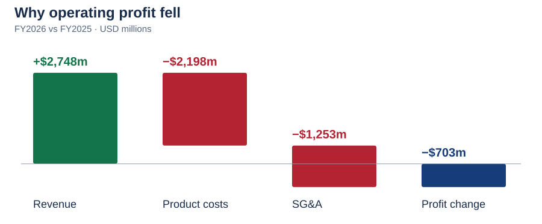

# 2. Revenue vs operating profit: Did higher FY2026 sales produce higher operating profit?

**Answer:** No — revenue increased **3.3%**, but operating profit fell **3.4% ($703m)** because the combined increase in product costs and SG&A exceeded the revenue increase.

**Why it matters:** Revenue growth can hide weaker profit conversion.

Compare the original report with Excel

**Original annual report · Revenue and operating costs · USD millions**

**Excel · PG_1_Analysis · Revenue growth and profit bridge**

Click an image to enlarge it. Red marks identify the corresponding revenue and operating-income figures; they do not mean that every highlighted result is unfavorable.

[Unmarked source page](../raw_data/PG_2026_Earnings_Original_Page.pdf) · [Full original annual report](https://s204.q4cdn.com/332108499/files/doc_financials/2026/ar/2026_annual_report.pdf#page=49) · [Open the Excel analysis](../outputs/PG_1_Analysis.xlsx)

These are cropped excerpts from the original report and an actual Microsoft Excel screenshot. Red highlights identify matching evidence. The links above open the complete source and workbook.

How the $703m decline is explained

| FY2026 compared with FY2025 | Effect on operating profit |
|---|---:|
| Additional revenue | +$2,748m |
| Higher cost of products sold | −$2,198m |
| Higher selling, general and administrative expense | −$1,253m |
| Change in intangible impairment | $0m |
| **Total operating profit change** | **−$703m** |

In Excel, subtract FY2025 from FY2026 for each line, then add the revenue effect and subtract the expense increases. The result equals the change in reported operating income: **$19,748m − $20,451m = −$703m**.

Operating margin falls from **24.3% to 22.7%**. This is an accounting explanation of the change; the company disclosures in questions 5–7 explain the business drivers.

FY2024 included a **$1,341m intangible impairment charge**. Its absence helped FY2025 operating profit, so the three-year profit trend should not be treated as wholly recurring growth.

---
[← Project home](../README.md) · [All analysis questions](README.md) · [Skills and evidence](../SKILLS.md)
