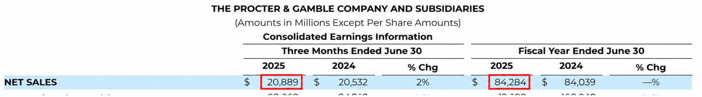
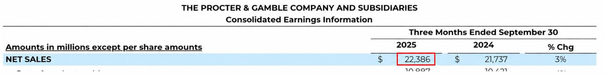
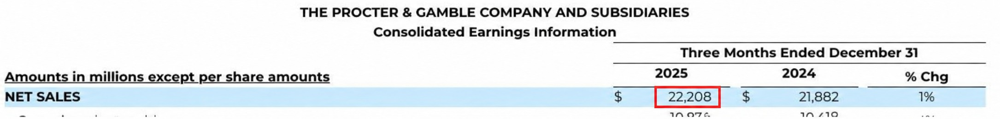
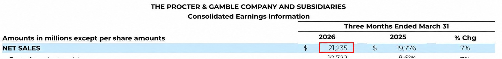
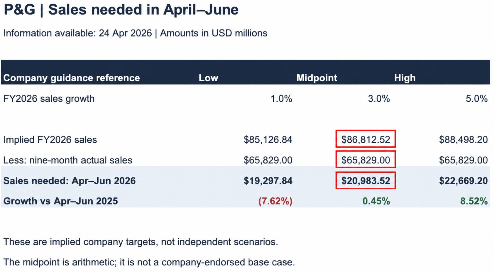

# 2. Quarterly sales target: What sales are needed in April–June?

[← Project home](../README.md) · [How to review](../PROJECT_GUIDE.md)

`02 / QUARTERLY SALES TARGET` · `Completed analysis`

**Answer: To reach 3% full-year sales growth, P&G needs $20,983.52 million in April–June — 0.45% more than the same quarter last year.**

- 🎯 **Goal:** turn the annual guidance into a quarterly target we can assess.
- 📅 **Information cutoff:** 24 April 2026; only releases available by that date.
- 📊 **Data:** published sales → [our formula-based Excel worksheet](../outputs/april_guidance_sample/PG_2_Quarter_Sales_Target.xlsx).

## What does each reference require?

Amounts below are **USD millions**. FY2026 runs from July 2025 to June 2026.

| Company guidance reference | Low | Arithmetic midpoint | High |
|---|---:|---:|---:|
| Full-year sales growth | 1% | 3% | 5% |
| Implied full-year sales | $85,126.84 | $86,812.52 | $88,498.20 |
| Less: July–March actual sales | $65,829.00 | $65,829.00 | $65,829.00 |
| **Sales needed: April–June** | **$19,297.84** | **$20,983.52** | **$22,669.20** |
| **Growth vs April–June 2025** | **−7.62%** | **+0.45%** | **+8.52%** |

> 💡 **1% annual growth can still mean a decline in the final quarter.** The first nine months already contribute to the full-year total.

These are **targets implied by company guidance**. They are not our independent downside, base and upside forecasts; the midpoint is not a company-endorsed base case.

## How did we get the midpoint?

1. **Annual target:** last year's $84,284 × 1.03 = **$86,812.52**.
2. **Quarter needed:** $86,812.52 − nine-month actuals of $65,829 = **$20,983.52**.
3. **Quarterly growth:** compare $20,983.52 with last April–June's $20,889 = **+0.45%**.

The same calculation uses 1% and 5% for the endpoints. No monthly allocation is required.

🔎 Evidence: published sales → Excel calculation

Red boxes identify the numbers used below. These are annotated copies; the original releases and unannotated Excel screenshot remain linked.

### ① Last year's comparison figures

**FY2025 sales: $84,284 million. April–June 2025 sales: $20,889 million.** Read the 2025 columns, not the 2024 columns.

[S1 · P&G release, 29 July 2025](https://www.pginvestor.com/news/news-details/2025/PG-Announces-Fourth-Quarter-and-Fiscal-Year-2025-Results/default.aspx)

### ② The three quarters already reported

| Sales period | Actual sales |
|---|---:|
| July–September 2025 | $22,386 million |
| October–December 2025 | $22,208 million |
| January–March 2026 | $21,235 million |
| **Calculated nine-month total** | **$65,829 million** |

**$22,386 + $22,208 + $21,235 = $65,829.** This is our subtotal of three published figures.

**July–September 2025:**

[S2 · P&G release, 24 October 2025](https://www.pginvestor.com/news/news-details/2025/PG-Announces-Fiscal-Year-2026-First-Quarter-Results/default.aspx)

**October–December 2025:**

[S3 · P&G release, 22 January 2026](https://www.pginvestor.com/news/news-details/2026/PG-Announces-Fiscal-Year-2026-Second-Quarter-Results/default.aspx)

**January–March 2026:**

[S4 · P&G release, 24 April 2026](https://www.pginvestor.com/news/news-details/2026/PG-Announces-Fiscal-Year-2026-Third-Quarter-Results/default.aspx)

### ③ Our Excel result

**Read the three red boxes in the Midpoint column from top to bottom:**

- **$86,812.52:** full-year sales target, calculated from $84,284 × 1.03.
- **$65,829.00:** sales already reported for July–March: $22,386 + $22,208 + $21,235.
- **$20,983.52:** sales still needed in April–June: subtract the second box from the first.

Red **boxes** mark evidence; red/green **growth figures** show negative/positive growth.

[Download the workbook](../outputs/april_guidance_sample/PG_2_Quarter_Sales_Target.xlsx) · [View the full Excel screenshot](../evidence/quarter_target_excel_full.jpg)

The workbook contains the original inputs, source links and formulas. We built this worksheet ourselves; P&G supplied the published financial figures. Annual target minus nine-month sales minus required quarter sales reconciles to zero for all three references. Changing an input updates the results.

## Next question

**Can P&G realistically achieve the required quarterly sales?**

1. **Review performance:** identify how volume, pricing, product mix and currency affected recent sales.
2. **Challenge the outlook:** use market evidence published by 24 April to assess demand and competitive pressure.
3. **Build our forecast:** set downside, base and upside driver assumptions, explain each choice and calculate April–June sales. The company's 1% / 3% / 5% remains a comparison reference.
4. **Update and test later:** save the April forecast, revise it with new evidence through 15 May, then compare both versions with the actual quarter when released.

The next deliverable is an evidence-to-assumption table: **driver → evidence → assumption → sales impact**.

[← Company guidance](01_management_guidance.md) · [Project home](../README.md)