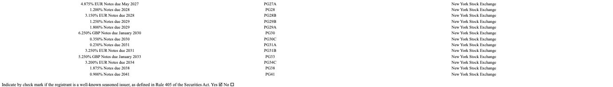
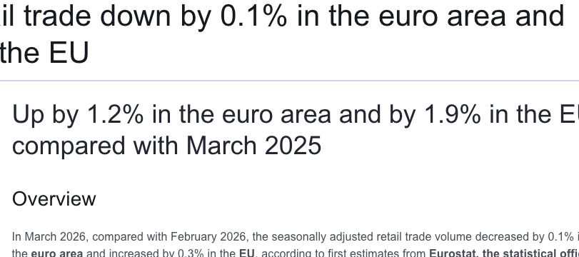
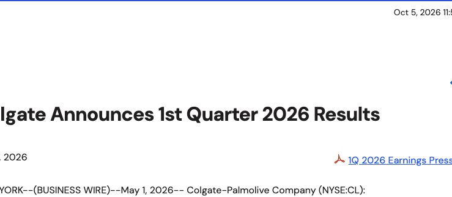

# Section 2. Scenario adjustment: What changes after new market evidence?

**Answer: The wider evidence is mixed. Keep the $20,983.5m midpoint as a comparison reference; treat the $104.4m reduction as a stress test, not a measured forecast revision.**

🧭 **What changed in this review?** We added US jobs and retail sales, European and Chinese data, and a second competitor. These challenge the earlier one-sided case for reducing sales. The existing Excel remains the original sensitivity experiment; its “Base” label means the middle stress case, not an evidence-validated central forecast.

- **Goal:** use new evidence to challenge the April company-guidance references.
- **Target:** April–June 2026 sales; combine them with July–March actuals for the full year.
- **New information:** releases published **25 April–15 May 2026**. The starting information cutoff remains **24 April**.
- **Files:** [editable Excel](../outputs/may_adjustment/PG_3_Scenario_Adjustment.xlsx) · [evidence register](../data/processed/may_evidence.json) · [calculated case results](../outputs/may_adjustment/results.json).

## Questions answered

- [1. Demand: Should we reduce the sales assumption?](#1-demand-should-we-reduce-the-sales-assumption)
- [2. Pricing: Does competitor evidence justify a change?](#2-pricing-does-competitor-evidence-justify-a-change)
- [3. Other drivers: What should stay unchanged?](#3-other-drivers-what-should-stay-unchanged)
- [4. Revised scenarios: What is the financial impact?](#4-revised-scenarios-what-is-the-financial-impact)

**Starting point:** the low / midpoint / high targets from [section 1](02_quarter_sales_target.md). They are company-guidance references, not three previously completed independent forecasts. Here we add analyst sensitivities to create three adjusted sales scenarios. They are not assigned probabilities.

## 1. Demand: Should we reduce the sales assumption?

**Answer: Test weaker demand, but do not assume that one US indicator proves P&G’s worldwide sales will fall.**

### Why start with the US?

P&G reported **$41.6bn US sales** and **$42.7bn international sales** in FY2025: about **49% US / 51% overseas**, using the rounded amounts. The US is a large exposure, but overseas demand is equally important. This is a historical exposure guide, not an exact April–June sales weight. [P&G FY2025 10-K, Note 2](https://www.sec.gov/Archives/edgar/data/80424/000008042425000076/pg-20250630.htm).

**How the economy reaches P&G:** household purchasing power → product purchases and brand choice → retailers’ orders → P&G sales. Shoppers can switch brands, buy on promotion or choose cheaper packs; an economic slowdown does not mean they stop buying everyday necessities. Retailer inventory changes can also separate consumer spending from P&G shipments.

🔎 Original report: why US-only research is incomplete

**Read the 2025 NET SALES rows: United States $41.6bn; International $42.7bn.** The original report also says no other individual country exceeds 10% of sales.

**Calculation:** 41.6 ÷ (41.6 + 42.7) ≈ 49%. Do not confuse the US with all of North America.

### What else does the US evidence say?

BEA means **Bureau of Economic Analysis**, a US government statistics agency. Its data describe the economy; BEA itself does not cause P&G sales to change.

| Evidence available by 15 May | What it tells us | Effect on our view |
|---|---|---|
| **BEA, 30 Apr:** March real spending +0.2% month on month; real disposable income −0.1%. [Report, p.3](https://www.bea.gov/sites/default/files/2026-04/pi0326.pdf) | Spending grew despite weaker purchasing power. “Real” removes price effects. | ⚠️ Affordability risk, alongside continuing demand. |
| **BLS, 8 May:** April payrolls +115,000; unemployment unchanged at 4.3%. [Jobs release](https://www.bls.gov/news.release/archives/empsit_05082026.htm) | Employment still supported household income. | ↔️ Counters a broad demand-collapse story; not a P&G volume estimate. |
| **Census, 14 May:** April retail sales +0.5% month on month; excluding petrol stations +0.3%. [Release, pp.1 & 6](https://www2.census.gov/retail/releases/historical/marts/adv2604.pdf) | Retail spending rose even outside petrol stations. | ↔️ No broad nominal spending contraction. Inflation still affects these figures. |
| **Same Census release:** grocery stores +0.7%; health and personal-care stores 0.0% month on month. | Channels relevant to everyday goods showed different results. | ⚖️ Mixed, not uniformly weak. Store totals include goods other than P&G products. |

**Decision:** the evidence supports a downside test, but does not establish the size or even the necessity of a global base-case cut. These indicators overlap; do not assign a separate sales reduction to each one.

🌍 Europe, China and the markets we have not fully covered

| Market and timing | Evidence | What it changes |
|---|---|---|
| **Europe — new, 7 May** | March retail volume: euro area −0.1%, EU +0.3% month on month; non-food excluding fuel +0.6% / +1.0%. [Eurostat release](https://ec.europa.eu/eurostat/en/web/products-euro-indicators/w/4-07052026-ap) | Headline weakness does not mean all non-food demand fell. EU and euro area overlap; neither equals P&G’s entire Europe business. |
| **China — baseline, 17 Apr** | March retail sales +1.7% year on year; cosmetics +8.3%; daily necessities +4.6%. [NBS release](https://www.stats.gov.cn/english/PressRelease/202604/t20260417_1963351.html) | Relevant categories were stronger than the headline. These are nominal values; category figures cover enterprises above the designated size. Already known by 24 Apr, so not a new May upgrade. |
| **China — new, 11 May** | April CPI +1.2% year on year; household goods and services +1.4%. [NBS release](https://www.stats.gov.cn/sj/zxfb/202605/t20260511_1963659.html) | Price context, not proof of stronger sales volume or P&G pricing power. |
| **Other markets — partial coverage** | Colgate reported Q1 organic growth of +5.4% in Latin America and +5.6% in Asia Pacific on 1 May. [Peer release](https://investor.colgatepalmolive.com/news-releases/news-release-details/colgate-announces-1st-quarter-2026-results) | Useful counterevidence to a universal slowdown. This is a peer signal, not country-level research or P&G’s growth. |

**Original European release:** the non-food figures below are positive. This matters when interpreting a negative headline.

**Why not analyse every country equally?** Prioritise revenue exposure, relevant product categories, unusual risks and information available before the cutoff. Smaller markets can still matter through currency or supply shocks. This review adds Europe and China, but does not claim complete global coverage: Canada, the UK, Japan, India and individual Latin American markets still need direct checks before a calibrated regional forecast.

**Cutoff check:** China’s April retail-sales English release was published on [19 May](https://www.stats.gov.cn/english/PressRelease/202605/t20260519_1963757.html), after our 15 May cutoff. Its figures are excluded. Later European revisions are also excluded.

BEA's **30 April** release showed March real consumption rising **0.2% month on month**, while real disposable income fell **0.1%**. This is one affordability signal, not sufficient evidence for a global sales cut. It covers US households, not P&G's global sales. [Source: BEA, page 3](https://www.bea.gov/sites/default/files/2026-04/pi0326.pdf).

| Analyst adjustment to quarterly sales growth | Downside | Base | Upside |
|---|---:|---:|---:|
| Demand contribution | −0.75pp | −0.25pp | 0.00pp |

**What these sizes mean:** these are the original stress-test inputs retained for comparison. The broader evidence does not calibrate −0.25pp or −0.75pp. They describe “what if growth is weaker by this amount?”, not “the data predict this amount”.

🔎 Evidence: BEA report → demand assumption

**Read the March column:** real income **−0.1**, real spending **+0.2**. These are monthly changes, not P&G quarterly growth rates.

[Unannotated excerpt](../evidence/may_bea_crop.png) · [Original PDF](../raw_data/may_review/BEA_March_2026.pdf)

**Excel:** in the demand group, the Base input is **−0.25%**, representing a **−0.25 percentage-point** contribution to quarterly growth. It reduces sales by **$52.2m**: $20,889m × 0.25%.

[See the native Excel calculation below](#4-revised-scenarios-what-is-the-financial-impact).

## 2. Pricing: Does competitor evidence justify a change?

**Answer: Pricing evidence differs by category. A universal 0.25pp cut is a stress assumption, not a conclusion proved by peers.**

| Company / category | Reported evidence | Interpretation |
|---|---|---|
| **P&G, 24 Apr — baseline** | Jan–Mar volume +2%; pricing +1%. [P&G release](https://www.pginvestor.com/news/news-details/2026/PG-Announces-Fiscal-Year-2026-Third-Quarter-Results/default.aspx) | The starting point includes positive pricing; it is not a new May signal. |
| **Unilever Home Care, 30 Apr** | Q1 volume +6.2%; pricing −0.1%. | Supports a pricing-pressure test for related categories. |
| **Unilever Personal Care, 30 Apr** | Q1 pricing +2.5%; volume +1.1%. [Both Unilever categories](https://www.unilever.com/files/unilever-q1-2026-full-announcement.pdf) | Counters the claim that all peer categories lost pricing power. |
| **Colgate, 1 May** | Q1 total pricing +2.2%; North America pricing +1.0%, reported volume −3.2%. [Colgate release](https://investor.colgatepalmolive.com/news-releases/news-release-details/colgate-announces-1st-quarter-2026-results) | Positive pricing can coexist with weak regional volumes. It does not prove price caused the volume decline. |

**Decision:** retain the pricing cut as an optional sensitivity. To make it a forecast, first match categories and countries, assess promotions and product mix, and estimate P&G’s exposure. Do not average these companies’ growth rates.

🔎 Second peer: positive pricing alongside weaker North American volume

**Read the North America row: volume −3.2%, pricing +1.0%.** The group pricing figure is +2.2%.

Colgate includes Hill’s pet nutrition, and its geographic mix differs from P&G’s. Use the relevant divisions to challenge an assumption, not the group rate as P&G’s input.

Unilever's **30 April** update reported Home Care volume growth of **6.2%** with a **−0.1%** price contribution. Demand can be resilient while pricing is constrained. Different category and geographic mixes mean this does not establish P&G market-share loss. [Source: Unilever Q1 results](https://www.unilever.com/news/press-and-media/press-releases/2026/strong-volume-growth-full-year-outlook-reconfirmed/).

**Why 0.25pp?** This is a small common pricing stress, applied consistently while the demand cases vary. It is not copied from Unilever's −0.1%, and no elasticity has been estimated. The unadjusted reference remains visible so readers can compare a zero-change alternative.

🔎 Evidence: Unilever report → pricing assumption

**Read the red boxes:** **6.2% volume** alongside **−0.1% price** in Home Care.

[Unannotated excerpt](../evidence/may_unilever_source.png) · [Full original announcement](https://www.unilever.com/files/unilever-q1-2026-full-announcement.pdf)

**Excel:** pricing is **−0.25pp** in each case, reducing quarterly sales by **$52.2m**. This is a sensitivity to weaker pricing contribution; it is not a prediction that P&G's selling prices fall by 0.25%.

## 3. Other drivers: What should stay unchanged?

**Answer: Costs deserve a separate margin test; the evidence does not supply a new P&G sales-FX adjustment.**

| Additional evidence | Why it matters | Model treatment |
|---|---|---|
| **P&G, 24 Apr:** FY2026 after-tax commodity headwind $150m; tariff headwind $400m; FX tailwind $200m. [Company outlook](https://www.pginvestor.com/news/news-details/2026/PG-Announces-Fiscal-Year-2026-Third-Quarter-Results/default.aspx) | Company-specific evidence of profit pressure, already known at baseline. | These are annual after-tax effects. Do not deduct them from quarterly sales or add them again as May news. |
| **Colgate, 1 May:** gross-margin outlook changed from up to down, while sales guidance was maintained. [Peer outlook](https://investor.colgatepalmolive.com/news-releases/news-release-details/colgate-announces-1st-quarter-2026-results) | Direct example of margin risk without a sales-guidance cut. | Strengthens the case for a separate cost/margin scenario. No mechanical transfer of the peer’s margin change. |
| **US CPI, 12 May:** April headline +0.6% month on month; energy +3.8%. [CPI](https://www.bls.gov/news.release/archives/cpi_05122026.htm) | Household budgets face pressure. | Demand context; not an extra deduction on top of the same affordability concern. |
| **US PPI, 13 May:** April final demand +1.4% month on month. [PPI](https://www.bls.gov/news.release/archives/ppi_05132026.htm) | Broad producer-price pressure. | Need input costs, purchase weights, contracts, hedges and timing before estimating P&G margins. |

🔎 Original peer outlook: sales maintained, margin outlook lowered

**Compare the first two bullets with the next two:** sales guidance stays; gross-margin direction changes.

This supports separating the sales question from the profit question. It does not quantify P&G’s cost increase.

**FX distinction:** 0.00pp means **no additional model adjustment**, not “currencies do not matter”. P&G’s April annual sales guidance already included about +1pp from FX and acquisitions/disposals combined. A fresh estimate would require currency sales exposures and comparable exchange-rate assumptions; peer FX effects are not a substitute.

| Information reviewed | Decision | Why |
|---|---|---|
| P&G's 24 April guidance | Keep in the starting reference | It was already known at the starting cutoff; counting it again would duplicate information. |
| April CPI, released 12 May | Demand context; no second cut | Higher consumer prices can affect affordability, but that concern is already represented in the demand sensitivity. |
| April PPI, released 13 May | Flag for a separate margin model | Producer prices are not P&G's cost basket or a direct sales-growth input. |
| FX / portfolio | 0.00pp incremental adjustment | This review has no company-specific currency-basket or disposal estimate to justify a change. |

[April CPI release](https://www.bls.gov/news.release/archives/cpi_05122026.htm) · [April PPI release](https://www.bls.gov/news.release/archives/ppi_05132026.htm)

This section completes the **sales adjustment**. Gross margin, EPS and cash flow require their own calculations; no profit effect is claimed here.

## 4. Revised scenarios: What is the financial impact?

**Answer: The middle stress test produces $20,879.1m. The wider research does not establish that it is a better central forecast than the unchanged $20,983.5m reference.**

| Comparison | Quarterly sales | Status |
|---|---:|---|
| No additional adjustment | $20,983.5m | Company-guidance midpoint converted to a quarter; still a reference, not an independently validated forecast. |
| Original middle stress | $20,879.1m | Assumes demand −0.25pp and pricing −0.25pp; useful for measuring exposure. |
| Difference | −$104.4m | Calculated consequence of assumptions, not an amount measured from market releases. |

**How large is one step?** Each 0.25pp change in group quarterly growth changes sales by **$52.2m**: $20,889m × 0.0025. Changing both drivers by −0.25pp doubles the effect.

**Why geography matters:** an illustrative −1pp change in US growth is not −1pp worldwide. With a rough 49% historical US weight, its group contribution would be about −0.49pp if all else stayed unchanged. This is a weighting illustration, not a calibrated forecast; the correct model needs prior-year target-quarter regional sales and separate FX effects.

📊 Original three stress cases and native Excel evidence

The original Excel and screenshots below are preserved so the prior calculation remains reproducible. “Base” in that workbook refers to the middle stress case. No new calibrated central forecast has been produced by this evidence review.

All amounts are USD millions, displayed to one decimal. Growth compares April–June 2026 with April–June 2025.

| Scenario | 24 Apr reference | Net adjustment | 15 May adjusted | Sales change | Adjusted quarterly growth |
|---|---:|---:|---:|---:|---:|
| Downside | $19,297.8 | −1.00pp | $19,089.0 | −$208.9 | −8.62% |
| Base | $20,983.5 | −0.50pp | $20,879.1 | −$104.4 | −0.05% |
| Upside | $22,669.2 | −0.25pp | $22,617.0 | −$52.2 | +8.27% |

**Base calculation:** $20,983.52m − ($20,889m × 0.25%) − ($20,889m × 0.25%) = **$20,879.075m** before display rounding.

**Full-year implication:** add unchanged nine-month actuals of $65,829m. The base becomes **$86,708.1m**, or **2.88% annual growth**, versus the 3% reference.

The wide scenario range mainly comes from the original company-guidance range. These adjustments do not establish a statistically calibrated prediction interval.

🔎 Evidence: actual Excel worksheet and editable assumptions

**The red boxes show reference sales, adjusted sales and the change.** The calculation below them separates the two $52.2m effects.

The screenshot was captured in Microsoft Excel. [Download the working model](../outputs/may_adjustment/PG_3_Scenario_Adjustment.xlsx).

**How to use it:** open Assumptions, select **Downside / Base / Upside** in C3, then return to Sales adjustment. The same calculation updates. Blue figures are editable inputs. Change an adjustment to zero to test whether your conclusion depends on it.

The table above records each case from a run of the same model. It is a published report, so later workbook edits do not automatically change this GitHub table.

## Checks and next step

- **Dates:** historical exposure and April information are labelled baseline; May-review evidence was public by 15 May. Later retail releases and later revisions are excluded.
- **Evidence strength:** mixed directional evidence supports testing risks. It does not identify an exact sales sensitivity. The expanded [evidence register](../data/processed/may_evidence.json) separates facts, interpretation and model use.
- **Arithmetic:** demand + pricing + FX impacts equal the total sales change; nine-month actuals + the adjusted quarter equal full-year sales.
- **Model:** all three case selections and a change to the demand assumption were tested in the calculation engine; the base result was also checked in Microsoft Excel.
- **Timing:** this is a retrospective reconstruction. The April–June actual result was not used in these calculations.

**Next:** compare both the unchanged reference and the saved stress cases with the reported quarter. Explain which assumptions helped or hurt; do not quietly choose the best-looking case after seeing actuals. A stronger independent forecast also needs a regional/category build before making a new quantified central revision.

[← Quarterly target](02_quarter_sales_target.md) · [Project home](../README.md)
