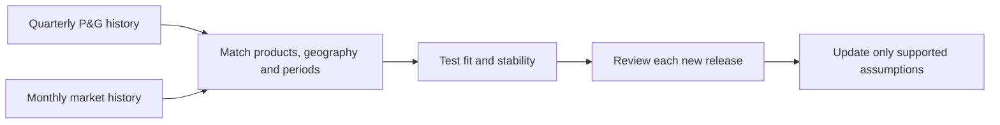

# Section 2 | Test the evidence before changing the forecast

**Answer: replace the unsupported blanket sales cut with four years of P&G–market comparisons. No new forecast adjustment is validated yet.**

- 🎯 **Goal:** decide which market signals can support an April–June 2026 sales forecast.
- 📚 **Dataset:** 17 P&G quarters, five reporting segments, and monthly market histories.
- 📅 **Information cutoffs:** 24 April and 15 May 2026. Review releases when they arrive; save the May checkpoint separately.
- 📂 **Files:** [original sources and data](../data/history_rebuild/README.md) · [editable Excel](../outputs/history_review/PG_4_Historical_Market_Analysis.xlsx).

## Analysis questions

| Question | Answer | Open the evidence |
|---|---|---|
| **1. History:** Is one month enough? | No. We collected January 2022–March 2026 company results and aligned monthly market data to quarters. | [Financial history](04_historical_matching.md#1-financial-history-what-did-pg-actually-report) |
| **2. Products:** Can we isolate Baby Care? | Not with the complete financial series available here. Baby Care sits within a combined reporting segment. | [Product matching](04_historical_matching.md#2-product-matching-can-we-model-baby-care-separately) |
| **3. Sensitivity:** Can we quantify the market link? | Yes, as exploratory associations. None has passed the checks needed for use in our forecast. | [Excel results and limitations](04_historical_matching.md#3-sensitivity-how-much-do-the-series-move-together) |
| **4. Competitors:** Must we model peers too? | No. Add them when the question concerns industry performance or market share, using comparable histories. | [When competitors help](04_historical_matching.md#4-competitors-do-we-need-a-second-sensitivity-model) |
| **5. Timing:** Must we wait until 15 May? | No. Review each public release; 15 May is a saved checkpoint. | [Release calendar](04_historical_matching.md#5-release-timing-when-should-the-forecast-change) |

## Release-aware backtest

**Latest:** [Expanded backtests and policy timing](06_driver_policy_tests.md) add 2021 company history, product-price tests and corrections based only on earlier published errors.

**New result:** Grooming pricing retains some value, but more information and 50/50 blending do not always improve accuracy. We replayed historical versions across eight target quarters.

[6. Backtest: Do immediate updates improve the forecast?](05_release_backtest.md) · [7. Data gaps: Can model changes solve them?](05_release_backtest.md#4-data-gaps-can-adding-variables-solve-the-limitations)

## What changed?

- **Kept:** the company-guidance references from [section 1](02_quarter_sales_target.md).
- **Added:** source-linked quarterly histories, product mapping, an editable sensitivity workbook and real Excel screenshots.
- **Removed from the active argument:** automatic demand and pricing cuts inferred from a few macro or peer observations.
- **Still needed:** suitable regional/product demand data and independent confirmation beyond the historical model-development sample before a calibrated numerical revision.

📁 Earlier market commentary and stress experiment

The [earlier research](03_market_context_archive.md) and [original stress workbook](../outputs/may_adjustment/PG_3_Scenario_Adjustment.xlsx) remain available for comparison. Their numerical cuts are analyst stress assumptions, not the current forecast or measured P&G sensitivities.

[→ Read the detailed answers and expand the screenshot evidence](04_historical_matching.md) · [← Project home](../README.md)
