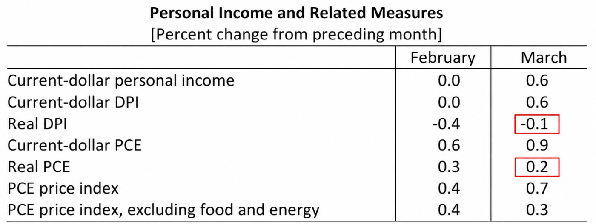
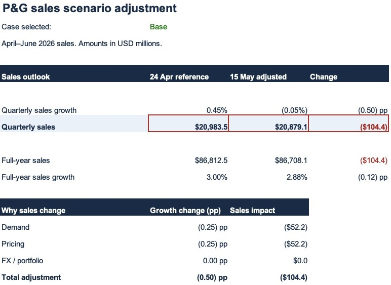
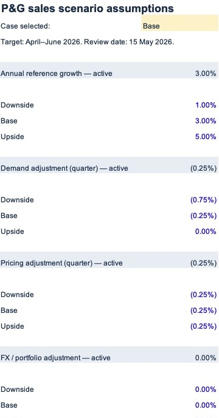

# Section 2. Scenario adjustment: What changes after new market evidence?

**Answer: Our base sales scenario falls by $104.4m to $20,879.1m after small demand and pricing adjustments.**

- **Goal:** use new evidence to challenge the April company-guidance references.
- **Target:** April–June 2026 sales; combine them with July–March actuals for the full year.
- **New information:** releases published **25 April–15 May 2026**. The starting information cutoff remains **24 April**.
- **Files:** [editable Excel](../outputs/may_adjustment/PG_3_Scenario_Adjustment.xlsx) · [evidence register](../data/processed/may_evidence.json) · [calculated case results](../outputs/may_adjustment/results.json).

## Questions answered

- [1. Demand: Should we reduce the sales assumption?](#1-demand-should-we-reduce-the-sales-assumption)
- [2. Pricing: Does competitor evidence justify a change?](#2-pricing-does-competitor-evidence-justify-a-change)
- [3. Other drivers: What should stay unchanged?](#3-other-drivers-what-should-stay-unchanged)
- [4. Revised scenarios: What is the financial impact?](#4-revised-scenarios-what-is-the-financial-impact)

**Starting point:** the low / midpoint / high targets from [section 1](02_quarter_sales_target.md). They are company-guidance references, not three previously completed independent forecasts. Here we add analyst sensitivities to create three adjusted sales scenarios. They are not assigned probabilities.

## 1. Demand: Should we reduce the sales assumption?

**Answer: Apply a small demand reduction in the base case; allow a larger reduction in the downside.**

BEA's **30 April** release showed March real consumption rising **0.2% month on month**, while real disposable income fell **0.1%**. This suggests limited real spending momentum, rather than a collapse. It covers US households, not P&G's global sales. [Source: BEA, page 3](https://www.bea.gov/sites/default/files/2026-04/pi0326.pdf).

| Analyst adjustment to quarterly sales growth | Downside | Base | Upside |
|---|---:|---:|---:|
| Demand contribution | −0.75pp | −0.25pp | 0.00pp |

**Why these sizes?** The base uses one small 0.25pp sensitivity step; downside tests three steps. Upside leaves demand unchanged because real spending still grew and peer volumes were resilient. These are judgement-based tests, not an estimated link between US consumption and P&G sales.

🔎 Evidence: BEA report → demand assumption

**Read the March column:** real income **−0.1**, real spending **+0.2**. These are monthly changes, not P&G quarterly growth rates.

[Unannotated excerpt](../evidence/may_bea_crop.png) · [Original PDF](../raw_data/may_review/BEA_March_2026.pdf)

**Excel:** in the demand group, the Base input is **−0.25%**, representing a **−0.25 percentage-point** contribution to quarterly growth. It reduces sales by **$52.2m**: $20,889m × 0.25%.

[See the native Excel calculation below](#4-revised-scenarios-what-is-the-financial-impact).

## 2. Pricing: Does competitor evidence justify a change?

**Answer: Test a 0.25pp reduction in pricing contribution across the three cases.**

Unilever's **30 April** update reported Home Care volume growth of **6.2%** with a **−0.1%** price contribution. Demand can be resilient while pricing is constrained. Different category and geographic mixes mean this does not establish P&G market-share loss. [Source: Unilever Q1 results](https://www.unilever.com/news/press-and-media/press-releases/2026/strong-volume-growth-full-year-outlook-reconfirmed/).

**Why 0.25pp?** This is a small common pricing stress, applied consistently while the demand cases vary. It is not copied from Unilever's −0.1%, and no elasticity has been estimated. The unadjusted reference remains visible so readers can compare a zero-change alternative.

🔎 Evidence: Unilever report → pricing assumption

**Read the red boxes:** **6.2% volume** alongside **−0.1% price** in Home Care.

[Unannotated excerpt](../evidence/may_unilever_source.png) · [Full original announcement](https://www.unilever.com/files/unilever-q1-2026-full-announcement.pdf)

**Excel:** pricing is **−0.25pp** in each case, reducing quarterly sales by **$52.2m**. This is a sensitivity to weaker pricing contribution; it is not a prediction that P&G's selling prices fall by 0.25%.

## 3. Other drivers: What should stay unchanged?

**Answer: Keep FX and portfolio effects unchanged; do not turn producer-cost inflation into a sales reduction.**

| Information reviewed | Decision | Why |
|---|---|---|
| P&G's 24 April guidance | Keep in the starting reference | It was already known at the starting cutoff; counting it again would duplicate information. |
| April CPI, released 12 May | Demand context; no second cut | Higher consumer prices can affect affordability, but that concern is already represented in the demand sensitivity. |
| April PPI, released 13 May | Flag for a separate margin model | Producer prices are not P&G's cost basket or a direct sales-growth input. |
| FX / portfolio | 0.00pp incremental adjustment | This review has no company-specific currency-basket or disposal estimate to justify a change. |

[April CPI release](https://www.bls.gov/news.release/archives/cpi_05122026.htm) · [April PPI release](https://www.bls.gov/news.release/archives/ppi_05132026.htm)

This section completes the **sales adjustment**. Gross margin, EPS and cash flow require their own calculations; no profit effect is claimed here.

## 4. Revised scenarios: What is the financial impact?

**Answer: The adjusted sales range is $19,089.0m–$22,617.0m, with a base of $20,879.1m.**

All amounts are USD millions, displayed to one decimal. Growth compares April–June 2026 with April–June 2025.

| Scenario | 24 Apr reference | Net adjustment | 15 May adjusted | Sales change | Adjusted quarterly growth |
|---|---:|---:|---:|---:|---:|
| Downside | $19,297.8 | −1.00pp | $19,089.0 | −$208.9 | −8.62% |
| Base | $20,983.5 | −0.50pp | $20,879.1 | −$104.4 | −0.05% |
| Upside | $22,669.2 | −0.25pp | $22,617.0 | −$52.2 | +8.27% |

**Base calculation:** $20,983.52m − ($20,889m × 0.25%) − ($20,889m × 0.25%) = **$20,879.075m** before display rounding.

**Full-year implication:** add unchanged nine-month actuals of $65,829m. The base becomes **$86,708.1m**, or **2.88% annual growth**, versus the 3% reference.

The wide scenario range mainly comes from the original company-guidance range. These adjustments do not establish a statistically calibrated prediction interval.

🔎 Evidence: actual Excel worksheet and editable assumptions

**The red boxes show reference sales, adjusted sales and the change.** The calculation below them separates the two $52.2m effects.

The screenshot was captured in Microsoft Excel. [Download the working model](../outputs/may_adjustment/PG_3_Scenario_Adjustment.xlsx).

**How to use it:** open Assumptions, select **Downside / Base / Upside** in C3, then return to Sales adjustment. The same calculation updates. Blue figures are editable inputs. Change an adjustment to zero to test whether your conclusion depends on it.

The table above records each case from a run of the same model. It is a published report, so later workbook edits do not automatically change this GitHub table.

## Checks and next step

- **Dates:** both numerical adjustment sources were published on 30 April, after the starting cutoff and before 15 May.
- **Arithmetic:** demand + pricing + FX impacts equal the total sales change; nine-month actuals + the adjusted quarter equal full-year sales.
- **Model:** all three case selections and a change to the demand assumption were tested in the calculation engine; the base result was also checked in Microsoft Excel.
- **Timing:** this is a retrospective reconstruction. The April–June actual result was not used in these calculations.

**Next: compare the saved adjusted sales scenarios with the reported quarter and explain the variance.** Keep the 24 April reference and 15 May review unchanged during that evaluation.

[← Quarterly target](02_quarter_sales_target.md) · [Project home](../README.md)
