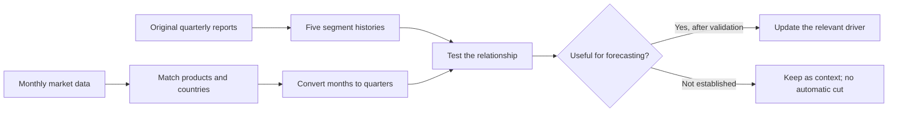
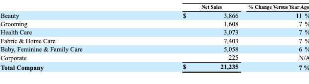
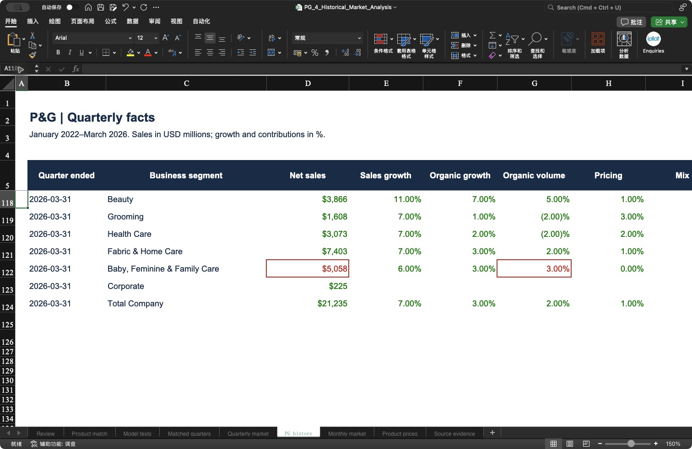
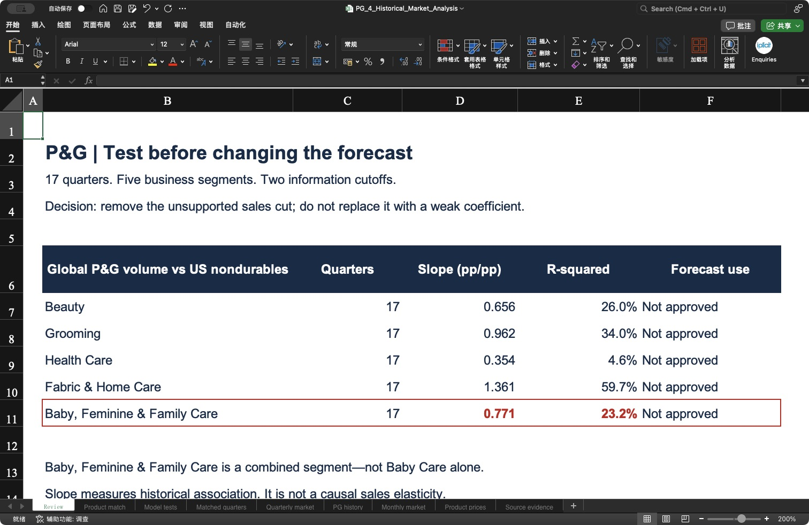

# Historical matching | Does the market actually explain P&G?

**Answer: some indicators move with P&G, but the relationships are not strong enough to justify the old blanket sales cut.**

- 🎯 **Goal:** test the connection before changing a forecast.
- 📚 **Company data:** 17 quarters, January 2022–March 2026; five global business segments.
- 📅 **Market data:** monthly history from January 2021, saved as known on **24 April** and **15 May 2026**; the extra year supplies year-on-year comparisons.
- 📂 **Files:** [Excel analysis](../outputs/history_review/PG_4_Historical_Market_Analysis.xlsx) · [original sources](../data/history_rebuild/README.md) · [matched quarterly data](../data/history_rebuild/matched_quarters.csv).

## Analysis questions

- [1. Financial history: What did P&G actually report?](#1-financial-history-what-did-pg-actually-report)
- [2. Product matching: Can we model Baby Care separately?](#2-product-matching-can-we-model-baby-care-separately)
- [3. Sensitivity: How much do the series move together?](#3-sensitivity-how-much-do-the-series-move-together)
- [4. Competitors: Do we need a second sensitivity model?](#4-competitors-do-we-need-a-second-sensitivity-model)
- [5. Release timing: When should the forecast change?](#5-release-timing-when-should-the-forecast-change)

## 1. Financial history: What did P&G actually report?

**Answer: we now have quarterly sales and growth drivers for all five segments, rather than a single month of economic commentary.**

The history separates **sales, organic sales, organic volume, pricing, mix and FX**. The source tables report quarters, not P&G's individual January, February and March sales. We do not divide a quarterly number by three and call those monthly actuals.

🔎 Original report → real Excel: follow the $5,058m sales figure

**Original:** P&G's January–March 2026 segment table reports **$5,058m** for **Baby, Feminine & Family Care**. This is the combined segment, not Pampers or Baby Care alone. [Original 10-Q, segment results](https://www.sec.gov/Archives/edgar/data/80424/000008042426000060/pg-20260331.htm).

**Excel:** the same **$5,058m** appears in red. The second red cell is **3% organic volume growth**, taken from the report's separate sales-driver table. Revenue and volume are different measures.

Every number has its original URL, publication date, table location and source row in **Source evidence**. [Download the source-to-value register](../data/history_rebuild/pg_observations.csv).

## 2. Product matching: Can we model Baby Care separately?

**Answer: not from the complete series collected here; we can model the combined segment and research Baby Care separately.**

| P&G reporting segment | Product lines researched | Available market evidence | Safe use |
|---|---|---|---|
| **Beauty** | Hair, Personal, Skin Care | Personal-care and cosmetics price indices | Pricing context; these baskets are broader than each P&G line. |
| **Grooming** | Razors, blades and appliances | Hair/dental/shaving price index | Combined price basket, not razor demand. |
| **Health Care** | Oral and Personal Health Care | Personal-care prices; health/personal-care store sales | Price and channel context; store sales also include other products. |
| **Fabric & Home Care** | Fabric and Home Care | Household-cleaning price index | Price context, not detergent units sold. |
| **Baby, Feminine & Family Care** | Baby, Feminine and Family Care | Household-paper prices for Family Care | No matched diaper or feminine-care quantity series collected. |

**A price index is not a market-volume dataset.** Baby-food spending is not a substitute for diaper demand. Nor can a competitor's baby business reveal P&G's undisclosed monthly baby sales.

📚 What has been collected, and what is missing?

- **17 complete P&G quarters:** January 2022–March 2026, with five segments plus Corporate and the company total.
- **Three historical market series at two cutoff dates:** real nondurable consumption, health/personal-care store sales, and personal-care product prices. There are **377 monthly observations across the two versions**, not 377 independent months.
- **Four more product-price series:** cleaning, paper, hair/dental/shaving, and cosmetics/bath. Their January 2021–April 2026 downloads contain **252 values and four missing entries**.
- **Those four downloads are research-only:** their April/May historical versions have not been verified, so they are excluded from the forecast-cutoff calculations.
- **Missing:** consistent quarterly product-line amounts and matching country/product market quantities. No separate Baby Care sensitivity is claimed.

[P&G product-to-segment definitions, FY2025 report](https://www.sec.gov/Archives/edgar/data/80424/000008042425000076/pg-20250630.htm) · [BLS product-index definitions](https://www.bls.gov/cpi/additional-resources/index-publication-level.htm).

## 3. Sensitivity: How much do the series move together?

**Answer: the combined Baby, Feminine & Family Care segment has a slope of about 0.77 against US real nondurable spending growth, but this is a weak descriptive relationship—not a usable Baby Care forecast rule.**

**Read 0.77 like this:** within these 17 quarterly pairs, 1 percentage point higher US nondurable spending growth is associated with about 0.77 percentage points higher P&G combined-segment organic volume growth. It does **not** mean US spending causes that increase.

| Test using the 15 May data version | Slope | Past variation explained | Decision |
|---|---:|---:|---|
| US nondurable spending → combined Baby/Feminine/Family **volume** | 0.77 | 23.2% | Too broad to use as a Baby Care rule. |
| US health/personal-care store sales → global Health Care **organic sales** | 0.05 | 0.1% | Almost no explanatory relationship in this sample. |
| US personal-care prices → global Beauty **pricing contribution** | 0.96 | 84.3% | Promising association; still needs geography, lag and real-time validation. |

The last column is a modelling decision, not a claim that all US indicators are useless. A proxy can be useful if it predicts reliably; a high historical fit alone does not establish that.

📊 Actual Excel results and how the test works

1. **Match the period:** compare January–March market activity with January–March P&G results.
2. **Aggregate levels first:** add monthly retail spending; average price indices and annualised spending levels. Then calculate growth versus the same quarter last year.
3. **Require a complete quarter:** missing observations remain missing. Incomplete quarters are excluded, not filled with zero. The price test has 16 pairs because one quarter lacks a monthly observation.
4. **Estimate one relationship at a time:** the slope, intercept and fit recalculate in Excel from the matched rows.
5. **Challenge the fit:** remove one quarter at a time; also use an expanding historical window and compare errors with a simple trailing-four-quarter average.

For the combined baby/feminine/family test, the leave-one-quarter-out slope ranges from **0.54 to 0.91**. Its expanding-window error is **2.86pp**, versus **3.20pp** for the simple baseline. That modest improvement does not fix the product and geography mismatch.

These market tests keep a single cutoff vintage while walking through older quarters. They are **diagnostic holdouts**, not a fully reconstructed real-time forecasting track record. Same-quarter market observations may also become available after the quarter ends. No causal elasticity or calibrated probability interval is claimed.

**Seasonality:** year-on-year comparisons and seasonally adjusted spending series help avoid comparing holiday months with ordinary months. Four years still give only 17 quarterly observations; inflation, portfolio changes and changing retailer inventories can alter the relationship. Lag tests, regional weights and historical release-by-release validation remain necessary before deploying a coefficient.

[All fitted results and stability checks](../data/history_rebuild/sensitivity_tests.csv) · [Matched inputs](../data/history_rebuild/matched_quarters.csv).

## 4. Competitors: Do we need a second sensitivity model?

**Answer: no—if P&G's own matched history answers the question, competitors are an optional cross-check.**

| What we want to know | Is a peer needed? | Why? |
|---|---|---|
| How does P&G react to market demand? | **Not necessarily** | Estimate from P&G and the relevant market first. |
| Is the weakness industry-wide or specific to P&G? | **Useful** | Compare similar products and regions across companies. |
| Did P&G lose market share? | **Useful, but insufficient alone** | Both peers and P&G could grow while private-label brands grow faster. Market totals are needed. |
| Can a peer fill missing P&G Baby Care data? | **No** | Different brands, prices, customers and countries prevent a direct substitution. |

No peer coefficient enters this rebuild. The previous single-quarter peer examples remain [background research](03_market_context_archive.md), not numerical evidence for a sales cut.

If a peer is later used quantitatively, collect the **same January 2022–March 2026 quarterly window**, plus any comparison-year inputs. Match its own categories, countries, currency treatment and accounting changes to market data. Its sensitivity stays separate from P&G's; do not average the two or multiply both into P&G sales.

## 5. Release timing: When should the forecast change?

**Answer: review each relevant release when it becomes public; change a forecast only when the new evidence changes a supported assumption.**

| Publication date | What became available | What we do |
|---|---|---|
| **24 April** | P&G's January–March results | Establish company actuals and the starting view. March real consumption was not yet available. |
| **30 April** | BEA March consumption | Complete the market quarter and reassess momentum; do not call this April consumption. |
| **12 May** | April personal-care prices | Update the price evidence, not unit demand. |
| **14 May** | April retail sales | Update observed April channel spending; May and June remain unknown. |
| **15 May** | Review checkpoint | Save the accumulated information and decisions; this is not a reason to delay earlier reviews. |

At the 15 May cutoff, April personal-care prices rose **0.62% month on month** before seasonal adjustment. Health/personal-care store sales were approximately **flat** after seasonal adjustment: the underlying levels imply **−0.02%**, rounded to **0.0%** in the release. These are different measures and should not be added together. [Dated market versions](../data/history_rebuild/market_manifest.json).

**Current decision:** remove the unsupported −0.25pp demand/pricing revisions from the active argument. Keep the company-guidance references separately. This rebuild does not yet establish a new, validated downside/base/upside forecast.

**What would unlock a numerical update?** A suitable product/region series, a tested timing relationship, and a forecast of the still-unknown target months. Until then, showing a precise new sales cut would overstate what the evidence supports.

[← Section 2](03_scenario_adjustment.md) · [Project home](../README.md)
