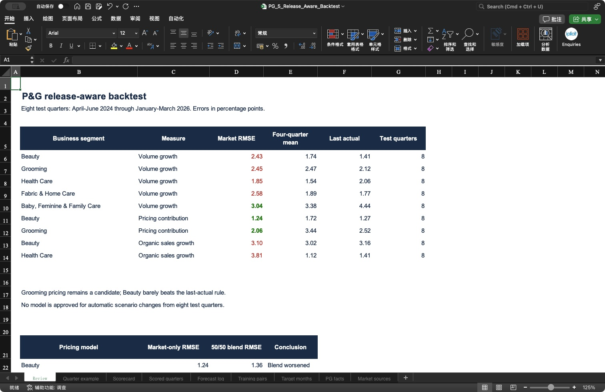
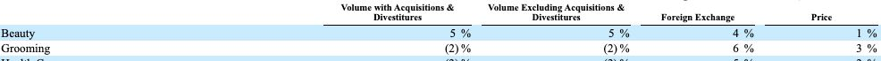
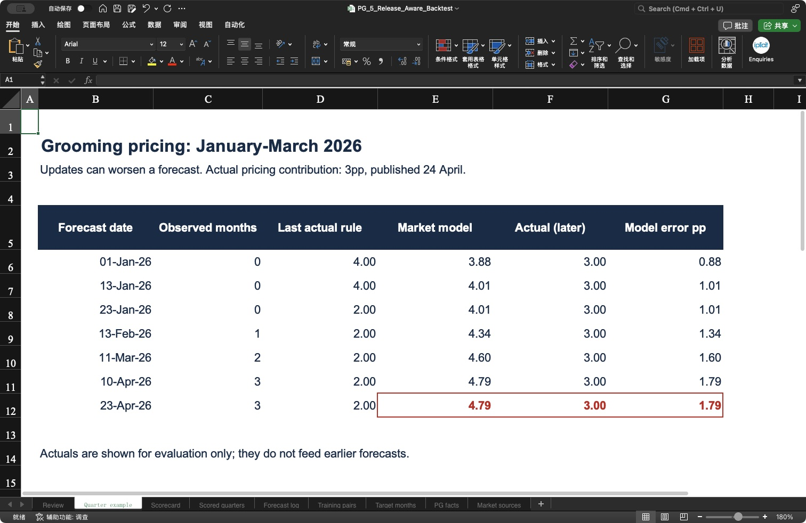

# Release-aware forecasting | Does new information improve the forecast?

> **Latest extension:** [12-quarter tests, bias correction, product drivers and tariff timing](06_driver_policy_tests.md). This page preserves the earlier eight-quarter experiment.

**Answer: sometimes. Grooming pricing improved across eight test quarters, but automatic updates also produced a clear failure. Adding models did not automatically help.**

- 🎯 **Goal:** update when information becomes available, then test whether the updates improve accuracy.
- 📚 **Company history:** January 2022–March 2026. **Test quarters:** April–June 2024 through January–March 2026.
- 📅 **Market evidence:** 122 preserved ALFRED versions covering 90 revision dates plus forecast checkpoints.
- 📂 **Files:** [Excel workbook](../outputs/release_backtest/PG_5_Release_Aware_Backtest.xlsx) · [raw versions and processed data](../data/release_backtest/README.md).

## Analysis questions

- [1. Timing: Do we update immediately?](#1-timing-do-we-update-immediately)
- [2. Backtest: Which methods worked?](#2-backtest-which-methods-worked)
- [3. Example: Can more information make a forecast worse?](#3-example-can-more-information-make-a-forecast-worse)
- [4. Data gaps: Can adding variables solve the limitations?](#4-data-gaps-can-adding-variables-solve-the-limitations)
- [5. Decision: What can enter our scenarios?](#5-decision-what-can-enter-our-scenarios)

## 1. Timing: Do we update immediately?

**Answer: yes. Recalculate on each relevant historical data-version date and P&G publication date; do not wait for the 15 May checkpoint.**

At each date, the process loads the latest market version available by that date and only P&G results already published. The quarter being forecast is excluded from training. Its actual result is joined afterwards for scoring.

| Forecast stage | Information allowed |
|---|---|
| **Quarter start** | Only facts published by the first calendar day of that quarter. |
| **First target month available** | Replace that month's estimate with its published observation. |
| **Second target month available** | Use both observed months; estimate the remaining month. |
| **Before earnings** | Use the information available on the day before P&G's report. |

Unknown market months use the **average year-on-year growth of the latest three observed months**, applied to the corresponding prior-year monthly levels. This preserves the prior-year seasonal pattern while making the assumption explicit. It does not invent P&G monthly sales.

🔎 What does “available that day” mean?

- Each download carries its requested vintage date, last available month, original URL and file hash in the [version register](../data/release_backtest/vintage_manifest.json).
- The [forecast log](../data/release_backtest/predictions.csv) records market version, company publication cutoff, observed months, fitted coefficients and each model result.
- ALFRED normally incorporates releases within one business day. This is an **end-of-day historical-vintage replay**, not proof of execution at the exact publication minute. [ALFRED methodology](https://alfred.stlouisfed.org/help).
- P&G availability uses the publication/filing dates preserved in the company source register. Earlier intraday availability is not claimed.
- Data collection extends to the 15 May 2026 checkpoint. **April–June 2026 P&G actuals are not used.**

## 2. Backtest: Which methods worked?

**Answer: the Grooming price model remained useful in this sample; Beauty's advantage over the latest reported result became very small. Broad US demand and channel proxies mostly failed to beat simple alternatives.**

We tested five methods without choosing a different formula for every quarter:

| Method | Plain-language rule |
|---|---|
| **Four-quarter mean** | Use the average of the latest four published company results. |
| **Last actual** | Repeat the latest published company result. |
| **Market model (“bridge”)** | Estimate the current quarter's market growth from observed and estimated months; apply the relationship fitted to earlier published quarters. |
| **Lagged market** | Fit previous-quarter market growth to the following quarter's company result. Leave unavailable cases blank. |
| **50/50 blend** | Average the market forecast and the four-quarter mean. This weight is a fixed test rule, not an estimated optimum. |

**Before-earnings RMSE, in percentage points. Lower is better.** All rows below use the same eight target quarters for their three comparisons.

| P&G measure | Market model | Four-quarter mean | Last actual |
|---|---:|---:|---:|
| Beauty volume growth | 2.43 | 1.74 | **1.41** |
| Grooming volume growth | 2.45 | 2.47 | **2.12** |
| Health Care volume growth | 1.85 | **1.54** | 2.06 |
| Fabric & Home Care volume growth | 2.58 | 1.89 | **1.77** |
| Baby/Feminine/Family volume growth | **3.04** | 3.38 | 4.44 |
| Beauty pricing contribution | **1.24** | 1.72 | 1.27 |
| Grooming pricing contribution | **2.06** | 3.44 | 2.52 |
| Beauty organic sales growth | 3.10 | **3.02** | 3.16 |
| Health Care organic sales growth | 3.81 | **1.12** | 1.41 |

The combined baby/feminine/family model also improved on both rules, but its product and geography mismatch remains. It is not a Baby Care forecast model.

📊 Open the actual Excel summary and complete scores

- **RMSE** penalises large errors; it is not a percentage accuracy score.
- **Beauty pricing:** the market model beat the four-quarter mean in only **3 of 8** individual quarters, despite its lower overall RMSE. The advantage is uneven.
- **Grooming pricing:** it beat that mean in **6 of 8** quarters, but overpredicted by **1.38pp on average** before earnings.
- At quarter start, Grooming market-model RMSE was **2.83pp**, versus **3.87pp** for the last-actual rule. Beauty's market model was **1.72pp**, versus **1.54pp** for last actual.
- The lagged pricing model could be scored in **7 quarters**: the missing October 2025 CPI observation prevents a complete prior-quarter value for January–March 2026. Its same-sample benchmarks appear alongside it in the score file. Do not compare its seven-quarter result with an eight-quarter benchmark.

[All methods and stages](../data/release_backtest/scores.csv) · [Individual scored forecasts](../data/release_backtest/scored_predictions.csv).

## 3. Example: Can more information make a forecast worse?

**Answer: yes. For January–March 2026 Grooming pricing, the market model rose from 3.88pp to 4.79pp; P&G eventually reported 3pp.**

| Information date | Target months observed | Market-model estimate | What happened |
|---|---:|---:|---|
| **1 January** | 0 | 3.88pp | Estimate the quarter using information already published. |
| **13 February** | 1 | 4.34pp | January CPI becomes available. |
| **11 March** | 2 | 4.60pp | February CPI becomes available. |
| **10 April** | 3 | 4.79pp | March CPI completes the market quarter. |
| **24 April** | — | **Actual: 3.00pp** | Score the forecast; do not feed this actual into earlier estimates. |

The model responds to new data as intended, but its market-price relationship overstates P&G's pricing contribution in this quarter. More timely inputs do not repair an imperfect business relationship.

🔎 Original report → real Excel: compare actual 3pp with forecast 4.79pp

**Original:** read the **Grooming** row and **Price** column in the January–March sales-driver table: **3%**, expressed here as a **3 percentage-point contribution to sales growth**. This is not revenue growth or an observed average selling-price increase. [P&G original report](https://www.sec.gov/Archives/edgar/data/80424/000008042426000060/pg-20260331.htm).

**Excel:** the final forecast **4.79**, actual **3.00** and overprediction **1.79** are highlighted in red. The actual column is shown afterwards for evaluation only.

On 1 January, the latest published P&G quarter was July–September. October–December results were not published until 23 January. That is why “last actual” changes from 4 to 2 during the timeline.

## 4. Data gaps: Can adding variables solve the limitations?

**Answer: some gaps can be reduced by better matching, explicit estimates and simpler models. Missing company disclosures cannot be created by arithmetic.**

| Limitation | Practical response | What we implemented |
|---|---|---|
| Later revisions leak into earlier forecasts | Save the historical version available at each forecast date | **Implemented:** 122 frozen downloads and availability checks. |
| Monthly indicators versus quarterly reports | Aggregate monthly levels, then calculate quarterly growth | **Implemented:** aligned periods and explicitly labelled estimates for unknown target months. |
| Strong historical fit but weak prediction | Test chronological forecasts against simple alternatives | **Implemented:** eight scored quarters, five methods, four forecast stages where available. |
| An unstable market model dominates the answer | Test a fixed blend with a simple company-history forecast | **Tested:** it did not improve these two pricing models. |
| US indicators versus global P&G | Collect comparable regional indicators and combine them with justified exposure weights | **Not implemented:** product-by-country exposure weights are unavailable here. Global sales weights are not automatically valid for every segment. |
| Broad price basket versus specific products | Use finer product indices and verify their historical release versions | **Partly addressed:** four detailed price histories collected earlier; historical versions still unverified. |
| Undisclosed Baby Care quarterly sales | Model the disclosed combined segment; label separate Baby Care research qualitative | **Implemented:** no invented Baby Care amounts or coefficient. |
| Few independent quarters | Keep few parameters, show benchmark results, extend history and test later unseen periods | **Partly addressed:** one market variable per fit and two simple benchmarks; sample size remains small. |

**Two different kinds of “addition”:**

- **Business drivers:** volume, price, mix and FX can be analysed separately. Their sales-growth contributions are an approximate bridge with rounding and definition differences, not a licence to add unrelated growth rates.
- **Predictor variables:** putting consumption, retail sales and inflation into one regression can count overlapping information and overfit 17 quarters. Adding a variable is justified only if it helps on comparable out-of-sample periods.

Do not multiply the already-estimated global P&G sensitivity by a US revenue weight again. A regional model needs its own consistent regional inputs and aggregation design.

🧮 Did a simple 50/50 blend help?

| Pricing forecast | Market-only RMSE | 50/50 blend RMSE | Result |
|---|---:|---:|---|
| Beauty | **1.24pp** | 1.36pp | Worse |
| Grooming | **2.06pp** | 2.68pp | Worse |

This blend averages the market estimate and the four-quarter company mean. It is not a regional weighting scheme and does not fill missing data. We preserve the failed test rather than assuming complexity helps.

## 5. Decision: What can enter our scenarios?

**Answer: retain the promising relationships as candidate inputs; do not mechanically replace the current scenarios with their point estimates.**

- **Grooming pricing:** useful candidate, but test its upward bias and changing price relationship.
- **Beauty pricing:** weak incremental value over the last-actual rule; avoid overstating the benefit.
- **Other businesses:** retain the complete score table, including failed demand/channel models.
- **New releases:** update the evidence and calculations immediately within the chosen end-of-day process. A scenario change still needs a defensible business assumption.

There are **eight test quarters**, not 508 independent tests: repeated forecasts for the same quarter share an eventual actual. The model family was developed after inspecting these historical periods, so this is a **retrospective development backtest**, not an untouched confirmation sample. No confidence level, causal elasticity or fully validated final scenario is claimed.

[← Historical matching](04_historical_matching.md) · [Project home](../README.md)
