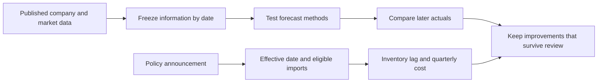
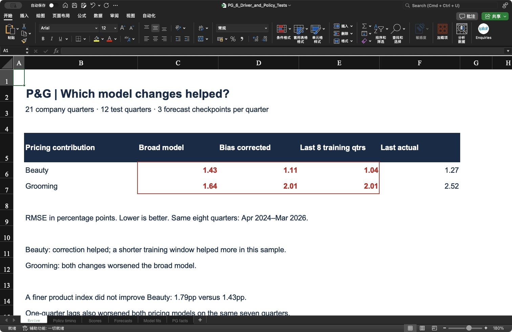
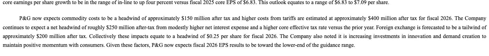
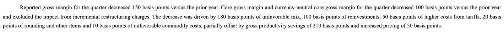
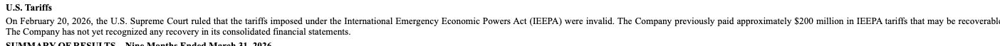
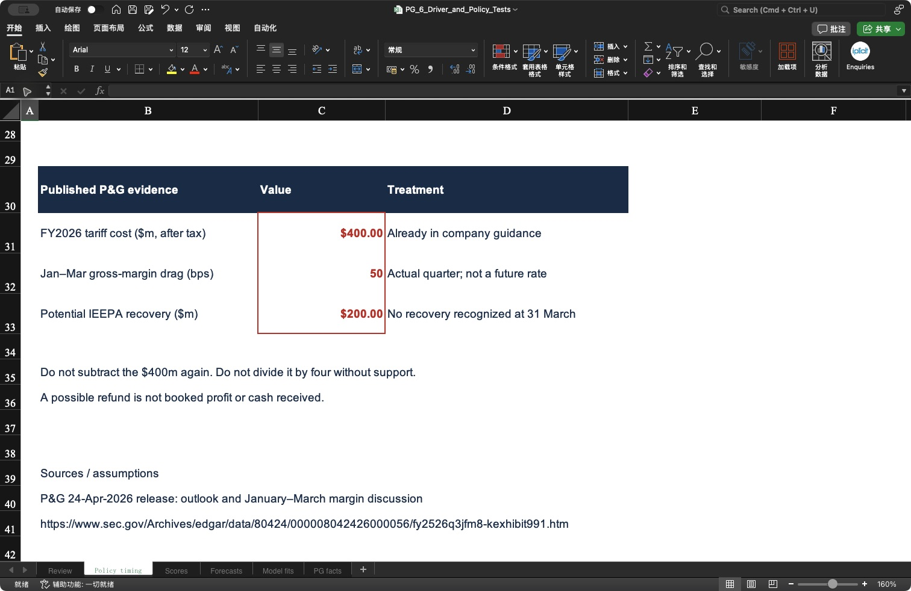
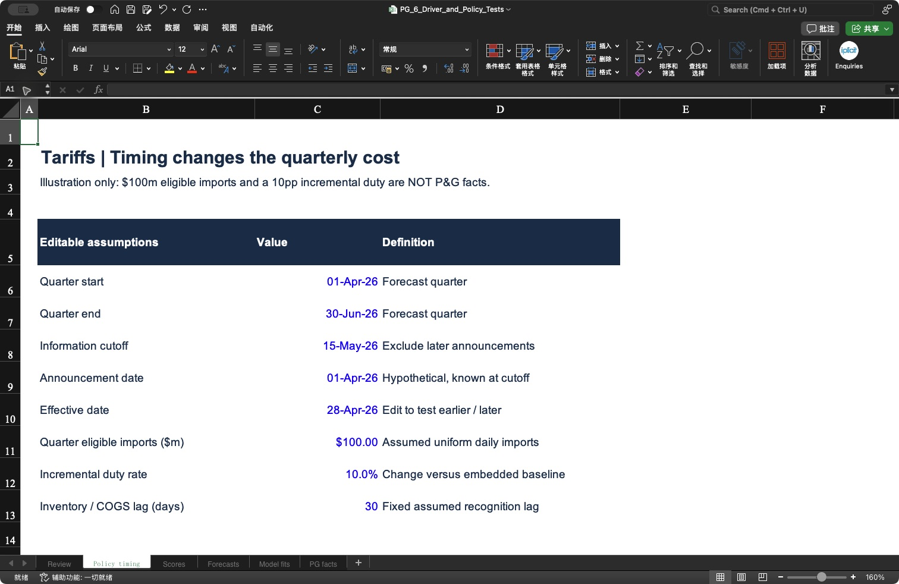
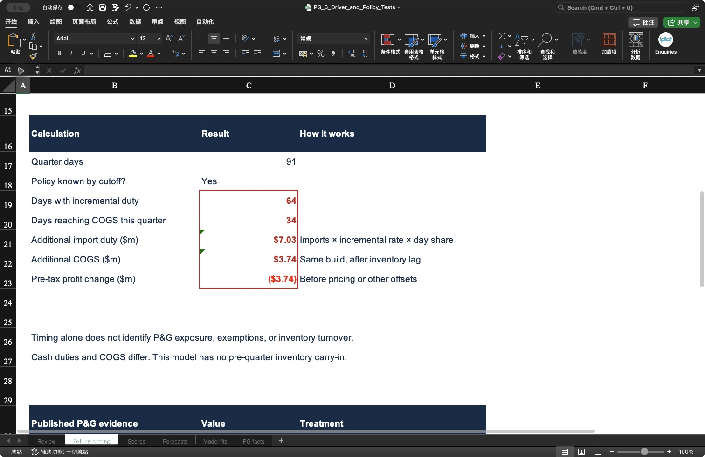

# P&G | Better drivers, better forecasts?

**Answer: more detail helped some forecasts and hurt others. Tariffs belong in a separate cost calculation with explicit dates.**

- 🎯 **Goal:** test improvements before changing our April–June 2026 scenarios.
- 📚 **History:** 21 company quarters, January 2021–March 2026; 12 test quarters, April 2023–March 2026.
- 🧪 **Added:** product prices, company history, rolling training, error correction and policy timing.
- 📂 **Open:** [Excel analysis](../outputs/driver_tests/PG_6_Driver_and_Policy_Tests.xlsx) · [data and rerun instructions](../data/driver_tests/README.md).

## Analysis questions

- [1. Drivers: What did we add?](#1-drivers-what-did-we-add)
- [2. Backtests: Did the changes improve accuracy?](#2-backtests-did-the-changes-improve-accuracy)
- [3. Correction: Can we fix a repeated forecast error?](#3-correction-can-we-fix-a-repeated-forecast-error)
- [4. Policy: Why include tariffs separately?](#4-policy-why-include-tariffs-separately)
- [5. Timing: Does early or late implementation matter?](#5-timing-does-early-or-late-implementation-matter)
- [6. Decision: What changes in our scenario process?](#6-decision-what-changes-in-our-scenario-process)

## 1. Drivers: What did we add?

**Answer: we tested product prices and company history, alongside the earlier US demand and retail indicators.**

| Driver or method | Question it helps answer | Treatment |
|---|---|---|
| US cosmetics CPI | Does a narrower price measure explain Beauty pricing better? | Tested against the broader personal-care CPI. |
| P&G's own past results | Does company momentum outperform market information? | Tested alone and, for Beauty, with product prices. |
| Previous-quarter market data | Does the effect arrive one quarter later? | Tested with the same available quarters for each benchmark. |
| Last eight training quarters | Has the historical relationship changed? | Compared with an expanding history. |
| Earlier forecast errors | Is the model persistently too high or low? | Tested full and half corrections, using only already-published outcomes. |
| Tariff timing | When would additional import costs reach profit? | Separate editable cost sensitivity. |

**Not yet quantified:** exchange rates, commodities, promotions and retailer inventories need matched exposure or consistently defined histories. Adding an unmatched index would not solve that gap.

🔎 Product matching and available evidence

The new [cosmetics CPI series](https://fred.stlouisfed.org/series/CUUR0000SEGB02) covers cosmetics, perfume, bath and nail products. It is a **US retail price index**, not P&G's global realised price. It only partially matches Beauty, which also includes other categories.

We preserved **144 historical versions across four series and 36 forecast dates**. Historical downloads attempted for three further product indexes did not succeed; those candidates were excluded rather than replaced with today's revised history. See the [download register](../data/driver_tests/market_manifest.json).

The five segment pricing comparisons include exploratory broad-proxy checks. Personal-care CPI is particularly weak as a match for Fabric/Home and Baby/Feminine/Family. Those checks are not evidence of a causal product relationship.

Original company figures: [source register for the four added 2021 quarters](../data/driver_tests/added_source_rows.csv), plus the [previously collected reports](../data/history_rebuild/selected_source_manifest.json). We use quarterly company outcomes; we do not invent monthly P&G sales.

## 2. Backtests: Did the changes improve accuracy?

**Answer: the shorter training window improved Beauty pricing, but worsened Grooming. A finer product index and a one-quarter lag did not improve these two pricing forecasts.**

**RMSE in percentage points; lower is better.** These results use the same eight recent target quarters, April–June 2024 through January–March 2026, immediately before each earnings report.

| Pricing model | Beauty | Grooming |
|---|---:|---:|
| Broad market, expanding history | 1.43 | **1.64** |
| Correct previous forecast bias | 1.11 | 2.01 |
| Correct half the previous bias | 1.17 | 1.79 |
| Use last eight training quarters | **1.04** | 2.01 |
| Repeat last actual | 1.27 | 2.52 |
| Product price only | 1.79 | Not tested |
| Company history + product price | 1.96 | Not tested |

📊 Open the real Excel results and full comparisons

**Read the red cells across each row:** Beauty improves from 1.43 to 1.11, while Grooming worsens from 1.64 to 2.01. These are forecast errors, not sales-growth forecasts.

- Across **all 12 test quarters**, Beauty's broad-model RMSE was **1.40pp**, versus **1.15pp** with an eight-quarter training window. Grooming was **1.70pp**, versus **1.88pp** with the shorter window.
- The bias model requires four completed earlier errors. It therefore has **eight before-earnings test quarters**, not twelve. At quarter start, it has only seven eligible quarters.
- The lagged pricing models have **seven recent observations** because an incomplete prior-quarter CPI prevents the January–March 2026 case. On those same seven quarters, Beauty's lag RMSE is **1.89pp**, versus broad-model **1.14pp**; Grooming's is **2.41pp**, versus **1.61pp**.
- [Every model, measure and stage](../data/driver_tests/scores.csv) · [Every forecast and later actual](../data/driver_tests/forecasts.csv).

The wider history includes 2021, so these fitted models differ from the earlier PG_5 workbook. This is **retrospective model development**, not a fresh, untouched confirmation sample. A winning method is a candidate for future testing, not proof of future accuracy.

## 3. Correction: Can we fix a repeated forecast error?

**Answer: yes, we can test a correction—but we cannot assume that a past 1.5pp error will repeat.**

1. Save the original forecast before the actual result is published.
2. Once the result is public, calculate **forecast minus actual**.
3. At the next checkpoint, average the last four eligible errors from the **same forecast stage**.
4. Subtract either all or half of that average from the new forecast.
5. Score the revised forecast only after its actual is published.

For illustration, an average overprediction of 1.5pp would reduce a new 3.0pp forecast to 1.5pp with full correction, or 2.25pp with half correction. **These are explanatory numbers, not our P&G forecast.**

🧮 Trace the calculation in Excel

In **Forecasts**, follow **Original prediction → Prior error mean → Correction weight → Final forecast → Actual → Error**. The prior-error formula links to four earlier forecast rows; the CSV records their IDs in `calibration_ids`.

The workbook recalculates forecasts and scores. Raw collection, date matching and preparation of regression training totals run in the analysis scripts. Editing an old company source value does not rebuild all historical training totals: rerun the analysis to do that.

The date checks confirm that each correction uses only outcomes published by its cutoff. No April–June 2026 P&G actual enters these tests.

## 4. Policy: Why include tariffs separately?

**Answer: tariffs can materially affect profit, but a sales regression cannot identify the cost without import exposure and timing.**

| Published evidence | What it means for our model |
|---|---|
| Approximately **$400m after-tax FY2026 tariff cost** in the 24 April outlook | Already embedded in management guidance. Do not deduct it again or allocate one quarter by simply dividing by four. |
| **50 basis points** of January–March gross-margin pressure from tariffs | Evidence that tariffs affected costs; not a forecast rate for the next quarter. |
| Approximately **$200m** of previously paid IEEPA tariffs potentially recoverable | The March 10-Q says no recovery had been recognized. Do not treat a possible refund as booked profit or received cash. |

🔎 Original report → actual Excel: follow $400m, 50bps and $200m

**Original release: full-year tariff guidance.** Read the first two lines, including **$400 million after tax for fiscal 2026**. [Open original release](https://www.sec.gov/Archives/edgar/data/80424/000008042426000056/fy2526q3jfm8-kexhibit991.htm).

**Original release: January–March gross margin.** Find **50 basis points of higher costs from tariffs**.

**Original 10-Q: possible recovery.** Read **$200 million** together with **not yet recognized any recovery**. [Open original 10-Q](https://www.sec.gov/Archives/edgar/data/80424/000008042426000060/pg-20260331.htm).

**Excel:** the three matching values are red; the treatment beside each value explains how we use it.

## 5. Timing: Does early or late implementation matter?

**Answer: yes. Track announcement, legal effectiveness and cost recognition separately.**

**Announcement → effective imports → inventory → cost of sales → profit.** A policy can affect expectations immediately, while its accounting effect arrives later.

For a real historical example, a US policy was announced on **12 May 2025** and specified **14 May 2025** effectiveness. Its 10% figure concerned the reciprocal-tariff component, not every applicable duty. This is a timing example, **not an assumption about the rules in 2026**. [Original presidential action](https://www.whitehouse.gov/presidential-actions/2025/05/modifying-reciprocal-tariff-rates-to-reflect-discussions-with-the-peoples-republic-of-china/).

The Excel illustration assumes **$100m of eligible imports evenly spread across April–June, a 10 percentage-point incremental duty and a 30-day inventory lag**. These are analyst assumptions, not P&G disclosures.

| Same assumptions, different effective date | 28 April: about 30% of quarter elapsed | 4 June: about 70% elapsed |
|---|---:|---:|
| Days subject to additional duty | 64 of 91 | 27 of 91 |
| Additional import duty | $7.03m | $2.97m |
| Additional cost recognized this quarter | $3.74m | $0.00m |

The later cost is deferred, not eliminated. The illustration excludes pre-quarter inventory, stockpiling, supplier absorption, exemptions and customer price responses. With actual import batches, use their dates and expected sale dates instead of uniform day weighting.

🧮 Open the editable inputs and actual Excel calculation

Change **Effective date** in Excel to test the timing. We checked that moving it to 4 June recalculates duty to **$2.97m** and current-quarter cost to **$0.00m**, then restored 28 April. A blank exposure is marked missing; zero exposure remains a valid zero. Announcements after the cutoff are excluded.

**P&G-specific incremental profit impact remains unquantified:** we do not have the necessary eligible import values, exact duty changes versus its embedded baseline, or inventory recognition schedule.

## 6. Decision: What changes in our scenario process?

**Answer: retain a small set of tested candidates and a separate policy cost sensitivity; do not apply a universal correction.**

- **Beauty:** retain the shorter-window and bias-adjusted models as candidates for a future frozen test.
- **Grooming:** retain the broad pricing model as the comparator; the tested corrections and lag did not improve it.
- **Other segments:** use the complete score table; weak product or geography matches stay exploratory even when one error measure improves.
- **Policy:** update the event register when news is public, then change cost assumptions only where exposure and timing are supported.
- **Next numerical scenarios:** still require driver selection and supported April–June assumptions. This page does not claim a completed calibrated downside/base/upside forecast.

[← Project overview](../README.md) · [Earlier release-by-release replay](05_release_backtest.md)
