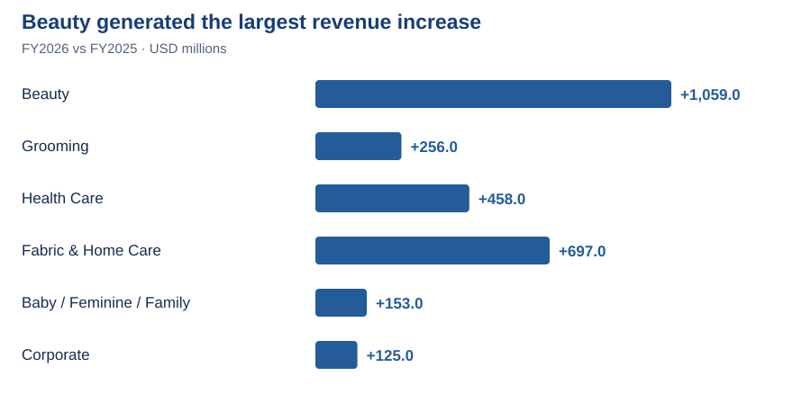

# 6. Segment contribution: Which business added the most revenue?

**Answer:** **Beauty added $1,059m**, or **38.5%** of the consolidated **$2,748m** increase, the largest contribution of any segment.

**Why it matters:** Contribution analysis identifies which businesses deserve closer review.

Compare FY2026 segment sales with the Excel contribution calculation

**Original annual report · FY2026 segment revenue · USD millions**

**Excel · PG_3_Analysis · Segment revenue and contribution · USD millions**

**Follow Beauty:** the FY2026 source shows **$16,023m**. Subtract FY2025 **$14,964m** to get **$1,059m**, then divide by the company increase of **$2,748m** to get **38.5%**.

Click an image to enlarge. [Original annual report, PDF page 56](https://s204.q4cdn.com/332108499/files/doc_financials/2026/ar/2026_annual_report.pdf#page=56) · [Open Excel](../outputs/PG_1_Analysis.xlsx)

Check the FY2025 starting figures

**Original annual report · FY2025 segment revenue · USD millions**

**Excel · PG_3_Analysis · FY2025 starting values and FY2026 changes · USD millions**

The prior-year source shows Beauty at **$14,964m**. All six segment changes, including Corporate, add to **$2,748m**. The displayed segment sales levels total $1m below consolidated sales in both years, so their changes still reconcile exactly.

Click an image to enlarge. [Original annual report, PDF page 57](https://s204.q4cdn.com/332108499/files/doc_financials/2026/ar/2026_annual_report.pdf#page=57) · [Open Excel](../outputs/PG_1_Analysis.xlsx)

---
[← Project home](../README.md) · [All analysis questions](README.md) · [Skills and evidence](../SKILLS.md)
