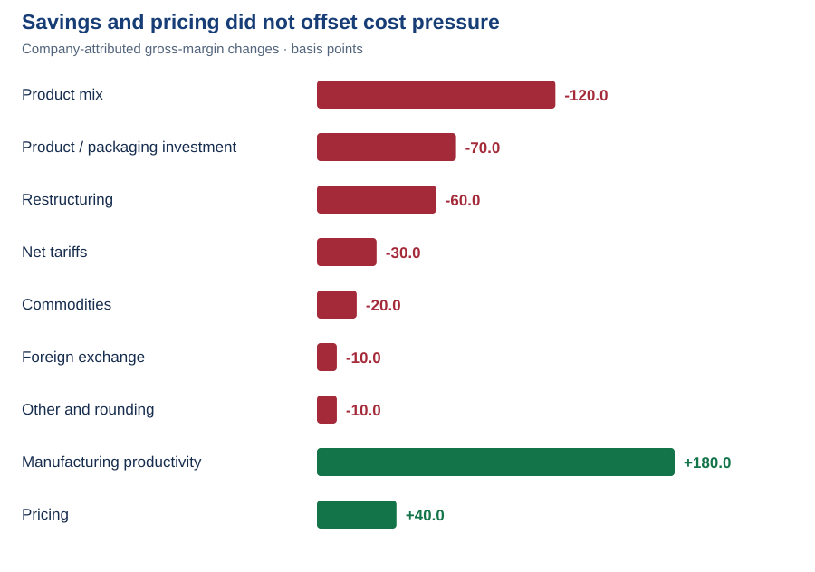

# 7. Margin drivers: Why did profit margins fall despite revenue growth?

**Answer:** Unfavorable product mix, product investment and restructuring outweighed manufacturing savings and pricing; higher SG&A spending further reduced operating margin.

**Why it matters:** A margin forecast needs both cost pressures and offsets.

Compare the first part of the company margin explanation with Excel

**Original annual report · Margin comparison and first three cost drivers**

**Excel · PG_4_Analysis · Margin changes and company explanation**

**Follow the red drivers:** product mix **−120 bps**, product and packaging investment **−70 bps**, and restructuring **−60 bps** are copied into the Excel explanation. These are company-attributed gross-margin effects, not assumptions.

Click an image to enlarge. [Original annual report, PDF page 32](https://s204.q4cdn.com/332108499/files/doc_financials/2026/ar/2026_annual_report.pdf#page=32) · [Open Excel](../outputs/PG_1_Analysis.xlsx)

Compare the remaining costs and offsets with Excel

**Original annual report · Remaining gross-margin drivers and SG&A explanation**

**Excel · PG_4_Analysis · Gross-margin bridge · Basis points**

Manufacturing productivity **+180 bps** and pricing **+40 bps** only partly offset the adverse drivers. All nine company effects sum to **−100 bps**. One basis point is **0.01 percentage point**.

Click an image to enlarge. [Original annual report, PDF page 33](https://s204.q4cdn.com/332108499/files/doc_financials/2026/ar/2026_annual_report.pdf#page=33) · [Open Excel](../outputs/PG_1_Analysis.xlsx)

How gross margin connects to operating margin

| Metric | FY2025 | FY2026 | Change calculated from reported dollars |
|---|---:|---:|---:|
| Gross margin | 51.16% | 50.18% | −98.34 bps |
| SG&A / revenue | 26.90% | 27.49% | +59.05 bps |
| Operating margin | 24.26% | 22.69% | −157.39 bps |

Calculate gross profit as sales less product costs, then divide by sales. Divide SG&A and operating income by the same year's sales. The report presents rounded changes of **−100, +60 and −160 bps** respectively.

SG&A increased **$1,253m**. Management attributes the higher SG&A ratio primarily to marketing. Its narrative does not provide a complete exact SG&A driver bridge: the separately disclosed **+80 bps marketing ratio** should not be presented as an exact reconciliation to the total **+60 bps**. The stated productivity benefit is already included; do not subtract it again.

The zero sales-mix contribution in question 5 and the adverse gross-margin mix effect here measure different things and can coexist.

---
[← Project home](../README.md) · [All analysis questions](README.md) · [Skills and evidence](../SKILLS.md)
