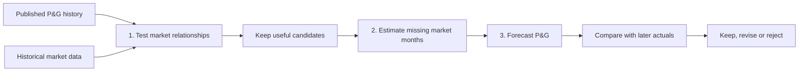
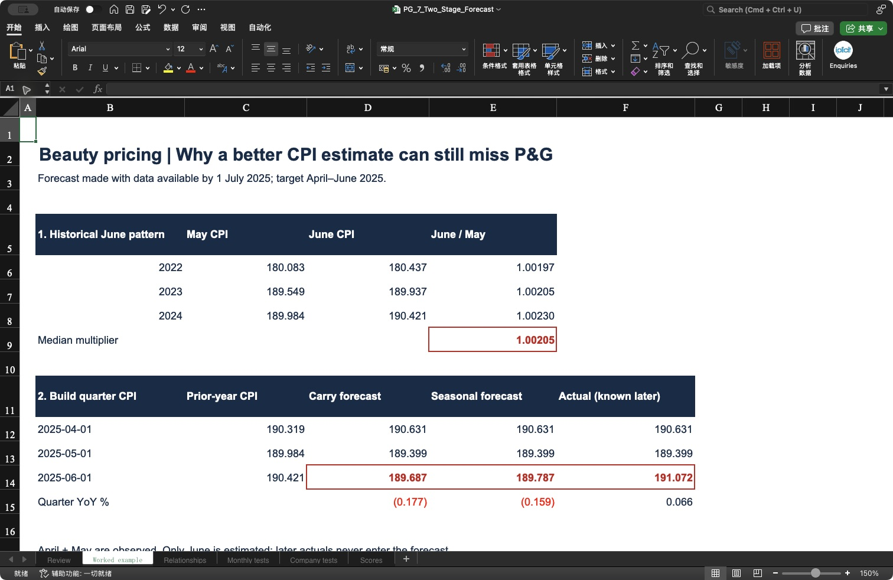
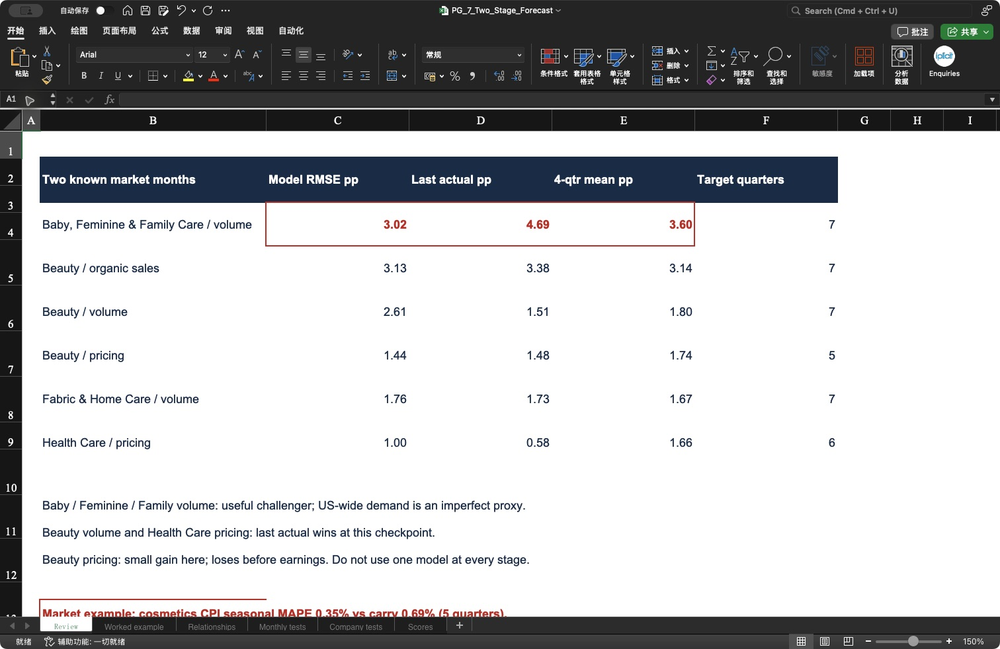
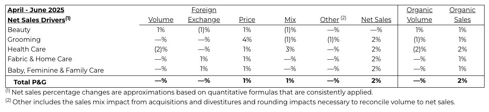
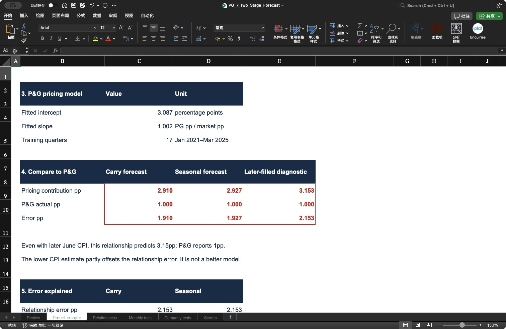

# P&G | First test the relationship. Then forecast the missing month.

**Can a better estimate of missing market data improve our P&G forecast?**

> **Answer:** Sometimes. The strongest demand challenger is Baby, Feminine & Family Care. But a more accurate cosmetics CPI forecast did **not** improve Beauty pricing at the two-month checkpoint.

[📊 Open the Excel analysis](../outputs/two_stage/PG_7_Two_Stage_Forecast.xlsx) · [📁 Inspect every forecast](../data/two_stage/) · [← Project overview](../README.md)

## Analysis questions

1. [Relationship: which market indicators deserve further testing?](#1-relationship-which-market-indicators-deserve-further-testing)
2. [Missing month: which method estimates unpublished data best?](#2-missing-month-which-method-estimates-unpublished-data-best)
3. [Company forecast: does the whole process beat simple rules?](#3-company-forecast-does-the-whole-process-beat-simple-rules)
4. [Worked example: why can a better market forecast still miss P&G?](#4-worked-example-why-can-a-better-market-forecast-still-miss-pg)
5. [Update rule: what changes when new data arrives?](#5-update-rule-what-changes-when-new-data-arrives)

## 1. Relationship: which market indicators deserve further testing?

**Answer:** Six relationships passed a small early screen; passing this screen does not establish that a model works in practice.

- **Company data:** 21 quarters, January 2021–March 2026, across five P&G reporting segments.
- **Market data:** real US nondurable consumption; health and personal care retail sales; broad personal care product CPI; cosmetics and perfume CPI.
- **Matching:** monthly market levels become quarterly totals or averages, then year-on-year growth. P&G quarterly values stay quarterly.
- **Screen:** four completed quarters, April 2023–March 2024, using market versions available by **1 July 2024**.
- **Models:** an expanding history or the latest eight training quarters. Each test quarter is excluded from its own fit.
- **Gate:** beat both the latest published P&G result and the previous four-quarter average.

| Candidate passing the screen | Market indicator | Next step |
|---|---|---|
| Baby, Feminine & Family Care volume | Real nondurable consumption | Test missing-month estimates |
| Beauty organic sales | Health and personal care retail sales | Test missing-month estimates |
| Beauty volume | Real nondurable consumption | Test missing-month estimates |
| Beauty pricing | Cosmetics and perfume CPI | Test missing-month estimates |
| Fabric & Home Care volume | Real nondurable consumption | Test missing-month estimates |
| Health Care pricing | Personal care products CPI | Test missing-month estimates |

**This step asks a conditional question:** if the market quarter is known, does its relationship with P&G look useful? It uses complete target-quarter market inputs for screening. It is **not** a claim that those inputs were available at the beginning of that quarter.

🔎 Inspect the data and selection evidence

- [Published P&G quarterly values](../data/driver_tests/pg_quarterly.csv)
- [Original report links and preserved files](../data/history_rebuild/selected_source_manifest.json)
- [Every relationship test](../data/two_stage/relationship_tests.csv)
- [All 22 series/window scores](../data/two_stage/relationship_scores.csv)
- Excel: **Relationships** contains the calculations; the bottom of **Scores** contains the selection table.

The earlier [driver tests](06_driver_policy_tests.md) ranked methods over a different, later sample. Here we freeze an earlier selection rule. Grooming does not pass this earlier screen. That difference shows selection instability; it does not erase the previous results.

## 2. Missing month: which method estimates unpublished data best?

**Answer:** The best method varies by indicator. Seasonality helps the cosmetics index; extending the recent trend helps retail sales in this sample.

| Method | How the missing month is estimated |
|---|---|
| Carry recent annual growth | Average the last three observed year-on-year growth rates; apply this to the same month last year. |
| Hold the latest level | Keep the latest observed monthly value unchanged. |
| Extend the recent trend | Extend the average monthly level change over the latest three observed months. |
| Follow the seasonal step | Use the median change between the same two calendar months in the previous three years. |

The seasonal method is tested on **non-seasonally-adjusted CPI** only. It is not added again to already seasonally adjusted consumption or retail data. Known monthly values are never overwritten.

**When two of the three market months were known:**

| Market indicator | Carry growth error | Flat level error | Trend error | Seasonal error | Quarters |
|---|---:|---:|---:|---:|---:|
| Personal care products CPI | 0.468% | 0.460% | 0.539% | **0.405%** | 6 |
| Cosmetics and perfume CPI | 0.690% | 0.545% | 0.551% | **0.348%** | 5 |
| Real nondurable consumption | **0.516%** | 0.661% | 0.809% | Not applied | 7 |
| Health and personal care retail sales | 1.065% | 0.759% | **0.690%** | Not applied | 7 |

Error = average absolute percentage error in the **monthly market level** (MAPE). Lower is better. Bold identifies the best observed result, not a method selected with advance knowledge. Broad CPI's seasonal method wins on MAPE but loses on percentage RMSE, so that result is sensitive to the error measure.

🔎 See the actual Excel calculation: three historical June patterns → one June forecast

Read the red cells: the historical median June/May multiplier is **1.00205**. Applied to May 2025's **189.399**, it predicts June at **189.787**. The later observed June value is **191.072**.

- [Original ALFRED vintage used for the forecast](../data/driver_tests/raw/CUUR0000SEGB02_2025-07-01.csv)
- [Later preserved version used to check June](../data/driver_tests/raw/CUUR0000SEGB02_2025-07-28.csv)
- [Every monthly forecast](../data/two_stage/monthly_forecasts.csv) · [Monthly scores](../data/two_stage/monthly_scores.csv)
- Excel: **Worked example**, rows 5–15; **Monthly tests** contains the full record.

The original monthly files contain a date and an index level. The Excel adds the prior-year comparison, forecast, later actual and calculated quarterly growth. The values are index levels, not dollars or P&G monthly sales.

## 3. Company forecast: does the whole process beat simple rules?

**Answer:** It helps some measures. It fails for others, and the answer changes with the forecast date.

For **July 2024–March 2026**, we reconstruct available information at the quarter's start, after one or two market months, and before P&G's earnings release. At every checkpoint, the company model is refitted using only reports already published and market versions already available.

The monthly method is chosen using **earlier, already verified errors** at the same checkpoint. It needs at least four completed calibration quarters and uses up to the most recent eight; otherwise it falls back to carrying recent annual growth.

**Two known market months — P&G forecast error:**

| P&G measure | Two-stage model | Last published result | Four-quarter average | Quarters | Decision at this checkpoint |
|---|---:|---:|---:|---:|---|
| Baby, Feminine & Family Care volume | **3.02pp** | 4.69pp | 3.60pp | 7 | Keep as a challenger |
| Beauty organic sales | **3.13pp** | 3.38pp | 3.14pp | 7 | Gain over the average is negligible |
| Beauty volume | 2.61pp | **1.51pp** | 1.80pp | 7 | Prefer last actual |
| Beauty pricing | **1.44pp** | 1.48pp | 1.74pp | 5 | Small gain; unstable across checkpoints |
| Fabric & Home Care volume | 1.76pp | 1.73pp | **1.67pp** | 7 | Prefer the four-quarter average |
| Health Care pricing | 1.00pp | **0.58pp** | 1.66pp | 6 | Prefer last actual |

Here error is **RMSE in percentage points of P&G growth/pricing**, not monthly market MAPE. These two error measures answer different questions.

⚠️ **Forecast timing matters:** Health Care pricing performs better at the quarter's start (0.59pp vs 1.29pp for last actual), but worse at the two-month checkpoint. Beauty pricing loses before earnings (1.96pp vs 1.41pp). A single model should not automatically replace the baseline at every date.

🔎 Expand the real Excel result table and complete scores

- [Every P&G forecast and later actual](../data/two_stage/company_forecasts.csv)
- [All checkpoints and method scores](../data/two_stage/company_scores.csv)
- [The monthly method chosen at each date](../data/two_stage/method_choices.csv)
- [Historical observations used to fit each coefficient](../data/two_stage/training_pairs.csv)

Excel **Company tests** calculates forecast = intercept + slope × market growth, then compares it with P&G actuals. **Scores** links these rows to the error summaries.

## 4. Worked example: why can a better market forecast still miss P&G?

**Answer:** The market relationship itself can be wrong; a missing-month error can accidentally offset that problem.

**Example:** forecast April–June 2025 Beauty pricing using information available by **1 July 2025**. The quarter had ended, but P&G had not yet published its result and the preserved market vintage contained only April and May. This is a **pre-release estimate**, not a forecast made before the quarter began.

1. **Fit the relationship:** use 17 published company quarters, January 2021–March 2025, paired with quarterly cosmetics CPI growth.
2. **Estimate missing June:** seasonal forecast **189.787**; carrying recent annual growth gives **189.687**.
3. **Calculate the market quarter:** combine observed April and May with estimated June, then compare with the previous year's quarter.
4. **Apply the fitted model:** P&G pricing contribution = **3.087 + 1.002 × market quarterly growth**. These coefficients are our estimates, not P&G guidance or a proven causal effect.
5. **Check the later P&G report:** actual Beauty pricing contribution was **1pp**, released **29 July 2025**.

| Calculation | Carry growth | Seasonal estimate | Later June actual plugged in¹ |
|---|---:|---:|---:|
| June cosmetics CPI | 189.687 | 189.787 | 191.072 |
| Market quarterly growth | −0.177% | −0.159% | +0.066% |
| Predicted P&G pricing contribution | 2.910pp | 2.927pp | 3.153pp |
| P&G actual pricing contribution | 1.000pp | 1.000pp | 1.000pp |
| Forecast minus actual | +1.910pp | +1.927pp | +2.153pp |

¹ A hindsight diagnostic only: replace missing June with the later observed value while keeping the original known months, prior-year values and fitted model unchanged. This column never enters the historical forecast.

**What this tells us:** even with June known, the model would predict **3.153pp**, well above P&G's **1pp**. The lower June estimate partly hides the relationship's error. Across the five scored two-month quarters, seasonal estimation halves monthly MAPE (**0.69% → 0.35%**) but increases P&G RMSE (**1.40pp → 1.44pp**).

🔎 Compare the original P&G report with the actual Excel worksheet

**Original report — look at the Beauty row and the Price column: 1%.**

[Open P&G's original announcement](https://www.pginvestor.com/news/news-details/2025/PG-Announces-Fourth-Quarter-and-Fiscal-Year-2025-Results/default.aspx)

**Our Excel — the same actual appears as 1.000pp, beside the two predictions.**

For the seasonal forecast: **+2.153pp relationship error − 0.226pp missing-month effect = +1.927pp total error**. This identity is checked for every forecast where later monthly verification is available.

[Inspect this example's inputs](../data/two_stage/worked_example.json) · [Download the workbook](../outputs/two_stage/PG_7_Two_Stage_Forecast.xlsx)

## 5. Update rule: what changes when new data arrives?

**Answer:** Replace the estimated market month with the new actual, recalculate the quarter, and record how much the P&G forecast changes.

- **Market release:** keep existing known months; replace only the newly observed month; re-estimate months still missing.
- **Company forecast:** apply the currently supported relationship and compare with the simple baseline.
- **P&G release:** record the forecast error; only then let that result enter future training.
- **Model review:** judge several completed forecasts together. One surprise is not enough to change a coefficient.

This workflow can update as soon as a release is captured. The current historical test uses **preserved checkpoints**, not a complete archive of every release day, and no live monitoring service has been enabled.

🧪 What was checked, and what remains uncertain?

- 845 missing-month forecast rows, including calibration observations; 641 company forecast rows, including the chronological method-choice series. These are repeated model/checkpoint comparisons, **not independent samples**.
- Nine series/checkpoint events are excluded because of an internal missing observation or insufficient common history. All methods face the same exclusion.
- Company training reports and market versions predate each forecast cutoff; the later company result never enters its own prediction.
- Later monthly truth is the **earliest preserved later version**, not necessarily the first official release. Revisions remain a limitation.
- The four-quarter screen is small. The seven later target quarters were inspected in earlier project work: this is **retrospective development**, not an untouched holdout.
- US indicators are proxies for globally reported segments. They do not identify geography, product mix, competitor actions or company-specific execution.
- Seasonal steps use three earlier calendar-year comparisons; other methods need shorter rolling histories. More history is not automatically better, and the relationship coefficients can change.
- Policy timing remains a separate cost sensitivity. This exercise does not demonstrate improved accuracy from the tariff model.
- No new calibrated April–June 2026 downside/base/upside forecast is claimed here.

[Validation checks](../data/two_stage/validation.json) · [Excluded events](../data/two_stage/excluded_events.csv) · [Market versions used](../data/two_stage/versions_used.csv)

## Reproduce the analysis

From the project root, run `python3 src/test_two_stage.py`. The Python analysis uses the standard library and preserved source files in this repository. It regenerates the screening, monthly forecasts, company forecasts and scores.

The Excel presentation is built by `src/build_two_stage.mjs` using `@oai/artifact-tool`; that presentation dependency must be available separately. Excel formulas recalculate the example, predictions and headline errors. Changing historical source data requires rerunning the analysis to refit coefficients and regenerate the outputs.

[← Previous: driver and policy tests](06_driver_policy_tests.md) · [↑ Back to project overview](../README.md)
