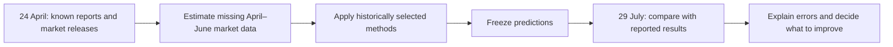
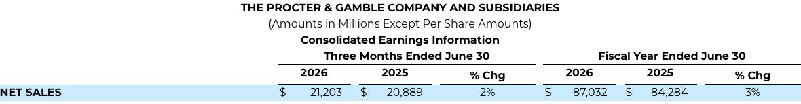
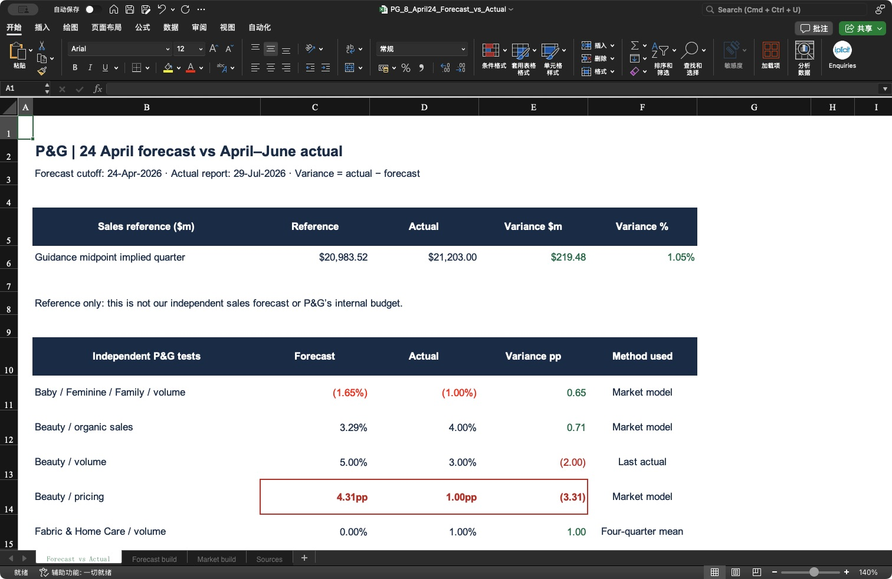
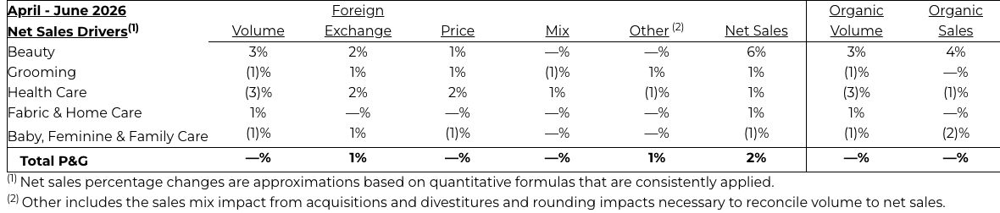
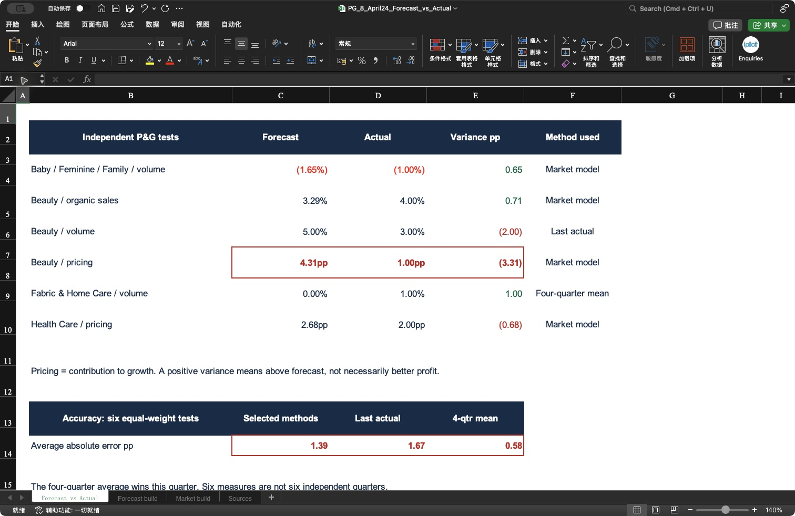
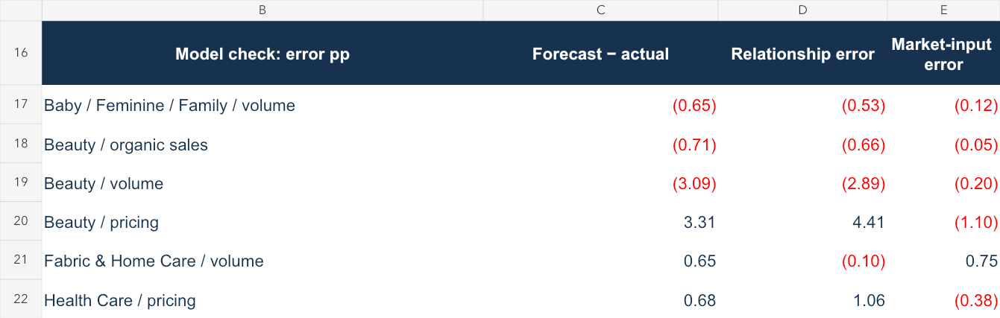

# P&G | Did the 24 April forecast work?

**Sales beat the guidance midpoint reference by $219.48m. Our selected forecasting methods did not beat the four-quarter average in this quarter.**

- 🎯 **Goal:** reconstruct an April–June forecast using information available on **24 April 2026**, then compare it with the results published on **29 July 2026**.
- 📊 **Output:** [Open the formula-linked Excel analysis](../outputs/april24_forecast/PG_8_April24_Forecast_vs_Actual.xlsx).
- 📁 **Data:** [Original quarterly report](https://www.pginvestor.com/news/news-details/2026/PG-Announces-Fourth-Quarter-and-Fiscal-Year-2026-Results/default.aspx) · [24 April market versions](../data/april24_forecast/market_manifest.json) · [Frozen predictions](../data/april24_forecast/frozen_forecast.csv).
- 🧭 **Read:** [1. Available information](#1-available-information-what-could-we-know-on-24-april) → [2. Sales difference](#2-sales-difference-how-far-was-the-actual-from-the-reference) → [3. Segment predictions](#3-segment-predictions-which-forecasts-were-close) → [4. Accuracy](#4-accuracy-did-the-tested-methods-beat-simple-rules) → [5. Explanation](#5-explanation-was-the-error-caused-by-missing-market-data).

## 1. Available information: what could we know on 24 April?

**Answer: P&G's January–March results were available, but no April–June market month was available.**

| Input | Latest available month / period | How it is used |
|---|---|---|
| P&G company results | January–March 2026 | Latest company observation; earlier quarters train the relationships. |
| US real nondurable consumption | February 2026 | Estimate missing months before calculating quarterly growth. |
| Health and personal care retail sales | March 2026 | Estimate April–June retail activity. |
| Personal care products CPI | March 2026 | Estimate April–June price growth. |
| Cosmetics and perfume CPI | March 2026 | Estimate April–June price growth. |

The monthly method is selected from historical **zero-known-month** tests. Consumption uses the latest known year-on-year growth; the other three series hold the latest level flat. These choices are made from earlier errors, not from April–June actuals.

Each company metric then uses the market model, last reported company value, or four-quarter average—whichever had the lowest historical RMSE at the matching zero-known-month checkpoint. The market relationships are refitted with eligible data available at the cutoff. See [method selection](../data/april24_forecast/model_selection.csv) and [training observations](../data/april24_forecast/training_pairs.csv).

**“Last actual” means carrying forward the previous reported value.** For example, Beauty organic volume was +5% in January–March, so that simple rule predicts +5% for April–June. It does not claim that the new quarter has already achieved +5%.

Scope and timing checks

- This is a retrospective reconstruction, not a forecast actually issued on 24 April. Headline Q4 results were encountered while finding sources; they do not enter estimation or method selection.
- The historical “Origin” checkpoint has zero target-quarter months, but is not an exact replica of the post-report 24 April timing. This limits the strength of the comparison.
- PCE's missing March observation prevents the latest company quarter entering a same-quarter relationship. Missing October 2025 CPI also removes an incomplete quarterly pair; no invented observation fills it.
- US indicators are proxies for global businesses. These six related metrics are separate tests, not six independent quarters or a reconciled sales model.
- [Forecast freeze record](../data/april24_forecast/freeze_record.json) · [Earlier two-stage tests](07_two_stage_forecast.md).

## 2. Sales difference: how far was the actual from the reference?

**Answer: actual quarterly sales were $219.48m above the guidance midpoint reference, a 1.05% difference.**

| USD millions | Reference | Actual | Actual − reference |
|---|---:|---:|---:|
| April–June sales | $20,983.52 | $21,203.00 | **+$219.48 / +1.05%** |

The reference comes from the original annual-guidance calculation: **$84,284 × 1.03 − $65,829 = $20,983.52m**. Actual annual sales reconcile: **$65,829 + $21,203 = $87,032m**.

This is a guidance-implied reference, **not** our independent sales model or P&G's internal budget. We use the familiar budget-versus-actual layout, but label the comparison correctly.

🔎 Evidence: original quarterly sales → Excel comparison

**Original report:** read the 2026 column under “Three Months Ended June 30”: **$21,203m**.

**Excel:** the same $21,203m is compared with the formula-linked $20,983.52m reference.

[Open full Excel screenshot](../evidence/april24_sales_excel.png) · [Earlier reference calculation](02_quarter_sales_target.md)

## 3. Segment predictions: which forecasts were close?

**Answer: four differences were within 1 percentage point; Beauty volume and pricing missed by more.**

| Segment / measure | Method chosen on 24 April | Forecast | Actual | Difference, pp |
|---|---|---:|---:|---:|
| Baby, Feminine & Family / organic volume growth | Market model | −1.65% | −1% | +0.65 |
| Beauty / organic sales growth | Market model | +3.29% | +4% | +0.71 |
| Beauty / organic volume growth | Last actual | +5.00% | +3% | −2.00 |
| Beauty / pricing contribution | Market model | +4.31pp | +1pp | **−3.31** |
| Fabric & Home Care / organic volume growth | Four-quarter average | 0.00% | +1% | +1.00 |
| Health Care / pricing contribution | Market model | +2.68pp | +2pp | −0.68 |

**Difference = actual − forecast.** A positive difference means above forecast; it does not automatically mean better profit. Pricing is the contribution to sales growth, not a standalone product price inflation rate. Reported contributions are rounded.

Do not add these predictions together. Beauty's sales, volume and pricing predictions are independently fitted and do not reconcile. They must be rebuilt into a consistent revenue bridge before producing a company-wide forecast.

🔎 Evidence: original segment figures → Excel variances

**Original report:** compare the “Organic Volume,” “Price” and “Organic Sales” columns with the matching Excel rows. Beauty's pricing contribution is **1%**, equivalent to **1pp** of growth contribution.

**Excel:** the red box highlights the largest miss—**4.31pp forecast versus 1pp actual**.

[Open full Excel screenshot](../evidence/april24_variance_excel.png) · [All unrounded calculations](../data/april24_forecast/variance.csv)

## 4. Accuracy: did the tested methods beat simple rules?

**Answer: no—the four-quarter average was the best of these methods for this quarter.**

| Forecast rule | Average absolute error across the six measures |
|---|---:|
| Selected methods | **1.39pp** |
| Market models for every measure, including rejected models | 1.52pp |
| Carry forward the last actual | 1.67pp |
| Four-quarter average | **0.58pp** |

The selected methods beat carrying forward the last actual, but lost to the four-quarter average. One target quarter cannot establish long-run superiority. We keep the original predictions rather than switching methods after seeing the answer.

The sales reference's small dollar difference does not validate the independent segment models.

## 5. Explanation: was the error caused by missing market data?

**Answer: missing market months were only part of the problem; Beauty's price relationship was the larger failure.**

- The frozen Beauty price model predicted **4.31pp**, versus **1pp actual**.
- Holding its original coefficients and prior-year base fixed, later April–June CPI data imply **5.41pp**—even farther from the actual.
- Therefore, knowing the later CPI would not fix this miss. The relationship between a US consumer-price index and P&G's global pricing contribution needs review.

For this diagnosis only, **forecast − actual = market-input error + relationship error**. Beauty pricing: **+3.31pp = −1.10pp + 4.41pp**. This sign convention differs from the actual-minus-forecast variance table above. Later data use a fixed **1 August vintage**, which may contain revisions; they are never substituted into the original forecast.

The report provides business context: Beauty's hair and personal care growth contrasted with weaker China skin-care volume; Health Care included weaker oral-care volume; Baby, Feminine & Family had different outcomes across its categories. These global product and mix differences help explain why a broad US proxy can miss. They do **not** prove a numerical causal allocation of the errors.

🔎 Inspect the error diagnosis and formulas

[Later market versions](../data/april24_forecast/later_market_manifest.json) · [Error decomposition](../data/april24_forecast/error_diagnosis.json)

In Excel, open **Forecast build**: fitted coefficients and company predictions appear above the error diagnosis. **Market build** shows monthly estimates and quarterly growth. **Sources** keeps dated source inputs and later actuals separate.

This image is a workbook preview; the earlier evidence images are native Microsoft Excel screenshots.

## What changes next?

- **Retain the four-quarter average as a strong benchmark.** Do not replace it simply because a model is more complicated.
- **Rework Beauty pricing.** Test global/category mix and company pricing history with the same chronological validation.
- **Build a reconciled sales forecast.** Connect segment sales, volume, price, mix and currency before interpreting a company-wide dollar variance.
- **Then test the 15 May update.** Compare it with this frozen 24 April forecast to measure whether new information actually helped.

### Reproduce this analysis

Run `python src/forecast_april24.py` to reconstruct the forecast from preserved cutoff data; run `python src/forecast_april24.py --score` to compare the preserved actuals. With the workspace spreadsheet runtime, `node src/build_april24.mjs` rebuilds the Excel workbook. Preserve the existing freeze record when auditing; reconstruction writes a new timestamp. The original source extraction and later error-diagnosis files are preserved inputs to the workbook.

✅ Six forecasts and six variances checked; sales reconciliation equals zero; workbook recalculation tested and restored; no formula errors found. [Validation record](../outputs/april24_forecast/validation.json)

[← Project overview](../README.md)
