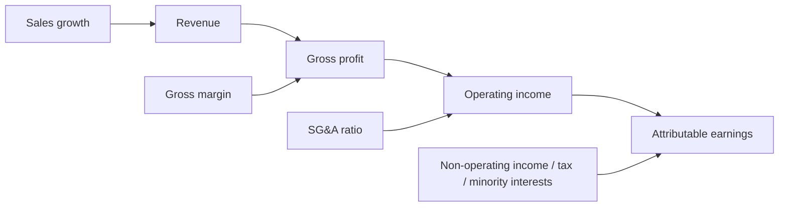

# 9. Scenario design: How do we compare forecasts fairly?

**Answer:** Build bear, base and bull cases for four information sets. Compare research with history-only at the same cutoff.

| Information set | Cutoff | Cases | What the comparison tests |
|---|---|---|---|
| March history | 31 March 2026 | Bear / Base / Bull | Starting financial information. |
| March + research | 31 March 2026 | Bear / Base / Bull | Research effect on the same history. |
| May history | 15 May 2026 | Bear / Base / Bull | Effect of newly released company history. |
| May + research | 15 May 2026 | Bear / Base / Bull | Research effect on updated history. |

**Target:** April–June 2026. **Profit measure:** Net earnings attributable to P&G.

## 🧮 From assumptions to earnings

EPS also depends on diluted shares. Cash uses a conversion ratio and a capex assumption. Those drivers change their own outputs; they should not be presented as changes in total attributable earnings.

🔎 Inspect assumptions and their calculation

These are workbook renders. [Open the editable Excel model](https://github.com/hoichengit/Portfolio-Guide/blob/codex/financial-scenarios/outputs/PG_Financial_Scenarios.xlsx).

[Frozen assumptions](https://github.com/hoichengit/Portfolio-Guide/blob/codex/financial-scenarios/outputs/runs/PG_mid_market/scenario/output.json) · [Freeze record](https://github.com/hoichengit/Portfolio-Guide/blob/codex/financial-scenarios/outputs/runs/PG_mid_market/freeze.json)

## Control that matters

The workflow checks publication dates, reviews role outputs, freezes accepted assumptions and verifies hashes before evaluation reads actuals. Running it now is a retrospective reconstruction, not proof that the forecast existed before the quarter.

[Next: forecast vs actual →](10_forecast_review.md)

[← Project home](../README.md) · [All questions](README.md)
