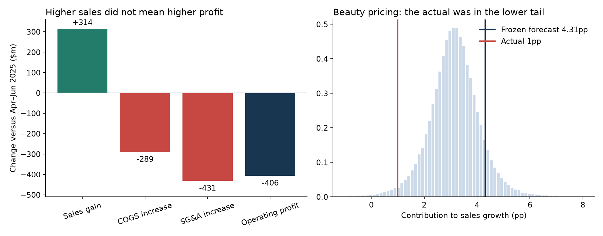
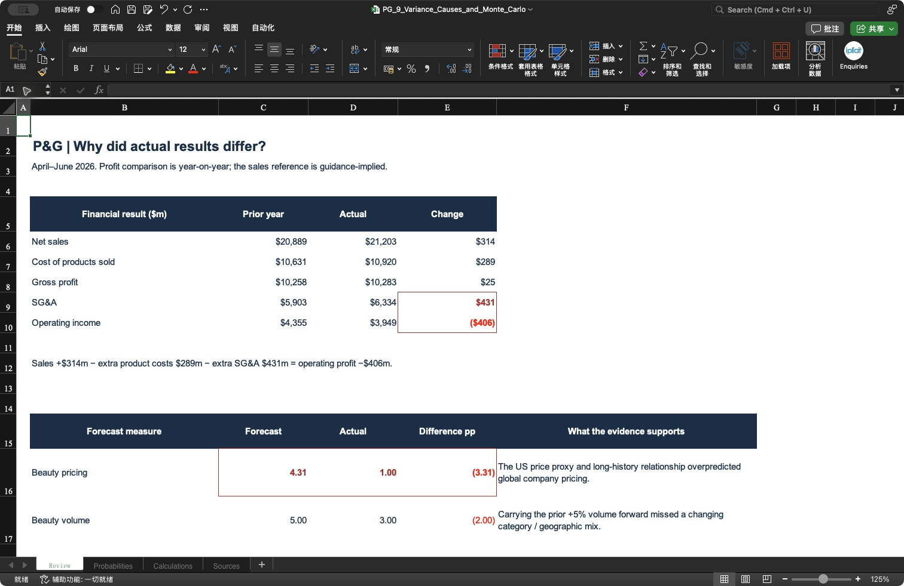
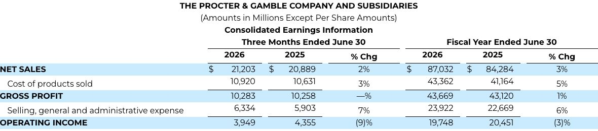
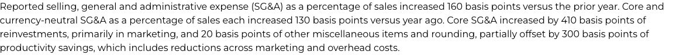
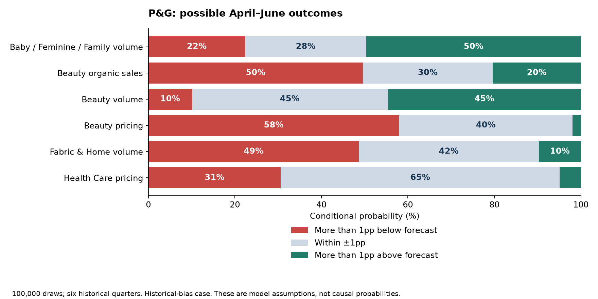
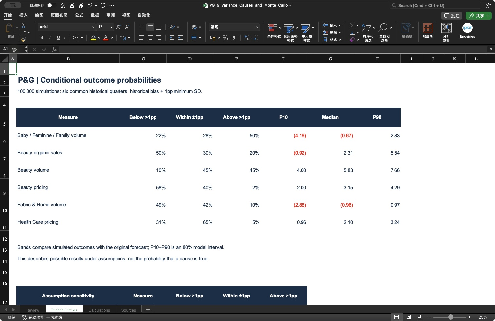

# P&G | Why did the forecast miss?

**The largest miss came from our Beauty pricing model. The profit decline had a different explanation: higher operating costs and investment.**

- 🔎 **Investigate:** volume, net pricing, product mix, countries, competitors, advertising, inventory and costs.
- 📊 **Calculate:** reconcile the financial changes, then simulate uncertainty around the six frozen forecasts.
- 📁 **Open:** [Excel analysis](../outputs/variance_causes/PG_9_Variance_Causes_and_Monte_Carlo.xlsx) · [Original data and sources](../data/variance_causes/README.md) · [Previous forecast comparison](08_april24_forecast_vs_actual.md).
- 🧭 **Questions:** [1. The biggest miss](#1-pricing-why-was-beauty-so-far-below-our-forecast) · [2. Volume](#2-volume-which-businesses-changed) · [3. Markets and competitors](#3-market-check-was-this-simply-weaker-consumption) · [4. Advertising and costs](#4-profit-what-did-advertising-and-operating-costs-change) · [5. Monte Carlo](#5-monte-carlo-what-outcomes-were-possible) · [6. Model changes](#6-next-model-what-should-change).

## 1. Pricing: why was Beauty so far below our forecast?

**Answer: the model predicted a pricing rebound that the company did not deliver—pricing stayed at 1pp.**

| Comparison | Beauty pricing contribution |
|---|---:|
| January–March actual, known on 24 April | 1pp |
| Our April–June forecast | **4.31pp** |
| April–June actual | **1pp** |
| Same model with later April–June market data | **5.41pp** |

The actual pricing contribution did not collapse from 4.31pp. **Our model expected it to rise from 1pp to 4.31pp.** That distinction changes the investigation: we must challenge the forecast before inventing a business crisis.

🔎 Evidence and the full reasoning chain

1. **Company result:** the [January–March](https://www.pginvestor.com/news/news-details/2026/PG-Announces-Fiscal-Year-2026-Third-Quarter-Results/default.aspx) and [April–June](https://www.pginvestor.com/news/news-details/2026/PG-Announces-Fourth-Quarter-and-Fiscal-Year-2026-Results/default.aspx) driver tables both show Beauty pricing at 1pp.
2. **Model calculation:** 2.68pp intercept + 1.03 × forecast US cosmetics-price growth of 1.58% ≈ 4.31pp. Even zero index growth implies roughly 2.68pp company pricing. This exposes a level mismatch against the latest company result.
3. **Historical context:** Beauty pricing reached 9pp in late 2022 and 8pp in early/mid-2023. It was mostly 1–3pp in the recent quarters. The expanding relationship combines different pricing environments. This is a plausible stability problem, not proof that one historical period alone caused the entire error. [Inspect history](../data/variance_causes/beauty_price_history.csv).
4. **Missing-data check:** replacing only the forecast market input with later data raises the prediction to 5.41pp. Forecast minus actual of 3.31pp equals a **−1.10pp market-input effect plus +4.41pp remaining relationship error**. The latter includes all unmodelled effects; it is not an identified causal contribution.
5. **Definition check:** a US consumer-price index measures a different geography, product basket and transaction level from global P&G pricing. P&G also records trade promotions against sales, so retail inflation need not become the same manufacturer net-price growth. See the [annual report, printed page 41](https://www.sec.gov/Archives/edgar/data/80424/000119312526372220/pg_ars_2026.pdf#page=53).

**Original report:** Beauty's “Price” is **1%**, meaning a 1pp sales-growth contribution.

**Excel:** the red box compares **4.31 with 1.00**. The profit figures above are a separate comparison.

[Open the full Excel screenshot](../outputs/variance_causes/native_excel_profit.png) · [Earlier frozen model and error calculation](../data/april24_forecast/error_diagnosis.json)

## 2. Volume: which businesses changed?

**Answer: categories and countries moved differently; one global segment number hid those differences.**

| Forecast measure | Forecast → actual | Explanation supported by the release |
|---|---|---|
| Beauty volume | +5% → +3% | China skin-care volume weakened, while hair and personal care grew. Carrying forward +5% missed that change. |
| Beauty organic sales | +3.29% → +4% | Reported volume +3pp and pricing +1pp supported growth. The model slightly underestimated the combined outcome. |
| Baby / Feminine / Family volume | −1.65% → −1% | Baby Care improved in China; Feminine and Family Care volume weakened. The net outcome was less negative than forecast. |
| Fabric & Home volume | 0% → +1% | European Fabric Care growth contrasted with weaker North American Home Care. |
| Health Care pricing | +2.68pp → +2pp | Pricing stayed at 2pp. Weak oral-care volume was a separate drag on sales, not evidence of a price collapse. |

These are company-reported explanations of actual performance. Public disclosures do not allocate each forecast error exactly between countries, categories, promotions and execution. [Quarterly business discussion](https://www.pginvestor.com/news/news-details/2026/PG-Announces-Fourth-Quarter-and-Fiscal-Year-2026-Results/default.aspx).

🔎 Inventory, promotions and evidence limits

- **Comparison effects:** January–March Family Care benefited from a weak prior-year retailer-inventory comparison. That was already a reason not to carry its growth mechanically into another quarter. [Prior report](https://www.pginvestor.com/news/news-details/2026/PG-Announces-Fiscal-Year-2026-Third-Quarter-Results/default.aspx).
- **Promotions:** the new report identifies merchandising investment in Family Care and North American Fabric Care. Promotional support can affect net revenue and margin, but the report does not provide the SKU amounts needed for an exact variance allocation.
- **Manufacturer inventory:** annual inventory growth used $641m of cash and days on hand rose by two; the annual report cites safety stock and new products. This is full-year context and is not proof that P&G's retail customers destocked in April–June. [Annual report, printed page 25](https://www.sec.gov/Archives/edgar/data/80424/000119312526372220/pg_ars_2026.pdf#page=37).
- **Needed to go further:** monthly shipments, retail sell-through, retailer inventory, net price, promotions and category/region weights. None should be invented from the segment's rounded growth figures.

[Expand the matching Excel evidence from the forecast comparison](08_april24_forecast_vs_actual.md#3-segment-predictions-which-forecasts-were-close) · [Question-by-question evidence register](../data/variance_causes/research.json)

## 3. Market check: was this simply weaker consumption?

**Answer: no. Broad market measures often grew more than our inputs assumed, yet P&G's businesses had mixed outcomes.**

| US indicator, April–June YoY | Forecast market input | Later observed input* |
|---|---:|---:|
| Real nondurable consumption | 1.30% | 2.29% |
| Health / personal care retail sales | 1.78% | 2.33% |
| Cosmetics / perfume CPI | 1.58% | 2.64% |
| Personal care products CPI | 2.18% | 2.68% |

*These diagnostics use the preserved 1 August market vintage and the original prior-year base, keeping the input-replacement test consistent. They are not revised official headline growth rates. Retail values are nominal; consumption is real; CPI measures prices. [Data and calculations](../data/variance_causes/market_comparison.csv).

China's cosmetics retail growth was **4.7% in April, 2.5% in May and 12.6% in June**. These are nominal sales at enterprises above the designated size, not P&G volumes. We show each month rather than averaging their growth rates into a false quarterly figure. They challenge a blanket “China cosmetics demand collapsed” explanation. [April](https://www.stats.gov.cn/english/PressRelease/202605/t20260519_1963757.html), [May](https://www.stats.gov.cn/english/PressRelease/202606/t20260617_1963969.html), [June](https://www.stats.gov.cn/english/PressRelease/202607/t20260717_1964156.html).

🔎 Competitors and publication timing

| Check | Relevant evidence | What we can infer |
|---|---|---|
| Unilever, April–June | Underlying sales +5.8%, volume +5.5%, price +0.2%; it described promotions and prior-year price comparisons. | Growth can coexist with limited pricing. Category, country and metric definitions differ from P&G. |
| Colgate, North America, April–June | Volume −3.9%, pricing +0.9%; management described slower categories, competition, share losses and retailer inventory reductions. | Provides evidence of pressure in a relevant region/category. It does not establish the size of P&G's losses or inventory changes. |
| Kimberly-Clark, April–June | Approximately flat organic sales, promotional/product investment and tariff recoveries. | A useful baby/family-care comparison, with company-specific events that cannot be transferred to P&G. |

Sources: [Unilever](https://www.unilever.com/files/unilever-q2-2026-results-full-announcement.pdf), [Colgate prepared remarks](https://investor.colgatepalmolive.com/static-files/ca92df4c-8d85-4df1-bf67-c2b76b8b36fe), [Kimberly-Clark](https://www.investor.kimberly-clark.com/news-releases/news-release-details/kimberly-clark-announces-second-quarter-and-first-half-2026).

Unilever's underlying volume includes mix, so subtracting its growth from P&G volume would not measure market-share loss. These peers are diagnostic comparisons; no competitor coefficient is fitted from a single quarter.

**Timing matters:** Unilever reported on 28 July, P&G on 29 July, June BEA consumption on 30 July, Colgate on 31 July and Kimberly-Clark on 4 August. All are post-cutoff diagnostic evidence. June BEA data were unavailable even on P&G's result day. [BEA release](https://www.bea.gov/news/2026/personal-income-and-outlays-june-2026).

## 4. Profit: what did advertising and operating costs change?

**Answer: additional costs more than absorbed the sales gain, reducing quarterly operating profit by $406m year-on-year.**

| April–June, USD millions | 2025 | 2026 | Change |
|---|---:|---:|---:|
| Sales | $20,889 | $21,203 | +$314 |
| Product costs | $10,631 | $10,920 | +$289 |
| SG&A | $5,903 | $6,334 | **+$431** |
| Operating profit | $4,355 | $3,949 | **−$406** |

**+$314 sales − $289 additional product costs − $431 additional SG&A = −$406 operating profit.** This reconciles the reported statements; it is a year-on-year bridge, not a profit-budget variance.

The core SG&A ratio rose **130 basis points**: **410bps reinvestment, primarily marketing + 20bps other − 300bps productivity**. The 410bps is a gross driver, not net expense growth or an advertising-only dollar figure. [Quarterly release](https://www.pginvestor.com/news/news-details/2026/PG-Announces-Fourth-Quarter-and-Fiscal-Year-2026-Results/default.aspx).

🔎 Original financial statement → Excel calculation

**Original report:** read the two quarterly columns, not the fiscal-year columns on the right.

**Excel:** the red cells show the $431m SG&A increase and $406m profit decline.

[Open the full Excel screenshot](../outputs/variance_causes/native_excel_profit.png)

**Original explanation of marketing and productivity:**

🔎 Advertising, product investment, commodities, tariffs and operations

**Advertising:** full-year expense increased from **$9.2bn to $10.2bn**. R&D remained around **$2.1bn**. Quarterly segment advertising spend and incremental sales generated by that spend are not disclosed here. Increased advertising may support future demand, but these figures cannot establish its return or explain a specific volume miss. [Annual report, printed page 41](https://www.sec.gov/Archives/edgar/data/80424/000119312526372220/pg_ars_2026.pdf#page=53).

**Core gross margin was flat:**

| Driver | Effect on gross margin |
|---|---:|
| Productivity | +160bps |
| Net tariffs, including recognized recoveries and costs | +40bps |
| Other / rounding | +20bps |
| Pricing | +10bps |
| Product mix | −120bps |
| Product / packaging reinvestment | −70bps |
| Commodities | −40bps |
| **Total** | **0bps** |

These are P&G's rounded core-margin drivers. The GAAP margin declined 60bps; core and GAAP adjustments must not be mixed. Tariffs were a **net benefit in this reported quarter**, so “tariffs explain the entire profit decline” contradicts the disclosure. [Quarterly margin discussion](https://www.pginvestor.com/news/news-details/2026/PG-Announces-Fourth-Quarter-and-Fiscal-Year-2026-Results/default.aspx).

The reviewed disclosures do not quantify a production outage, distribution loss or advertising failure as the cause of our six forecast errors. Those remain questions requiring operational data, not zero-valued effects.

🔎 What explains the $219.48m sales difference from the guidance midpoint?

The exact arithmetic is **$314m growth over last year's quarter − $94.52m growth required by our guidance reference = $219.48m**.

P&G reported rounded total sales growth of 2%, including 1pp currency and 1pp other/rounding, with approximately flat organic sales. Those are **year-on-year** drivers. Our original reference contained no explicit quarterly FX, volume or price budgets, so it cannot support an exact budget-driver bridge. We do not claim the entire $219.48m came from FX or distribute it arbitrarily across segments.

## 5. Monte Carlo: what outcomes were possible?

**Answer: we simulated 100,000 possible outcomes around the six frozen forecasts, using earlier errors and explicit risk assumptions.**

These are **conditional scenario probabilities**, not probabilities that advertising, competition or another cause is true. The quarter has already happened; this is a retrospective illustration of uncertainty around the 24 April forecast.

| Measure | More than 1pp below forecast | Within ±1pp | More than 1pp above forecast |
|---|---:|---:|---:|
| Baby / Feminine / Family volume | 22.3% | 28.0% | 49.6% |
| Beauty organic sales | 49.6% | 30.0% | 20.4% |
| Beauty volume | 10.0% | 45.3% | 44.7% |
| Beauty pricing | **57.9%** | **40.1%** | **1.9%** |
| Fabric & Home volume | 48.6% | 41.7% | 9.7% |
| Health Care pricing | 30.6% | 64.5% | 4.9% |

Rounding may prevent displayed percentages summing to exactly 100%. “Below” compares with our frozen forecast, not with last year's result and not necessarily with a loss.

**Beauty example:** the original pricing forecast is 4.31pp. The three bands are below 3.31pp, 3.31–5.31pp and above 5.31pp. Its actual 1pp result sits near the **2nd percentile** of the main simulated distribution. This flags a model that still assigned too little weight to such a low outcome; it is not proof the outcome had a true 2% chance.

🔎 How the simulation works, and what its probabilities depend on

1. Keep the six original point forecasts unchanged.
2. Use the **six common quarterly forecast errors from September 2024 through December 2025**, with outcomes published by 24 April 2026. Historical errors are actual minus forecast.
3. Add each measure's average historical error as a separately labelled bias adjustment. This is not a rewritten forecast.
4. Draw correlated Student-t shocks with **5 degrees of freedom**. Reduce sample correlations halfway toward zero because six quarters cannot estimate a stable six-variable correlation matrix.
5. Use the larger of historical error SD and **1pp**. This minimum is an **analyst risk assumption**, used to avoid a misleadingly narrow range from rounded data and a tiny sample. It is not empirically established. Show the no-floor alternative below.
6. Compute **frozen forecast + mean historical error + used SD × simulated shock**; count outcomes in the three exclusive bands. Fixed random seed: **20260424**.

Target-quarter actuals do not enter calibration. However, this design was made after reviewing them, and the earlier model selection used these historical quarters too. The probabilities are exploratory, not untouched out-of-sample probability validation. Historical “Origin” timing also differs from the 24 April post-report cutoff.

| Sensitivity | Beauty pricing: probability >1pp below forecast | Health pricing: probability within ±1pp |
|---|---:|---:|
| Main assumptions | 57.9% | 64.5% |
| Historical SD only, no minimum | 60.3% | 99.5% |
| No historical bias adjustment | 12.6% | 74.8% |
| 50% wider uncertainty | 55.4% | 51.8% |

The Health Care result is especially sensitive to the assumed minimum uncertainty. The Beauty result depends strongly on whether past overprediction continues. Neither should be presented as a precise real-world probability.

The model gives approximately **37.5%** for at least three measures being more than 1pp below forecast. Varying the correlation shrinkage changes this to roughly **37.1–38.0%**. These are six overlapping measures, not six independent businesses. No zero-correlation assumption removes the common Student-t tail shock.

[Simulation configuration](../data/variance_causes/simulation_config.json) · [Calibration observations](../data/variance_causes/common_errors.csv) · [All results](../data/variance_causes/probabilities.csv) · [Assumption sensitivities](../data/variance_causes/sensitivity.csv) · [Method and limitations](../data/variance_causes/simulation_method.json)

**Excel evidence:**

[Open full Excel screenshot](../outputs/variance_causes/native_excel_probabilities.png)

The workbook calculates financial bridges, calibration statistics and probabilities from the saved draw counts. Simulation runs are generated by the supplied Python workflow; editing a workbook parameter alone does not regenerate those runs. The 1,000-row CSV is a labelled preview sample, not the full 100,000-run population.

## 6. Next model: what should change?

**Answer: improve the business relationships and reconcile revenue before adding more statistical complexity.**

- **Pricing:** start from the latest realized company pricing; test changes, recent regimes and net promotional effects. Validate the change on earlier rolling quarters.
- **Volume:** separate category and geography where public data permit. Keep retailer inventory and comparison effects visible.
- **Advertising:** add spend and lagged response only when comparable data exist; do not assign a return from one annual spend number.
- **Profit:** separate trade promotions, advertising, product costs, productivity and non-core charges to prevent double counting.
- **Uncertainty:** use a longer untouched error history and test interval coverage before calling scenario probabilities calibrated.

There is no defensible percentage allocation of the forecast misses to individual causes from these public disclosures. There is also no reconciled company-revenue or profit forecast to simulate yet; the six metric simulations must not be added into a sales distribution. [Specific missing inputs](../data/variance_causes/research.json).

[← Project overview](../README.md)
