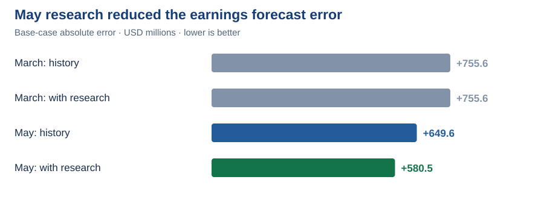
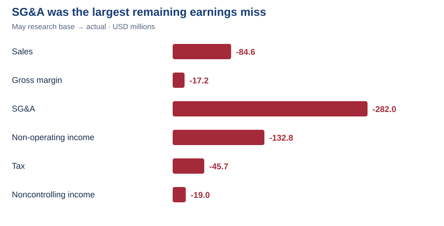

# 10. Forecast vs actual: Did research improve the result?

**Answer:** May research reduced the base earnings error by **$69.1m**. It did not eliminate the miss: forecast earnings of **$3,624.5m** were still above actual **$3,044.0m**.

| Information set | Base earnings | Absolute error | Error / actual |
|---|---:|---:|---:|
| March history | $3,799.6m | $755.6m | 24.82% |
| March + research | $3,799.6m | $755.6m | 24.82% |
| May history | $3,693.6m | $649.6m | 21.34% |
| May + research | $3,624.5m | $580.5m | 19.07% |

**Fair comparison:** The $69.1m improvement compares May with research against May history-only. The separate history refresh improved error by $106.0m. March research changed downside assumptions and left base accuracy unchanged.

## Where was the remaining miss?

**SG&A (−$282.0m)** and **net non-operating income (−$132.8m)** explain most of the remaining earnings shortfall. The next model review should focus on those areas, not simply add more commodity evidence.

🔎 Open the calculation and worksheet evidence

**Original evaluation data**

[Actuals, assumptions and sequential bridge](https://github.com/hoichengit/Portfolio-Guide/blob/codex/financial-scenarios/outputs/analysis.json) · [Results by information set and case](https://github.com/hoichengit/Portfolio-Guide/blob/codex/financial-scenarios/outputs/forecast_results.csv)

**Workbook comparison**

Quarterly workbook renders; [open Excel](https://github.com/hoichengit/Portfolio-Guide/blob/codex/financial-scenarios/outputs/PG_Financial_Scenarios.xlsx) for the editable model. The annual questions use native Excel screenshots.

The bridge changes one driver at a time in model order. A **+$0.8m** rounding/basis residual completes the reconciliation. The attribution is order-dependent arithmetic, not proof of economic causation.

## What can we conclude?

Research improved this one May base case. One quarter does not establish general predictive superiority. All four bear–bull ranges contained actual earnings, but these were judgmental scenarios, not calibrated confidence intervals.

**Forecast vs actual, not budget vs actual:** These are analyst-generated forecasts. P&G's internal budget is not available.

[Read the analytical choices →](../decisions/decision_log.md)

[← Project home](../README.md) · [All questions](README.md)
