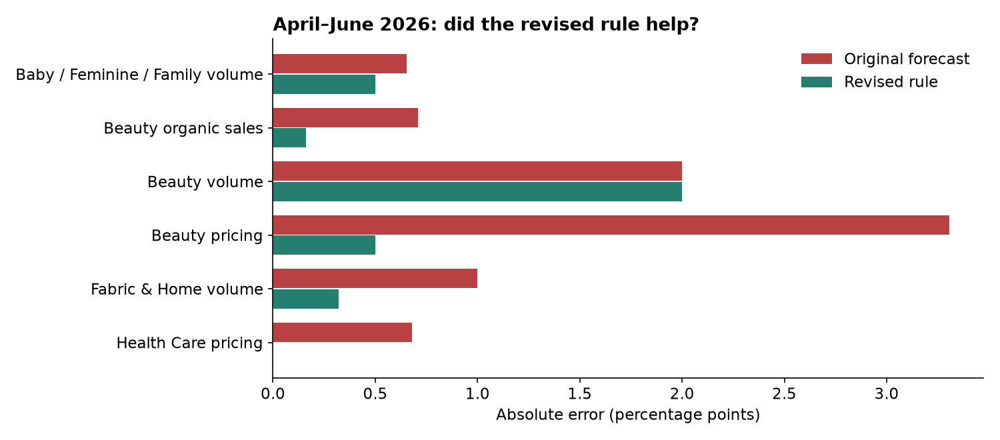
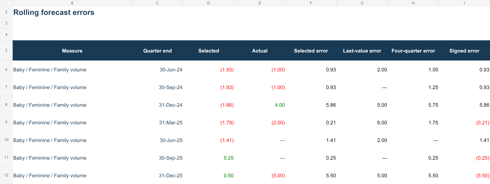
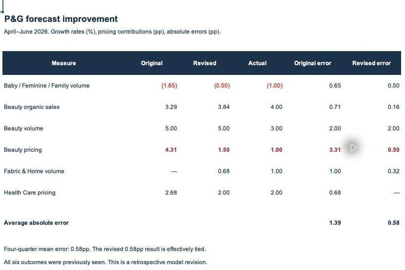
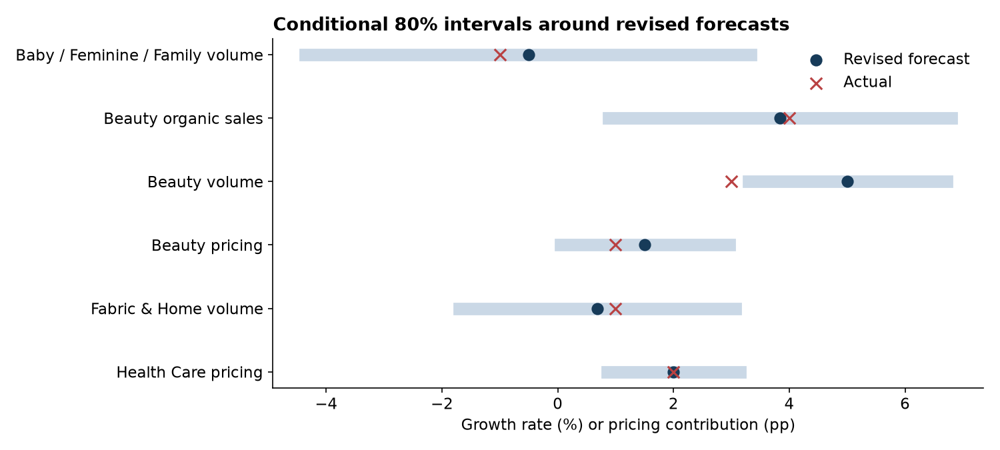
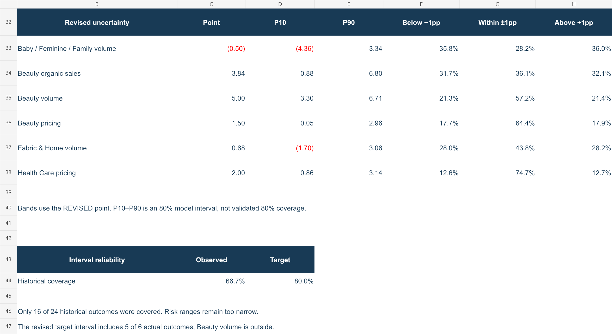

# P&G | Can we improve the forecast?

**Answer: the revised rule reduced April–June error from 1.39pp to 0.58pp, but effectively tied the simple four-quarter average. Probability ranges still need improvement.**

- 🎯 **Goal:** test improvements against simple benchmarks before relying on a more complicated model.
- 📁 **Open:** [Excel analysis](../outputs/forecast_improvement/PG_11_Forecast_Improvement.xlsx) · [Data and method](../data/forecast_improvement/README.md).
- 🧭 **Questions:** [1. What changed?](#1-method-what-did-we-change) · [2. Historical tests](#2-backtest-did-it-work-before-this-quarter) · [3. April–June result](#3-result-how-much-did-the-forecast-improve) · [4. Monte Carlo](#4-monte-carlo-what-changed-in-the-risk-ranges) · [5. What to use](#5-decision-which-results-should-we-trust).

This is a **retrospective redesign** after reviewing the outcomes. Each calculation respects its information cutoff, but the redesign is not an untouched prospective test. The original forecast is preserved.

## 1. Method: what did we change?

**Answer: choose between eight transparent methods using earlier errors, and require evidence before replacing a simple benchmark.**

| Candidate | Calculation in plain English |
|---|---|
| Last actual | Repeat the latest reported growth or pricing contribution. |
| Four-quarter mean | Average the last four company results. |
| Recent two mean | Average the last two results to reflect the recent environment. |
| Prior-year quarter | Repeat the same quarter's result from one year earlier. |
| Market level | Fit the historical market/company relationship and apply the forecast market growth. |
| Anchored market change | Start from the latest company result and add the recent sensitivity multiplied by the change in market growth. |
| Half last + market | Give the last company result and the market forecast equal weight. |
| Market bias correction | Add half the average error from the four latest completed market forecasts. |

🔎 Selection rules, timing and evidence

- Historical forecasts are reconstructed on the date of the **previous quarter's earnings release**, using end-of-day market vintages. This matches the April 24 post-report framing more closely than the earlier quarter-start comparison.
- All market vintages used in this run match the chosen cutoff date. Target-quarter market months remain unknown at these cutoffs and are forecast using the latest three available monthly year-on-year rates, applied to prior-year monthly levels.
- The market-level model uses available matched history. The anchored model uses the latest eight matched quarters for its sensitivity and the latest matched market growth as its reference.
- Begin method selection after four completed earlier tests. Rank methods using mean absolute error over up to eight earlier tests whose actual results were public at the cutoff.
- Pick the better of last actual and four-quarter mean. A challenger replaces it only if its earlier error is **more than 10% lower**. The threshold, half-weight bias correction and fixed blend are design assumptions, not tuned optimum values.
- Candidate errors are scored using the candidate forecasts actually constructed at each earlier cutoff. They are not refitted predictions of those historical outcomes.
- The market/company pairs were inherited from earlier research. Their earlier selection and the current redesign were retrospective; respecting dates in calculations does not remove that research-selection bias.

[Dated inputs](../data/forecast_improvement/release_inputs.csv) · [Training observations](../data/forecast_improvement/training_pairs.csv) · [Full selection audit](../data/forecast_improvement/selection_log.json).

The chronological evaluation follows the principle of training on earlier observations and testing on later ones. See [time-series evaluation documentation](https://scikit-learn.org/stable/modules/generated/sklearn.model_selection.TimeSeriesSplit.html). This workflow additionally checks financial publication dates; it does not use the library's splitter directly.

## 2. Backtest: did it work before this quarter?

**Answer: the selection rule modestly improved average historical error, but did not improve every measure.**

Four initial target quarters, June 2023–March 2024, supply the first selection history. The eight evaluated quarters run from **June 2024 through March 2026**. Six measures produce 48 error observations, not 48 independent quarters.

| Method, same 48 observations | Mean absolute error |
|---|---:|
| Last actual | 1.71pp |
| Four-quarter mean | 1.72pp |
| **Rolling selection rule** | **1.57pp** |

The selection rule reduced mean error by about **8% versus last actual** and **9% versus the four-quarter mean**. This is development evidence, not proof of future superiority.

🔎 Where the historical rule helped—and where it did not

| Measure | Selected rule | Last actual | Four-quarter mean |
|---|---:|---:|---:|
| Baby / Feminine / Family volume | 2.48pp | 3.50pp | 2.53pp |
| Beauty organic sales | 2.02pp | 2.50pp | 2.34pp |
| Beauty volume | 1.24pp | **1.00pp** | 1.31pp |
| Beauty pricing | 1.13pp | 1.13pp | 1.28pp |
| Fabric & Home volume | 1.87pp | 1.63pp | **1.53pp** |
| Health Care pricing | 0.66pp | **0.50pp** | 1.34pp |

The rule performed worse than a simple alternative for Beauty volume, Fabric & Home volume and Health Care pricing. These failures remain in the score. We did not retrospectively replace each historical prediction with the method that happened to win afterwards.

Some fixed candidate methods also beat the selection rule on this whole evaluation window. For example, market bias correction averaged 1.50pp. Selecting that method after reading this result would be another development decision requiring later validation.

[Every dated prediction](../data/forecast_improvement/rolling_forecasts.csv) · [All candidate scores](../data/forecast_improvement/historical_scores.csv).

**Excel calculation view:** absolute errors are calculated from the saved forecasts and company actuals.

## 3. Result: how much did the forecast improve?

**Answer: average April–June error fell to 0.58pp. Beauty pricing improved most; Beauty volume remained wrong by 2pp.**

| Measure | Original forecast | Revised forecast | Actual | Revised method |
|---|---:|---:|---:|---|
| Baby / Feminine / Family volume growth | −1.65% | −0.50% | −1% | Four-quarter mean |
| Beauty organic sales growth | 3.29% | 3.84% | 4% | Market bias correction |
| Beauty volume growth | 5% | 5% | 3% | Last actual |
| Beauty pricing contribution | 4.31pp | **1.50pp** | **1pp** | Recent two mean |
| Fabric & Home volume growth | 0% | 0.68% | 1% | Half last + market |
| Health Care pricing contribution | 2.68pp | 2pp | 2pp | Last actual |

Original mean absolute error was **1.3919pp**; revised error is **0.5803pp**. The four-quarter mean gives **0.5833pp**—an effectively equal result. The extra complexity has not established a meaningful advantage on this target quarter.

🔎 Original company report → Excel comparison

**Original report:** the segment table provides the actual growth contributions. Beauty's price column is 1 and its organic volume is 3. These are the later outcomes, not inputs to the forecast selection.

[Read P&G's original quarterly release](https://www.pginvestor.com/news/news-details/2026/PG-Announces-Fourth-Quarter-and-Fiscal-Year-2026-Results/default.aspx).

**Excel:** compare original, revised and actual. Beauty pricing is highlighted in red.

[Open the full Excel screenshot](../outputs/forecast_improvement/native_excel_full.png) · [Numerical comparison](../data/forecast_improvement/target_comparison.csv).

Beauty pricing's revised 1.50pp is the mean of the latest two reported contributions, 2pp and 1pp. It was selected using earlier errors. Beauty volume stays at 5% because the rule did not know its later 3% result. That retained miss demonstrates why we must not describe the revision as a perfect model.

## 4. Monte Carlo: what changed in the risk ranges?

**Answer: the simulations now start from revised forecasts and use eight quarters of errors generated by the full selection rule.**

| Measure | Revised point | Model P10–P90 range | Actual inside? |
|---|---:|---:|---|
| Baby / Feminine / Family volume | −0.50% | −4.36% to 3.34% | Yes |
| Beauty organic sales | 3.84% | 0.88% to 6.80% | Yes |
| Beauty volume | 5.00% | 3.30% to 6.71% | **No: actual was 3%** |
| Beauty pricing | 1.50pp | 0.05pp to 2.96pp | Yes |
| Fabric & Home volume | 0.68% | −1.70% to 3.06% | Yes |
| Health Care pricing | 2.00pp | 0.86pp to 3.14pp | Yes |

**Reliability check:** the nominal 80% intervals covered only **16 of 24 historical outcomes (66.7%)**, using earlier errors to construct each interval. The sample is small and dependent, but this is a warning that the ranges remain too narrow. We have not widened them simply to contain the known June results.

🔎 Probabilities, assumptions and Excel evidence

| Measure | Below revised point by >1pp | Within ±1pp | Above revised point by >1pp |
|---|---:|---:|---:|
| Baby / Feminine / Family volume | 35.8% | 28.2% | 36.0% |
| Beauty organic sales | 31.7% | 36.1% | 32.1% |
| Beauty volume | 21.3% | 57.2% | 21.4% |
| Beauty pricing | 17.7% | 64.4% | 17.9% |
| Fabric & Home volume | 28.0% | 43.8% | 28.2% |
| Health Care pricing | 12.6% | 74.7% | 12.7% |

For Beauty pricing, the revised point is **1.50pp**. The bands are **below 0.50pp**, **0.50–2.50pp**, and **above 2.50pp**. They differ from the old bands because the central forecast changed.

- Run **100,000 draws**, with seed 20260424, using correlated Student-t shocks with five degrees of freedom.
- Keep each revised forecast as the distribution center. Do not add another historical mean-error adjustment on top of candidate-level bias correction.
- Use each selected rule's historical **root mean squared error**, with a 1pp analyst minimum, as the shock scale. This includes both variation and historical bias in uncertainty.
- Estimate correlations from the eight common historical error quarters and shrink them 50% toward zero. No causal probability is inferred.
- Show no-floor and 50%-wider alternatives as sensitivities. They are not promoted to a calibrated model based on June's known outcomes.
- Historical interval checks start only after four earlier eligible selected-rule errors exist. That leaves four evaluation quarters per measure, or 24 observations in total.

[Saved simulation counts](../data/forecast_improvement/probabilities.csv) · [Earlier errors](../data/forecast_improvement/calibration_errors.csv) · [Historical interval checks](../data/forecast_improvement/interval_tests.csv) · [Sensitivity results](../data/forecast_improvement/sensitivity.csv).

The wider business model is still incomplete: no causal advertising-response, promotion elasticity, total-company revenue or profit distribution is claimed. Excel calculates comparisons and count-based probabilities; Python reruns the forecast selection and simulation.

## 5. Decision: which results should we trust?

**Answer: keep simple baselines visible, treat the revised rule as a challenger, and treat the probabilities as exploratory.**

- **Keep:** release-date alignment, rolling method selection, the original forecast record, and error comparisons with simple alternatives.
- **Use cautiously:** the revised points improved this quarter, but the four-quarter average was essentially equal.
- **Do not claim:** reliable 80% interval coverage, quantified advertising causality, or a validated company-wide sales scenario.
- **Next evidence needed:** a genuinely later evaluation period whose outcome has not informed model design, plus more historical interval checks before choosing a coverage correction.

[← Project overview](../README.md) · [Original forecast](08_april24_forecast_vs_actual.md) · [Business causes and original simulation](09_variance_causes_and_risk.md)
