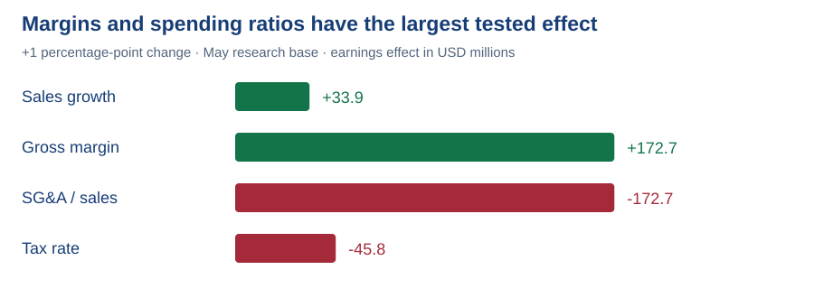

# 11. Sensitivity: Which assumptions matter most to earnings?

**Answer:** In the May research base, a one-percentage-point change in gross margin or SG&A / sales changes attributable earnings by about **$172.7m**, with opposite signs.

| One input changes; others stay fixed | Earnings effect |
|---|---:|
| Sales growth +1 percentage point | +$33.9m |
| Gross margin +1 percentage point | +$172.7m |
| SG&A / sales +1 percentage point | −$172.7m |
| Tax rate +1 percentage point | −$45.8m |

**Use:** Prioritise review of margin and spending ratios because small errors materially affect earnings. The size of a model effect does not say how likely the assumed change is.

🔎 Inspect the assumptions, output and method

[Stored sensitivity results](../data/processed/scenario_review.json) · [Original complete calculation](https://github.com/hoichengit/Portfolio-Guide/blob/codex/financial-scenarios/outputs/analysis.json) · [Editable Excel model](../model/README.md)

Start with the May research base. Increase one driver by 0.01, recalculate attributable earnings and subtract the unchanged base result. Restore the input before testing the next driver. A percentage point changes a rate from, for example, 48.6% to 49.6%; it is not a 1% relative increase.

[← All analysis questions](README.md) · [Executive memo](../reports/investment_memo.md)
