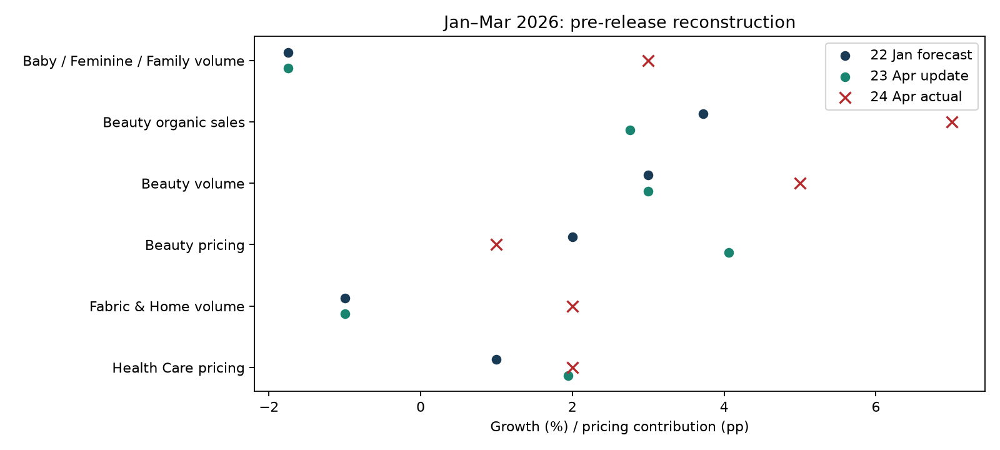
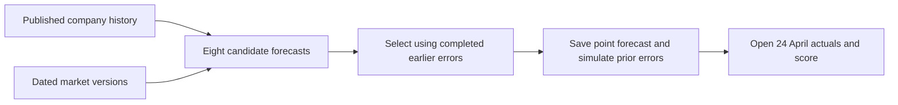
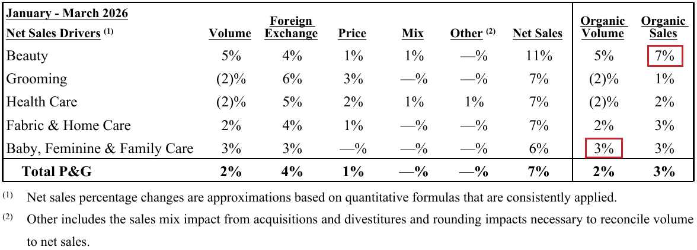
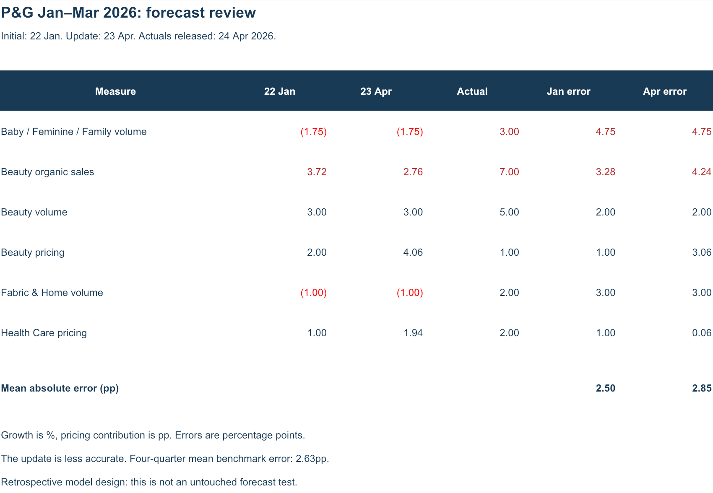
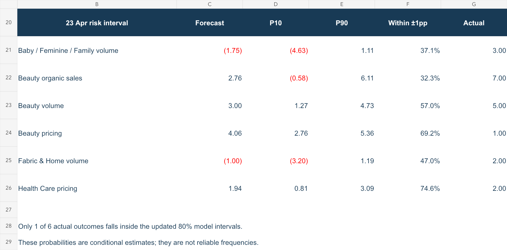

# P&G | Could we forecast January–March before the earnings release?

[▶️ Prefer a simpler explanation? Read the quick version](13_quick_read.md).

**Answer: not accurately enough. The January forecast missed by 2.50pp on average; the April update missed by 2.85pp.**

- 🎯 **Goal:** repeat the six-metric forecast using only inputs available before the results.
- 📅 **Initial forecast:** 22 January 2026, after the previous quarterly release, using end-of-day data.
- 📅 **Update:** 23 April 2026, one day before the results. This is a pre-release nowcast of an ended quarter.
- 📁 **Open:** [Excel analysis](../outputs/jan_mar_replay/PG_12_Jan_Mar_Replay.xlsx) · [Reproducible data](../data/jan_mar_replay/README.md).
- 🧭 **Questions:** [1. Future information](#1-timing-did-the-model-use-future-information) · [2. Inputs](#2-inputs-what-was-known) · [3. Results](#3-results-how-close-were-we) · [4. Monte Carlo](#4-monte-carlo-did-the-intervals-work) · [5. Decision](#5-decision-is-this-reliable).

## 1. Timing: did the model use future information?

**Answer: target actuals and later market vintages are excluded from the calculations, but the model design was developed after outcomes had already been seen.**

| Check | Finding |
|---|---|
| Company inputs | Only quarters ending before January–March and published by each cutoff. |
| Market inputs | Archived ALFRED versions dated on or before each cutoff; no later observation months. |
| Method selection | Only earlier forecasts whose results were already public. |
| Monte Carlo | Only completed earlier forecast errors; no January–March error in calibration. |
| Future-value test | Replacing future company results with 99,999 leaves predictions unchanged. Adding an extreme future market vintage also leaves them unchanged. |
| Research hindsight | **Still present.** Candidate models, market pairings and the six-metric scope were designed after reviewing historical outcomes. |

**This is a retrospective reconstruction, not an untouched out-of-sample test.** A file saved before the scoring step documents calculation order; it does not prove the model was created in January.

🔎 Date correction and audit evidence

The archived company table incorrectly dated the December 2025 earnings release as **23 January 2026**. The [official release](https://www.pginvestor.com/news/news-details/2026/PG-Announces-Fiscal-Year-2026-Second-Quarter-Results/default.aspx) is dated **22 January 2026**. This replay applies the correction explicitly and leaves the raw archive unchanged.

The previous April–June development run used the old date in its historical January snapshot. Its results are preserved, with a correction notice; they should not be described as a fully verified day-exact backtest. This one-day error alone does not show that June actuals entered that forecast.

[Date and poison-test checks](../data/jan_mar_replay/validation.json) · [Every dated input](../data/jan_mar_replay/release_inputs.csv) · [Every training pair](../data/jan_mar_replay/training_pairs.csv) · [Forecasts saved before scoring](../data/jan_mar_replay/unscored_forecasts.json).

The six target actuals were cross-checked against the original April release. Historical company observations still come from the preserved research archive, rather than a fully versioned restatement database. Historical cutoff dates other than the identified correction are inherited from that archive. Intraday release timing is not modeled: the January snapshot means end of day.

## 2. Inputs: what was known?

**Answer: January contained no observed target-quarter market months; by 23 April, consumption still lacked March, while retail and price series included March.**

| Input | 22 January snapshot | 23 April snapshot |
|---|---|---|
| Latest P&G quarter | October–December 2025 | October–December 2025 |
| US real nondurable consumption, PCENDC96 | Through November 2025 | Through February 2026 |
| Health/personal-care retail, RSHPCS | Through November 2025 | Through March 2026 |
| Personal-care price indexes, CUUR0000SEGB / SEGB02 | Through December 2025 | Through March 2026 |

Missing market months use the mean of the latest three available monthly year-on-year rates, applied to the matching prior-year month. This preserves a prior-year seasonal pattern without pretending the missing month was observed.

🔎 What stayed the same, and what changed?

The eight candidates, 10% improvement threshold, four-test minimum, eight-test selection window, half-weight bias adjustment, Student-t distribution and simulation settings are unchanged from the previous development version. Coefficients and the selected method are refitted using each snapshot's permitted history.

**Historical horizons are matched separately.** The initial forecast uses previous-quarter-release snapshots. The pre-release update uses snapshots one day before each historical target's earnings release. Therefore differences between the two targets reflect both newer market inputs and different historical selection evidence; this is not a controlled test of the value of new data alone.

No parameter is retuned to make January–March look better. The same six measures are retained, including overlapping Beauty sales and volume. These six measures cannot be summed into company revenue.

The initial evaluation has 7 quarters × 6 measures = 42 errors. The pre-release evaluation has 40 errors: the two pricing models cannot construct the December 2025 market estimate from their archived inputs and are omitted. This omission also excludes that quarter from the joint six-metric simulation calibration. Missing observations are not zero errors. Common calibration quarters total 7 for the initial simulation and 6 for the update. These small, overlapping samples limit reliability.

[All rolling predictions and selection scores](../data/jan_mar_replay/rolling_forecasts.json) · [Calibration errors](../data/jan_mar_replay/calibration_errors.csv).

## 3. Results: how close were we?

**Answer: we missed the volume rebound, and the April update worsened the Beauty forecasts.**

| Measure | 22 Jan forecast | 23 Apr update | Actual | Update error |
|---|---:|---:|---:|---:|
| Baby / Feminine / Family volume | -1.75% | -1.75% | 3% | 4.75pp |
| Beauty organic sales | 3.72% | 2.76% | 7% | 4.24pp |
| Beauty volume | 3.00% | 3.00% | 5% | 2.00pp |
| Beauty pricing | 2.00pp | 4.06pp | 1pp | 3.06pp |
| Fabric & Home volume | -1.00% | -1.00% | 2% | 3.00pp |
| Health Care pricing | 1.00pp | 1.94pp | 2pp | 0.06pp |

| Method | Average absolute error, same six outcomes |
|---|---:|
| Initial selected forecast | **2.50pp** |
| Pre-release selected update | **2.85pp** |
| Repeat last company result | 2.83pp |
| Average last four company results | 2.63pp |

The initial rule only slightly beats the four-quarter mean; the update loses to both simple benchmarks. These are segment growth/price forecasts, not an internal company budget.

🔎 Original report → workbook evidence

**Original P&G report, page 2:** the red boxes identify Baby/Feminine/Family organic volume of 3% and Beauty organic sales of 7%. These later results are used for scoring only.

[Original PDF](../raw_data/PG_2026_Q3_Release.pdf) · [Official release, published 24 April](https://www.pginvestor.com/news/news-details/2026/PG-Announces-Fiscal-Year-2026-Third-Quarter-Results/default.aspx).

**Workbook view:** the first two rows highlight the same actuals and the forecast gaps. Parentheses denote negative values. This is a rendered view of the exported workbook, not a native Excel screenshot; the current Excel automation remained on the previous workbook.

[Download and open in Excel](../outputs/jan_mar_replay/PG_12_Jan_Mar_Replay.xlsx) · [Exact comparison values](../data/jan_mar_replay/comparison.csv).

**Why might the broad indicators miss?** The release describes innovation-led Beauty growth and a Family Care comparison against prior-year retailer destocking. Our aggregate US market proxies do not explicitly model those company/category effects or all international markets. This is a plausible explanation of model misspecification, not an identified numerical causal split of the forecast error. Those explanations come from the later report and were not fed back into the forecasts.

## 4. Monte Carlo: did the intervals work?

**Answer: no. The updated 80% model intervals included only 1 of the 6 actual outcomes.**

| Measure | Updated P10–P90 | Actual inside? |
|---|---:|---|
| Baby / Feminine / Family volume | -4.63 to 1.11 | **No** |
| Beauty organic sales | -0.58 to 6.11 | **No** |
| Beauty volume | 1.27 to 4.73 | **No** |
| Beauty pricing | 2.76 to 5.36 | **No** |
| Fabric & Home volume | -3.20 to 1.19 | **No** |
| Health Care pricing | 0.81 to 3.09 | Yes |

Ranges use percentage growth for sales/volume and percentage-point contributions for pricing. The initial intervals covered 2 of 6 outcomes. Earlier rolling interval tests covered 14/18 initial outcomes (77.8%) and 12/16 pre-release outcomes (75.0%), but the samples are small and dependent. One quarter does not estimate a stable coverage rate, yet this failure is strong reason not to trust the displayed probabilities as calibrated probabilities.

🔎 Simulation settings and evidence

- 100,000 draws; fixed random seed 20260424 (an arbitrary reproducibility setting, not an input observation).
- Center each metric on its selected forecast.
- Scale from the root mean squared earlier rolling errors, with an assumed minimum of 1pp.
- Student-t innovations with 5 degrees of freedom; sample correlations shrunk 50% toward zero.
- No additional bias shift in the simulation center and no target-quarter errors in calibration.
- Below/near/above probabilities mean more than 1pp below, within ±1pp of, or more than 1pp above the point forecast. They are not probabilities of specific business causes.

[Simulation values](../data/jan_mar_replay/probabilities.csv) · [Earlier interval tests](../data/jan_mar_replay/interval_tests.csv).

Monte Carlo describes uncertainty conditional on the model. More draws would not repair the wrong forecast centers, omitted drivers or weak historical sample.

## 5. Decision: is this reliable?

**Answer: useful as an auditable research exercise; insufficient evidence to rely on it as a superior forecasting model.**

- Keep simple benchmarks beside every forecast.
- Treat market models as challengers until they win consistently at the same forecast horizon.
- Investigate volume rebounds and pricing proxies before adding further complexity.
- Freeze a future forecast before its actual earnings release. That provides evidence a historical reconstruction cannot.

[← Project overview](../README.md) · [Previous April–June development results](11_forecast_improvement.md)
