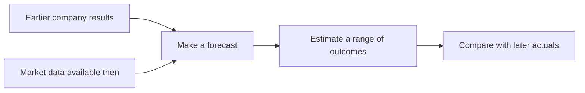

# P&G Forecast Review 📊

**Can public market data help us forecast P&G before its earnings release?**

I built forecasts, compared them with later results, and checked whether the model had used information that was not available at the time.

**The result: the model is not reliable enough yet. Keeping the misses visible is part of the analysis.**

[📥 Open Excel](../outputs/jan_mar_replay/PG_12_Jan_Mar_Replay.xlsx) · [🔎 Full analysis](12_jan_mar_replay.md) · [🏠 Project home](../README.md)

## 🎯 The goal

- Forecast January–March 2026 using earlier public information.
- Compare the forecasts with P&G's actual results.
- Test whether a more complex method beats a simple average.
- Check whether the simulated risk ranges were useful.

## 🧠 What to know first

- **Forecast:** our estimate of a result that has not been reported yet.
- **Actual:** the result P&G later reported.
- **Error:** the gap between the two. Smaller is better.
- **Percentage point (pp):** predicting 3% when actual growth is 5% means a 2pp error.

These are six segment growth and pricing measures. They are not six separate company revenue forecasts, and they must not be added together.

## 🛠️ Step 1: use only information available at the time

| Date in 2026 | What happens in the reconstruction? |
|---|---|
| **22 January** | Use the October–December report and available market data to make the initial forecast. |
| **23 April** | Update the estimate with information available before the next earnings release. |
| **24 April** | Read the January–March results and measure the errors. |

The April update happens after the quarter ends, but before P&G reports it. It has more information than the January forecast.

🔎 Which market data could we see?

| Market measure | Available on 22 January | Available on 23 April |
|---|---|---|
| US real nondurable consumption | Through November 2025 | Through February 2026 |
| Health and personal-care retail sales | Through November 2025 | Through March 2026 |
| Personal-care prices | Through December 2025 | Through March 2026 |

Missing months were estimated using recent year-on-year growth and the corresponding prior-year monthly level. Missing values were not treated as known results.

[Check the dated input files](../data/jan_mar_replay/release_inputs.csv).

## 📊 Step 2: compare the forecasts with actuals

**The April update was less accurate than the January forecast.**

| Method | Average absolute error |
|---|---:|
| Our January forecast | **2.50pp** |
| Our April update | **2.85pp** |
| Repeat the last reported result | 2.83pp |
| Average the last four reported quarters | 2.63pp |

For example, we predicted **−1.75%** volume growth for Baby, Feminine & Family Care. Actual growth was **+3%**. We missed by **4.75pp**.

🔎 See all six results

| Measure | January forecast | April update | Actual |
|---|---:|---:|---:|
| Baby / Feminine / Family organic volume | −1.75% | −1.75% | 3% |
| Beauty organic sales | 3.72% | 2.76% | 7% |
| Beauty organic volume | 3.00% | 3.00% | 5% |
| Beauty pricing contribution | 2.00pp | 4.06pp | 1pp |
| Fabric & Home organic volume | −1.00% | −1.00% | 2% |
| Health Care pricing contribution | 1.00pp | 1.94pp | 2pp |

The model missed the volume rebound. The company later discussed innovation-led Beauty growth and Family Care's comparison with prior-year retailer destocking. Broad US indicators do not capture all company-specific and international effects.

These later explanations help us investigate the misses. They were not inputs to the forecasts, and they do not provide an exact numerical split of each error.

[Read the original company release](https://www.pginvestor.com/news/news-details/2026/PG-Announces-Fiscal-Year-2026-Third-Quarter-Results/default.aspx).

📸 Check the original report against the workbook

**1. Original report:** red boxes show Beauty organic sales of 7% and Baby/Feminine/Family organic volume of 3%.

[Open the original PDF](../raw_data/PG_2026_Q3_Release.pdf).

**2. Workbook:** the same actuals and their forecast errors are highlighted in the first two rows. Parentheses mean negative numbers.

This image is a rendered view of the exported workbook. It is not a native Excel screenshot.

[Open the Excel workbook](../outputs/jan_mar_replay/PG_12_Jan_Mar_Replay.xlsx) · [Check exact figures](../data/jan_mar_replay/comparison.csv).

## 🎲 Step 3: test the risk ranges

**Monte Carlo simulated 100,000 possible outcomes around each forecast, using earlier forecast errors to set the spread.**

The updated model's **80% ranges contained only 1 of the 6 actual results**.

That is a poor result. Running more simulations would not fix a forecast that starts in the wrong place.

🔎 What does “80% range” mean?

It is the middle 80% of the model's simulated outcomes. It does not guarantee that actual results will fall inside it 80% of the time.

- The initial ranges covered **2 of 6** actual outcomes.
- The updated ranges covered **1 of 6**.
- Earlier rolling tests covered **14 of 18** initial outcomes and **12 of 16** updated outcomes.
- Those samples are small, and several measures overlap. They do not prove stable accuracy.

The simulation uses a Student-t distribution, a minimum scale of 1pp, and partially reduced historical correlations. These are assumptions. The full report explains them and links to the calculations.

[Read the simulation method and results](12_jan_mar_replay.md#4-monte-carlo-did-the-intervals-work).

## 🔍 Step 4: check for future information

**The calculations exclude later information. The model design still benefits from hindsight.**

- **Input check:** use only company results and historical market versions available by each cutoff.
- **Future-data check:** replacing future company results with extreme values did not change the forecasts. Adding a later market version also did not change them.
- **Design limitation:** the methods and six measures were chosen after we had already seen historical outcomes.

This is a **historical reconstruction**. It is not proof that we could have designed the same model before the results were known.

🔎 What else limits the conclusion?

- The previous release date was corrected from **23 January to 22 January 2026**.
- Some historical price data were missing. The initial evaluation has 42 errors; the update has 40. Missing tests are not counted as zero errors.
- Historical company restatement versions have not been fully audited.
- The two forecast dates use historical tests at different forecast horizons. Their difference reflects both new data and different method-selection evidence.
- The six measures do not form a complete revenue, profit or cash-flow model.

[Read the complete timing audit](12_jan_mar_replay.md#1-timing-did-the-model-use-future-information) · [Open the checks](../data/jan_mar_replay/validation.json).

## 💡 What I learned

**More data and more complex models do not automatically produce better forecasts.**

- Keep simple benchmarks in every comparison.
- Show failed forecasts as clearly as successful ones.
- Separate facts available at the time from later explanations.
- Test probability ranges against actual outcomes.

The April–June redesign had reduced error to 0.58pp, almost the same as the four-quarter average. This January–March exercise shows why one good quarter was not enough to establish reliability.

## 🧰 Skills shown

| Skill | What this project demonstrates |
|---|---|
| Financial analysis | Compare matching growth and pricing measures with actual results. |
| Excel | Present forecasts, calculate errors and link figures to their sources. |
| Python | Reproduce dated forecasts, method selection and simulation. |
| Research and QA | Check publication dates and test whether future data affect predictions. |
| Business communication | Explain misses, benchmarks and limitations in plain English. |

## 🔗 Want to go deeper?

- [Full January–March analysis and evidence](12_jan_mar_replay.md)
- [Excel workbook](../outputs/jan_mar_replay/PG_12_Jan_Mar_Replay.xlsx)
- [Data and rerun instructions](../data/jan_mar_replay/README.md)
- [Earlier April–June forecast improvement](11_forecast_improvement.md)
- [All project sections](../README.md#explore-project)

**Next tests:** hold the January method fixed when updating market data; investigate the largest misses; save a future forecast before its results are released. These are proposed next steps, not completed work.

Writing reference

The short sections, goal-first opening and deeper-reading links were inspired by [GitHub Community: Create your GitHub Profile](https://github.com/orgs/community/discussions/168000). The financial analysis and results belong to this project.

