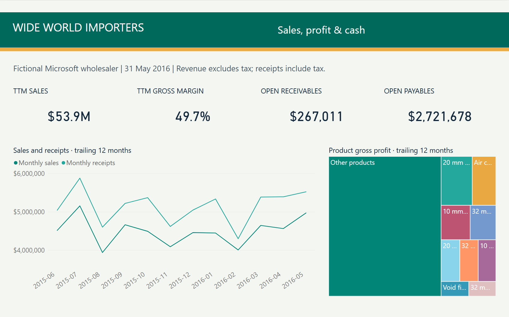
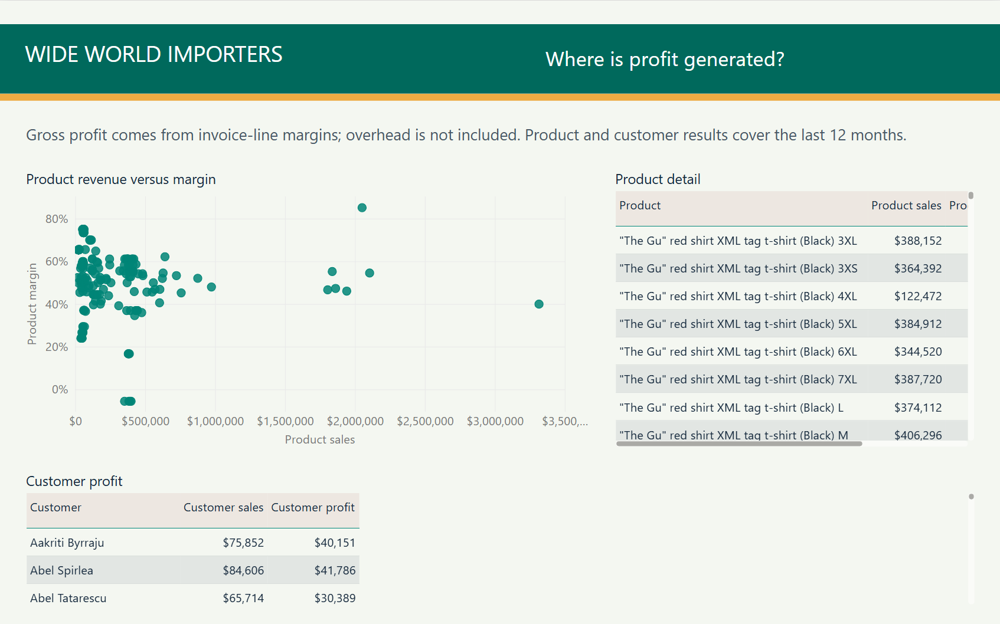
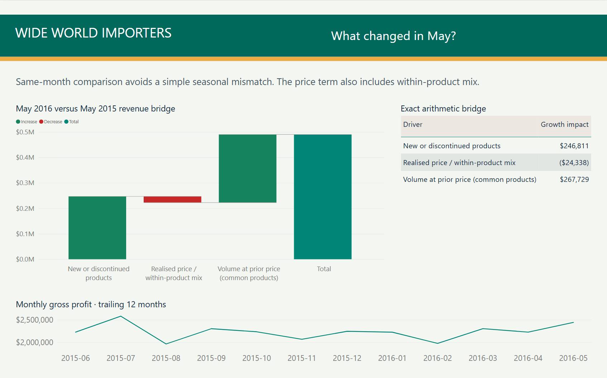
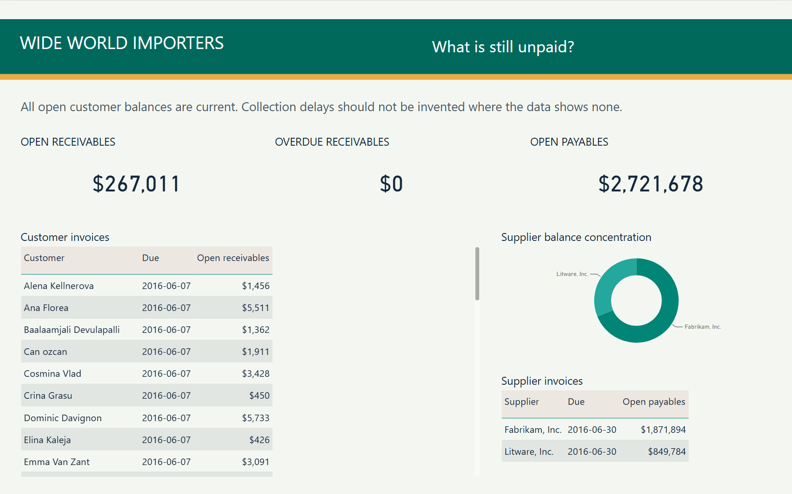
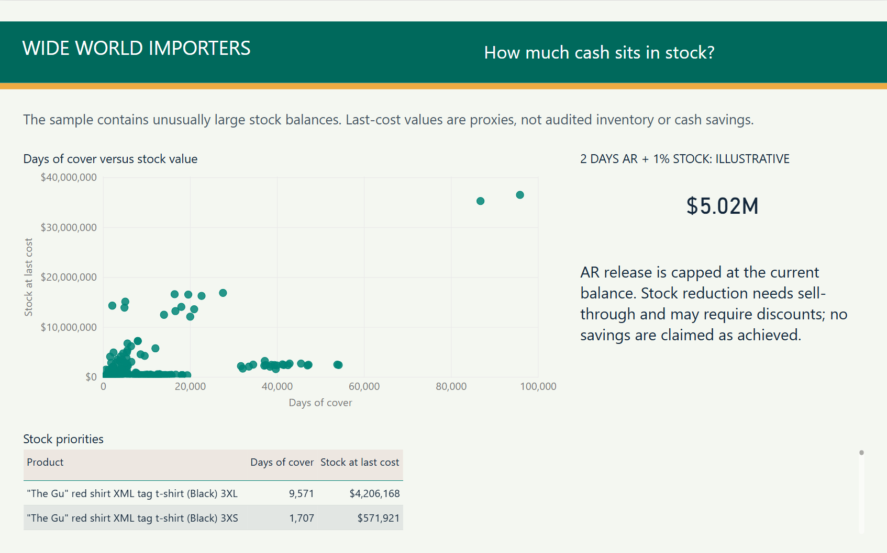
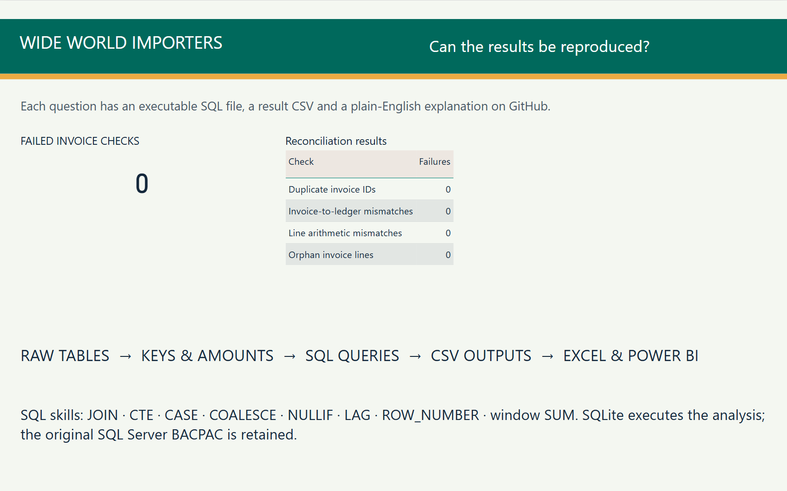

# WideWorldImporters — Power BI dashboard

[Download PBIX](processed_data/WWI_SQL_Finance.pbix) · [Excel analysis](processed_data/WWI_Financial_Analysis.xlsx) · [SQL questions](README.md)

Six pages show sales and cash, product profitability, the growth bridge, balances, inventory and query controls. The PBIX contains its data and opens in Power BI Desktop.

## 1. Sales, profit and cash

## 2. Product and customer profit

## 3. May growth bridge

## 4. Receivables and payables

## 5. Inventory and cash scenario

## 6. SQL controls

