# 1. Financial statements

[📖 Read the new question-by-question report](../analysis/README.md) · [Executive memo](../reports/investment_memo.md) · [Skills and evidence](../SKILLS.md)

- **Goal:** Transfer the three financial statements into Excel, check their connections, and explain revenue and margin changes.
- **Audience:** CIO, investment committee and credit analyst.
- **Data:** [P&G 2026 annual report, p.37](https://s204.q4cdn.com/332108499/files/doc_financials/2026/ar/2026_annual_report.pdf#page=49) · [Company's original financial spreadsheet](../raw_data/PG_2026_Company_Financials.xlsx).
- **Output:** [Our Excel analysis](../outputs/PG_1_Analysis.xlsx) · [Structured financial history](../processed_data/financial_history.csv).
- **Scope:** Income and cash flow: FY2024–FY2026. Balance sheet: 30 June 2025 and 2026, the two dates disclosed in this report.

Evidence opens on click. Each image shows the relevant report or Excel area; full documents remain available through the links.

## Analysis questions

| Area | Question | Who uses the answer? |
|---|---|---|
| Data accuracy | [1. Revenue extraction](#revenue-extraction) | Analyst checking the historical financial report. |
| Earnings quality | [2. Revenue vs operating profit](#revenue-vs-profit) | CIO assessing whether growth improves profitability. |
| Data accuracy | [3. Three-statement extraction](#statement-extraction) | Analyst tracing the figures to the company report. |
| Data accuracy | [4. Statement connections](#statement-connections) | Analyst checking earnings, cash and the balance sheet. |
| Revenue drivers | [5. Volume, price and FX](#sales-drivers) | Investor distinguishing underlying growth from currency effects. |
| Revenue drivers | [6. Segment contribution](#segment-contribution) | Investor locating the largest source of sales growth. |
| Profitability | [7. Margin drivers](#margin-drivers) | Investor understanding why profit margins fell. |

## Agent responsibilities

- **Financial Statements & Quality Agent:** Check the reported figures, accounting basis and explanation of the profit change.
- **Independent QA & Evidence Agent:** Independently compare sources, Excel values and calculations, then report mismatches.
- **Excel / Python:** Extract and calculate using explicit rules; they are tools used by the workflow.

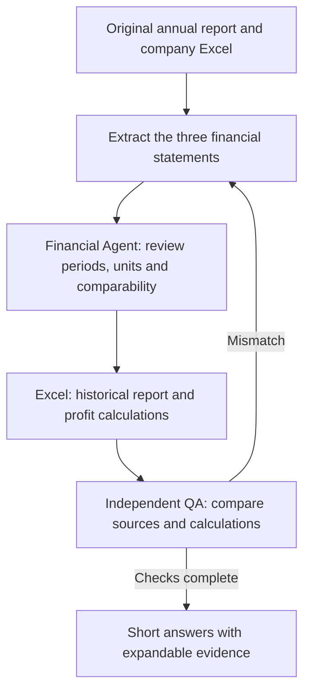

## 1. Revenue extraction: Do the revenues in our Excel match the original annual report?

**Answer:** Yes — FY2024, FY2025 and FY2026 revenues are **$84,039m, $84,284m and $87,032m** in both the annual report and our Excel.

Compare the original report with Excel

**Original annual report · Net sales · FY2024–FY2026 · USD millions**

**Excel · Reported Earnings · Matching net sales**

Click an image to enlarge it. Red marks identify the corresponding revenue and operating-income figures; they do not mean that every highlighted result is unfavorable.

[Unmarked source page](../raw_data/PG_2026_Earnings_Original_Page.pdf) · [Full original annual report](https://s204.q4cdn.com/332108499/files/doc_financials/2026/ar/2026_annual_report.pdf#page=49) · [Open the Excel analysis](../outputs/PG_1_Analysis.xlsx)

These are cropped excerpts from the original report and an actual Microsoft Excel screenshot. Red highlights identify matching evidence. The links above open the complete source and workbook.

How the figures were checked

- Read the original report's **NET SALES** row and its year headings.
- Compare those figures with **Reported Earnings**, cells **C7:E7**, in our workbook.
- Confirm the same full-year periods, USD currency and million-dollar scale.
- The report lists newest year first; Excel lists oldest year first, so compare year labels rather than column positions.

## 2. Revenue vs operating profit: Did higher FY2026 sales produce higher operating profit?

**Answer:** No — revenue increased **3.3%**, but operating profit fell **3.4% ($703m)** because the combined increase in product costs and SG&A exceeded the revenue increase.

Compare the original report with Excel

**Original annual report · Revenue and operating costs · USD millions**

<a href="../evidence/q2_source.png">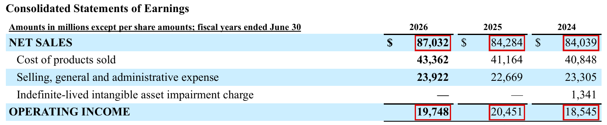</a>

**Excel · PG_1_Analysis · Revenue growth and profit bridge**

<a href="../evidence/q2_excel.png">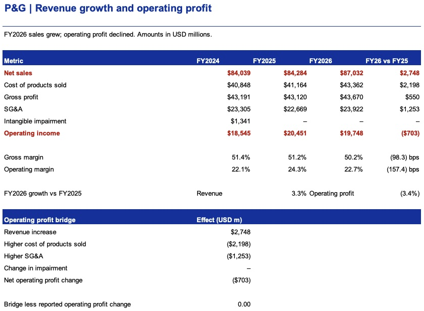</a>

Click an image to enlarge it. Red marks identify the corresponding revenue and operating-income figures; they do not mean that every highlighted result is unfavorable.

[Unmarked source page](../raw_data/PG_2026_Earnings_Original_Page.pdf) · [Full original annual report](https://s204.q4cdn.com/332108499/files/doc_financials/2026/ar/2026_annual_report.pdf#page=49) · [Open the Excel analysis](../outputs/PG_1_Analysis.xlsx)

These are cropped excerpts from the original report and an actual Microsoft Excel screenshot. Red highlights identify matching evidence. The links above open the complete source and workbook.

How the $703m decline is explained

| FY2026 compared with FY2025 | Effect on operating profit |
|---|---:|
| Additional revenue | +$2,748m |
| Higher cost of products sold | −$2,198m |
| Higher selling, general and administrative expense | −$1,253m |
| Change in intangible impairment | $0m |
| **Total operating profit change** | **−$703m** |

In Excel, subtract FY2025 from FY2026 for each line, then add the revenue effect and subtract the expense increases. The result equals the change in reported operating income: **$19,748m − $20,451m = −$703m**.

Operating margin falls from **24.3% to 22.7%**. This is an accounting explanation of the change; the company disclosures in questions 5–7 explain the business drivers.

FY2024 included a **$1,341m intangible impairment charge**. Its absence helped FY2025 operating profit, so the three-year profit trend should not be treated as wholly recurring growth.

[Back to questions](#analysis-questions) · [Agent workflow and review](../agents/README.md) · [Project home](../README.md)

## 3. Three-statement extraction: Have the reported figures been transferred into Excel correctly?

**Answer:** The workbook contains **199 reported values** from the income statement, balance sheet and cash flow statement, with the original periods, units and signs preserved.

- Income statement: **45 values**, FY2024–FY2026.
- Balance sheet: **64 values**, 30 June 2025 and 2026.
- Cash flow: **90 values**, FY2024–FY2026, including cash interest paid.

Compare the original balance sheet with Excel

**Original annual report · Balance sheet · USD millions**

<a href="../evidence/q3_balance_source.png">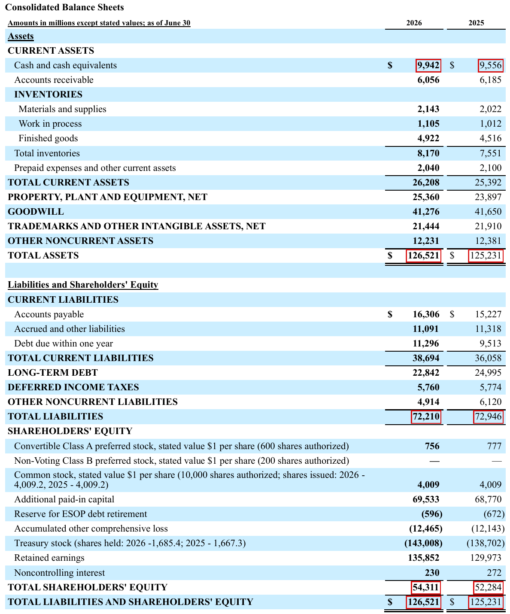</a>

**Excel · Reported Balance · FY2025 and FY2026**

<a href="../evidence/q3_balance_excel.png">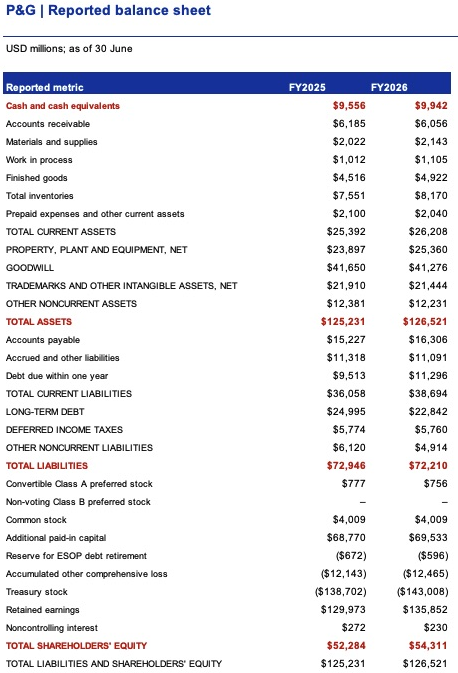</a>

**Follow the red figures:** FY2026 cash **$9,942m**, assets **$126,521m**, liabilities **$72,210m** and equity **$54,311m** match the Reported Balance worksheet. Read the year headings: the report and Excel use opposite year order.

Click an image to enlarge. [Original annual report, PDF page 50](https://s204.q4cdn.com/332108499/files/doc_financials/2026/ar/2026_annual_report.pdf#page=50) · [Open Excel](../outputs/PG_1_Analysis.xlsx)

Compare the original cash flow statement with Excel

**Original annual report · Cash flow statement · USD millions**

<a href="../evidence/q3_cash_source.png">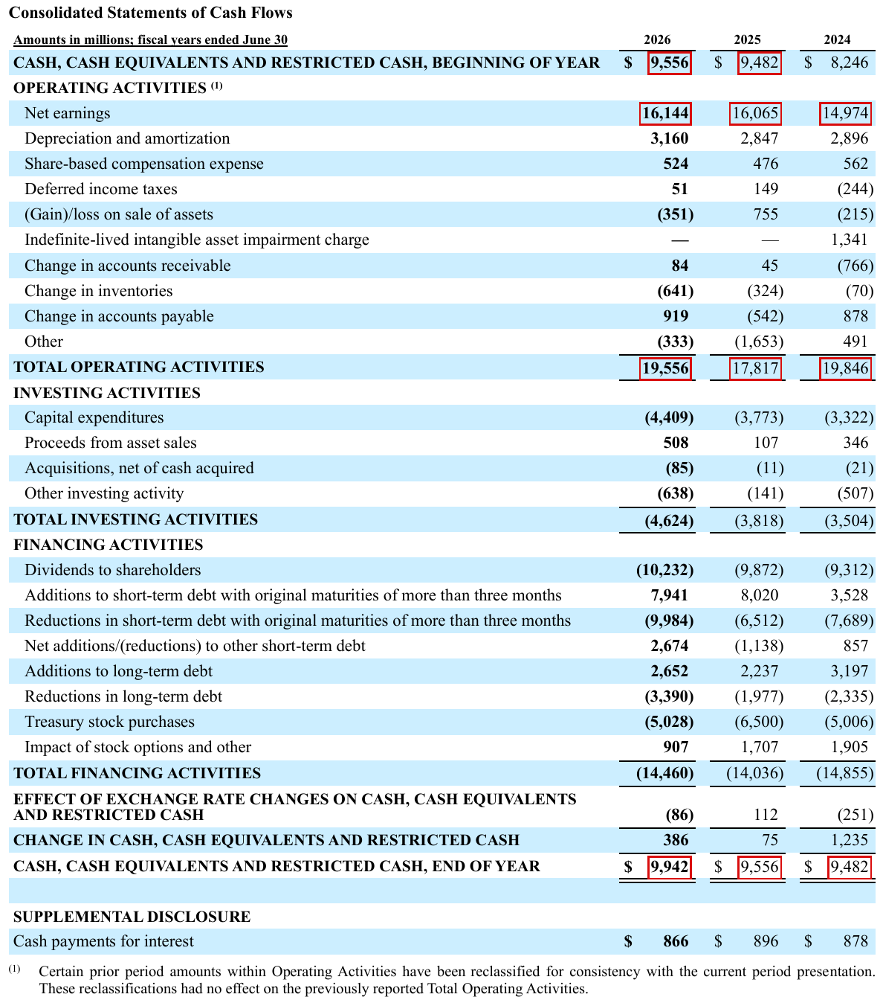</a>

**Excel · Reported Cash · FY2024–FY2026**

<a href="../evidence/q3_cash_excel.png">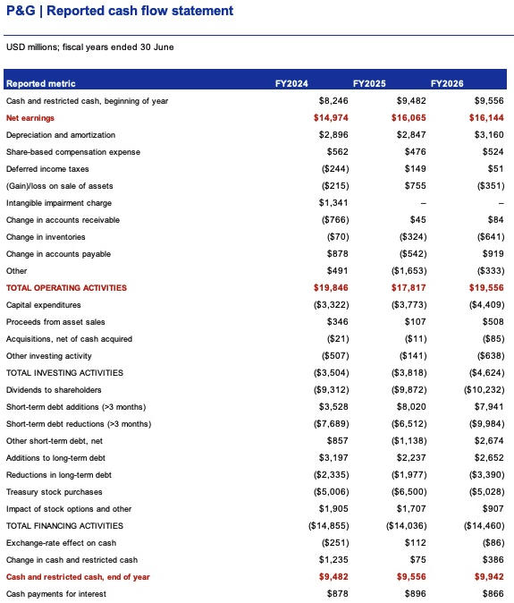</a>

**Follow the red figures:** FY2026 net earnings **$16,144m**, operating cash flow **$19,556m** and ending cash **$9,942m** match the Reported Cash worksheet. Negative cash flows retain their signs.

Click an image to enlarge. [Original annual report, PDF page 52](https://s204.q4cdn.com/332108499/files/doc_financials/2026/ar/2026_annual_report.pdf#page=52) · [Open Excel](../outputs/PG_1_Analysis.xlsx)

How the transfer works

Read the original company spreadsheet, reorder years chronologically, convert reported dashes to zero, and keep numeric amounts unchanged. Longer row labels are shortened in Excel; the complete source labels and source row numbers remain in [the extracted data](../processed_data/three_statement_inputs.csv). No FY2024 balance sheet is invented: it is outside this source's two-year balance-sheet presentation.

## 4. Statement connections: Do earnings and cash agree across the three statements?

**Answer:** The cross-statement earnings and cash links agree; some sums of the displayed figures retain **$1m differences**, which are shown explicitly rather than changed to zero.

Compare reported earnings and cash with the Excel checks

**Original annual report · Net earnings · Columns: FY2026, FY2025, FY2024 · USD millions**

<a href="../evidence/q4_earnings_source.png">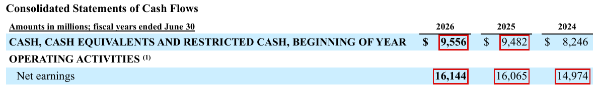</a>

**Original annual report · Ending cash · Same year order and units**

<a href="../evidence/q4_cash_source.png">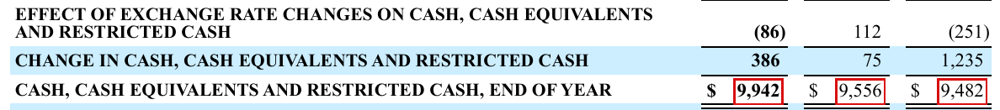</a>

**Excel · PG_2_Analysis · Matching FY2026 earnings and cash · USD millions**

<a href="../evidence/q4_excel.png">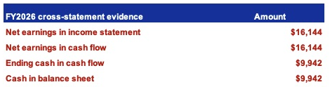</a>

**Excel · PG_2_Analysis · Reconciliation differences**

<a href="../evidence/q4_checks_excel.png">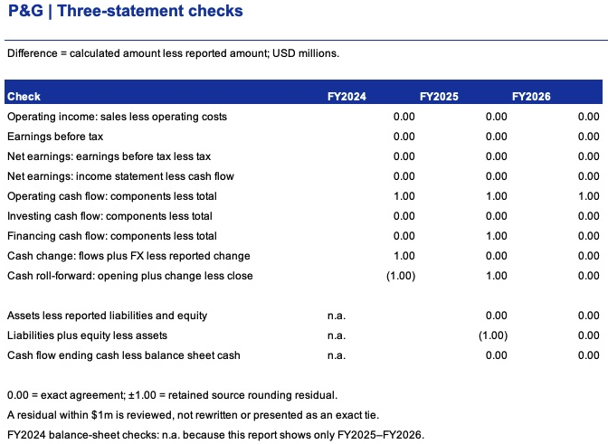</a>

**Read the matching red figures:** total FY2026 net earnings are **$16,144m** in both income and cash flow; ending cash is **$9,942m** in both cash flow and the balance sheet. Use total net earnings, not the **$16,046m** attributable only to P&G shareholders.

Click an image to enlarge. [Original annual report, PDF page 52](https://s204.q4cdn.com/332108499/files/doc_financials/2026/ar/2026_annual_report.pdf#page=52) · [Open Excel](../outputs/PG_1_Analysis.xlsx)

What does each difference mean?

- **0.00:** the calculated amount equals the reported amount.
- **1.00 or (1.00):** a $1m residual in the displayed million-dollar source figures; original inputs are retained.
- **n.a.:** this source does not contain the FY2024 balance sheet needed for that check.

For FY2026, **$9,556m opening cash + $19,556m operating cash − $4,624m investing cash − $14,460m financing cash − $86m FX = $9,942m ending cash**.

For FY2025, liabilities **$72,946m** plus equity **$52,284m** equal **$125,230m**, compared with reported assets of **$125,231m**. The $1m residual is consistent with rounded presentation, but is not an exact tie. Operating cash-flow components also exceed the displayed total by $1m in each of the three years. All tested residuals are at most $1m; this is a data reconciliation, not an audit opinion.

## 5. Volume, price and FX: What drove FY2026 revenue growth?

**Answer:** P&G attributes approximately **2% to favorable foreign exchange and 1% to pricing**, with volume and mix unchanged; organic sales grew **1%**.

Compare company sales drivers with the Excel analysis

**Original annual report · Sales growth drivers · FY2026 vs FY2025**

<a href="../evidence/q5_source.png">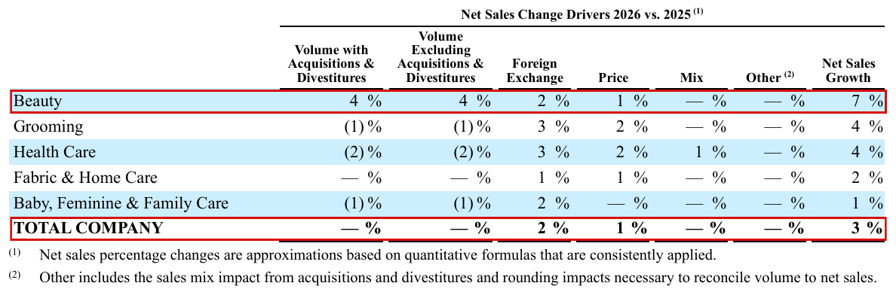</a>

**Excel · PG_3_Analysis · The same company-wide growth drivers**

<a href="../evidence/q5_excel.png">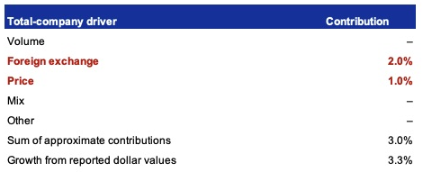</a>

**Follow the red figures:** the report’s TOTAL COMPANY row shows **FX 2%** and **Price 1%**; these match the Excel table shown below. The company percentages are approximate. Growth calculated from revenue amounts is **3.2604%**; do not force these rounded drivers into an exact dollar bridge.

Click an image to enlarge. [Original annual report, PDF page 34](https://s204.q4cdn.com/332108499/files/doc_financials/2026/ar/2026_annual_report.pdf#page=34) · [Open Excel](../outputs/PG_1_Analysis.xlsx)

How to interpret the drivers

Foreign exchange changes the US-dollar value of overseas sales. Pricing reflects changes in selling prices. Volume measures units sold; mix measures the composition of sales. Organic growth excludes foreign exchange and acquisitions/divestitures. The report's unchanged volume means the headline revenue increase was not driven by company-wide unit growth at the disclosed precision.

## 6. Segment contribution: Which business added the most revenue?

**Answer:** **Beauty added $1,059m**, or **38.5%** of the consolidated **$2,748m** increase, the largest contribution of any segment.

Compare FY2026 segment sales with the Excel contribution calculation

**Original annual report · FY2026 segment revenue · USD millions**

<a href="../evidence/q6_2026_source.png">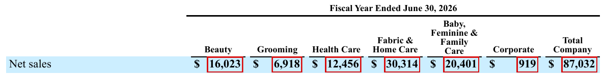</a>

**Excel · PG_3_Analysis · Segment revenue and contribution · USD millions**

<a href="../evidence/q6_excel.png">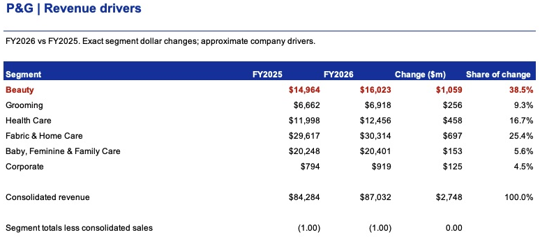</a>

**Follow Beauty:** the FY2026 source shows **$16,023m**. Subtract FY2025 **$14,964m** to get **$1,059m**, then divide by the company increase of **$2,748m** to get **38.5%**.

Click an image to enlarge. [Original annual report, PDF page 56](https://s204.q4cdn.com/332108499/files/doc_financials/2026/ar/2026_annual_report.pdf#page=56) · [Open Excel](../outputs/PG_1_Analysis.xlsx)

Check the FY2025 starting figures

**Original annual report · FY2025 segment revenue · USD millions**

<a href="../evidence/q6_2025_source.png">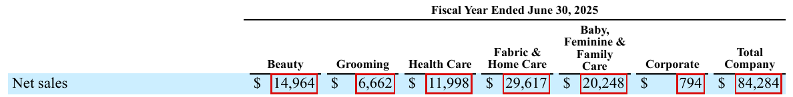</a>

**Excel · PG_3_Analysis · FY2025 starting values and FY2026 changes · USD millions**

The prior-year source shows Beauty at **$14,964m**. All six segment changes, including Corporate, add to **$2,748m**. The displayed segment sales levels total $1m below consolidated sales in both years, so their changes still reconcile exactly.

Click an image to enlarge. [Original annual report, PDF page 57](https://s204.q4cdn.com/332108499/files/doc_financials/2026/ar/2026_annual_report.pdf#page=57) · [Open Excel](../outputs/PG_1_Analysis.xlsx)

## 7. Margin drivers: Why did profit margins fall despite revenue growth?

**Answer:** Unfavorable product mix, product investment and restructuring outweighed manufacturing savings and pricing; higher SG&A spending further reduced operating margin.

Compare the first part of the company margin explanation with Excel

**Original annual report · Margin comparison and first three cost drivers**

<a href="../evidence/q7_source_a.png">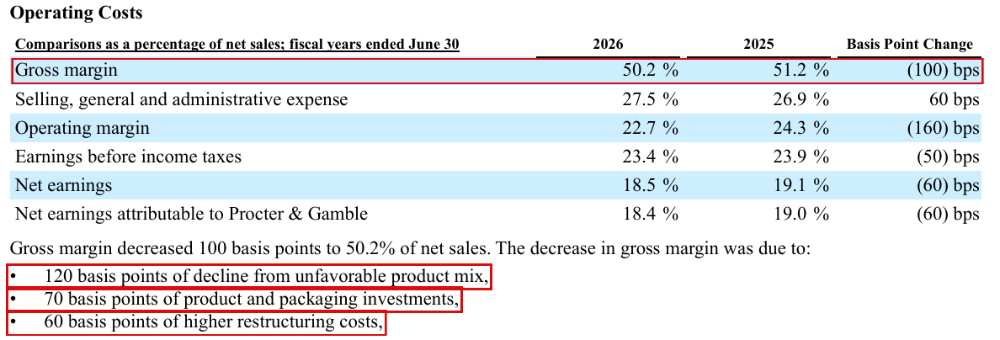</a>

**Excel · PG_4_Analysis · Margin changes and company explanation**

<a href="../evidence/q7_excel.png">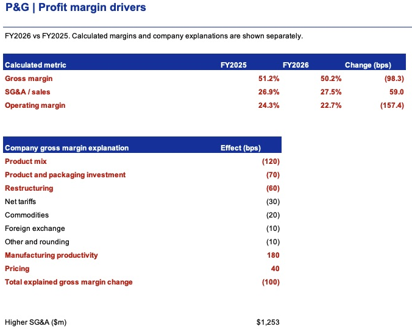</a>

**Follow the red drivers:** product mix **−120 bps**, product and packaging investment **−70 bps**, and restructuring **−60 bps** are copied into the Excel explanation. These are company-attributed gross-margin effects, not assumptions.

Click an image to enlarge. [Original annual report, PDF page 32](https://s204.q4cdn.com/332108499/files/doc_financials/2026/ar/2026_annual_report.pdf#page=32) · [Open Excel](../outputs/PG_1_Analysis.xlsx)

Compare the remaining costs and offsets with Excel

**Original annual report · Remaining gross-margin drivers and SG&A explanation**

<a href="../evidence/q7_source_b.png">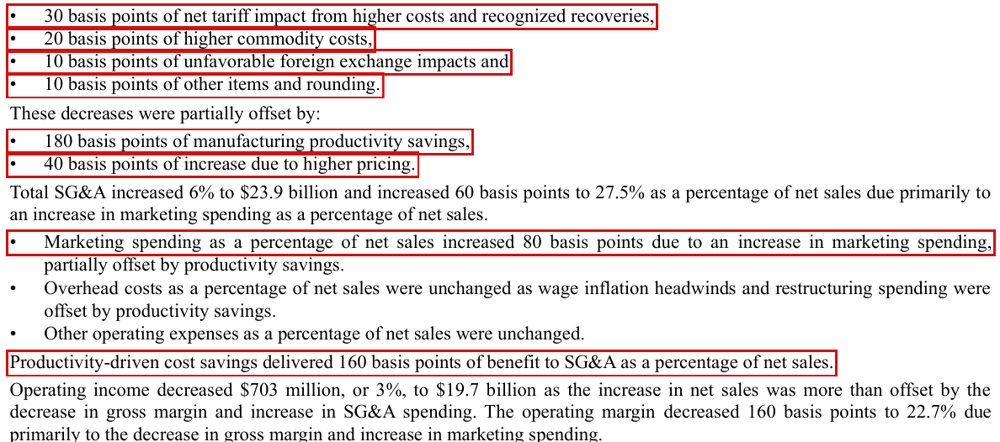</a>

**Excel · PG_4_Analysis · Gross-margin bridge · Basis points**

Manufacturing productivity **+180 bps** and pricing **+40 bps** only partly offset the adverse drivers. All nine company effects sum to **−100 bps**. One basis point is **0.01 percentage point**.

Click an image to enlarge. [Original annual report, PDF page 33](https://s204.q4cdn.com/332108499/files/doc_financials/2026/ar/2026_annual_report.pdf#page=33) · [Open Excel](../outputs/PG_1_Analysis.xlsx)

How gross margin connects to operating margin

| Metric | FY2025 | FY2026 | Change calculated from reported dollars |
|---|---:|---:|---:|
| Gross margin | 51.16% | 50.18% | −98.34 bps |
| SG&A / revenue | 26.90% | 27.49% | +59.05 bps |
| Operating margin | 24.26% | 22.69% | −157.39 bps |

Calculate gross profit as sales less product costs, then divide by sales. Divide SG&A and operating income by the same year's sales. The report presents rounded changes of **−100, +60 and −160 bps** respectively.

SG&A increased **$1,253m**. Management attributes the higher SG&A ratio primarily to marketing. Its narrative does not provide a complete exact SG&A driver bridge: the separately disclosed **+80 bps marketing ratio** should not be presented as an exact reconciliation to the total **+60 bps**. The stated productivity benefit is already included; do not subtract it again.

The zero sales-mix contribution in question 5 and the adverse gross-margin mix effect here measure different things and can coexist.

[Back to questions](#analysis-questions) · [Agent review](../agents/review.md) · [Project home](../README.md)
